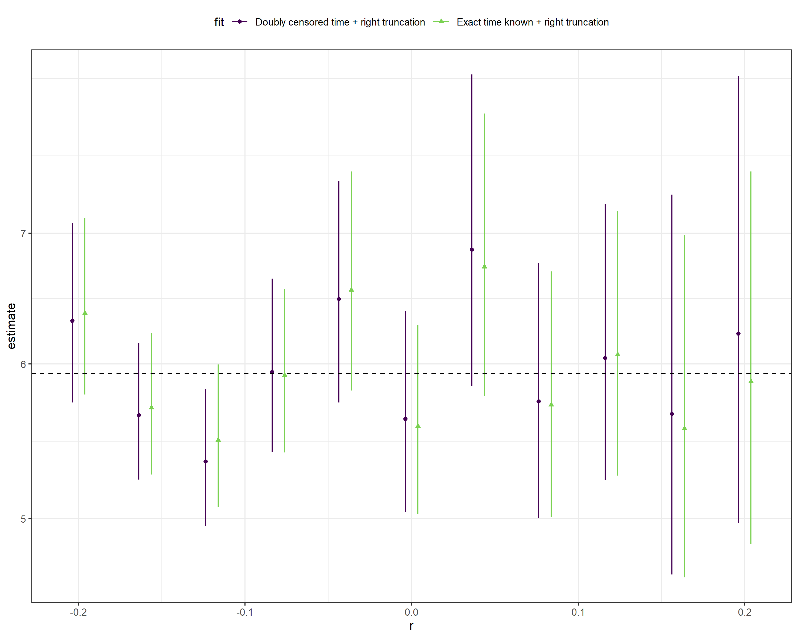

# Dynamical and truncation biases are equivalent

## Methods

Our goal is to estimate $f_s(\tau)$, where $s$ represents cohort time (i.e., the timing of the primaruy event), from truncated data. Five fits:
* Naive: $f_s(\tau)$
* Right truncation: $f_s(\tau)/F_s(t_{max}-s)$
* Dynamical correction: $b(\tau) = \exp(-r\tau) f_s(\tau)/(\int \exp(-r\tau) f_s(\tau) d\tau)$. This is a bit trickier to fit because we have to do some integration. Instead, we fit a lognormal distribution that represents $b(\tau)$ and calculate $f_s(\tau)$ after the fit for each posterior sample.
* Right truncation+dynamical correction: $b(\tau)/B(t_{max}-s)$
* Left trunction+dynamical correction: $b(\tau)/B(s-t_{min})$. Again, we fit a single lognormal distribution with left truncation and then correct for underlying dynamics after the fit

## Results

<!-- -->

* Naive fits are not too bad for $r < 0$ because not much right truncation
* Dynamical correction alone is not so good for $r < 0$ because we're missing left truncation (because we're starting from high incidence at $t=0$ and neglecting infections starting $t < 0$)
* Right truncation is good
* Right truncation + dynamical correction overcompensates and goes crazy
* Left truncation + dynamical correction is as good as right truncation but starts to give super wide CIs for high $r$ values. Need to check integration step.

<!-- -->

* Doubly censored likelihood performs just as well as if we knew exact time points
* Couldn't try negative binomial with truncation because it takes forever

## Flow
Makefile currently doesn't work because I had to switch to my Windows pc to run brms. I'm saving rda files to the rdacache directory so that I can move between machines (which you don't need to update)...

* `param.R` sets parameters
* `data_exponential.R` generates data
* `fit_exponential.R` performs fits
* `figure_exponential.R` generates the main figure

## Analyses

This analysis in this repository has been implemented using the [`targets`](https://docs.ropensci.org/targets/) package and associated packages. The workflow is defined in [`_targets.md`](https://github.com/parksw3/dynamicaltruncation/blob/main/_targets.md) and can be explored interactively using [`_targets.Rmd`](https://github.com/parksw3/dynamicaltruncation/blob/main/_targets.Rmd) `Rmarkdown` document. The workflow can be visualised as the following graph.


This complete analysis can be recreated using the following (note this may take quite some time even with a fairly large amount of available compute),

```{bash}
bash bin/update-targets.sh
```

Alternative the following `targets` functions may be used to interactively explore the workflow:

- Run the workflow sequentially.

```{r}
targets::tar_make()
```

- Run the workflow using all available workers.

```{r}
targets::tar_make_future(workers = future::availableCores())
```

- Explore a graph of the workflow.

```{r}
targets::tar_visnetwork(targets_only = TRUE)
```

Watch the workflow as it runs in a `shiny` app.

```{r}
targets::tar_watch(targets_only = TRUE)
```

To use our archived version of the interim results (and so avoid long run times) use the following to download it. Note that this process has not been rigorously tested across environments and so may not work seamlessly).

```{r}
source(here::here("R", "targets-archive.R"))
get_targets_archive()
```