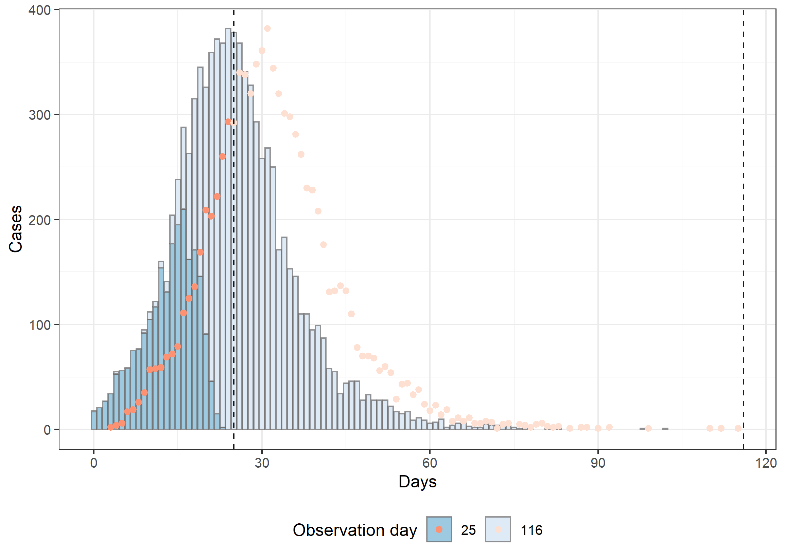
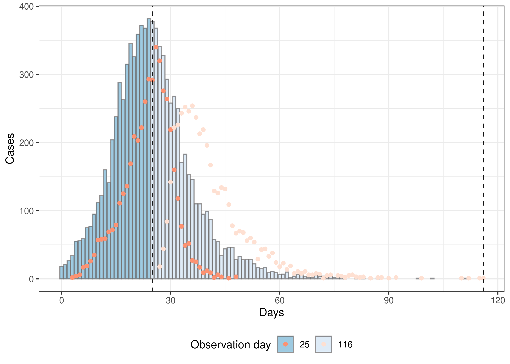
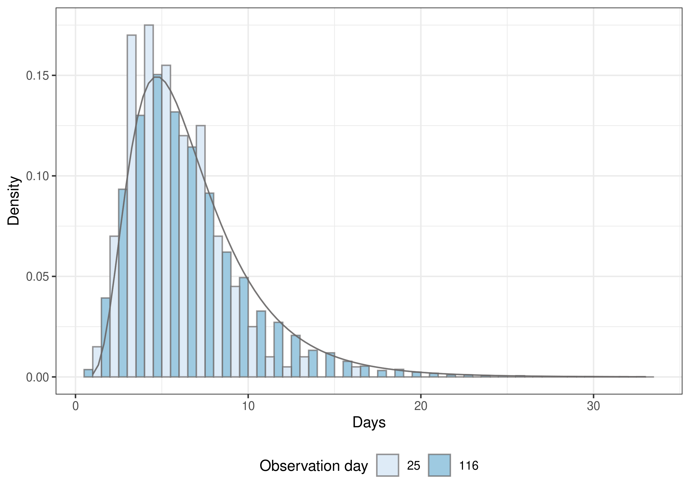
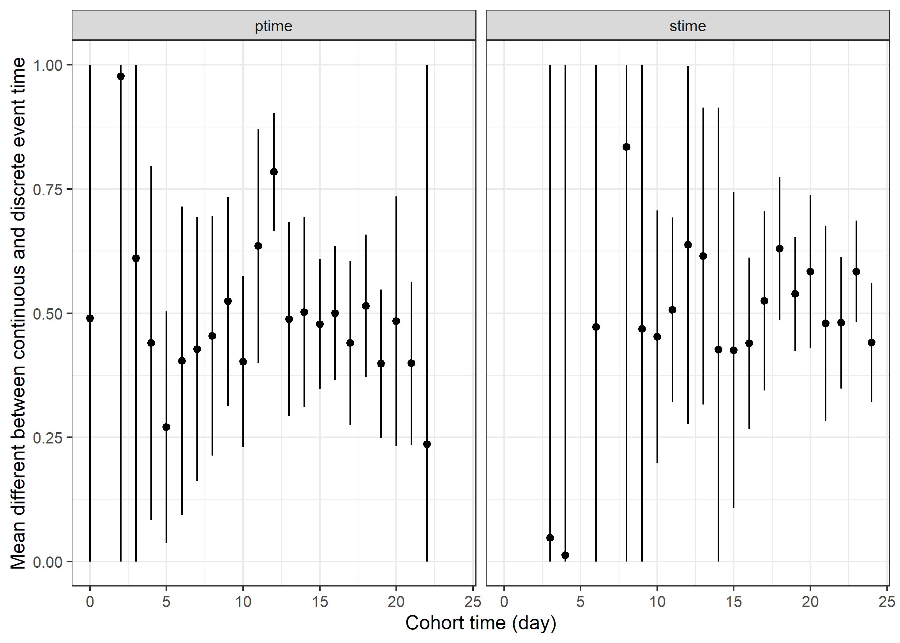
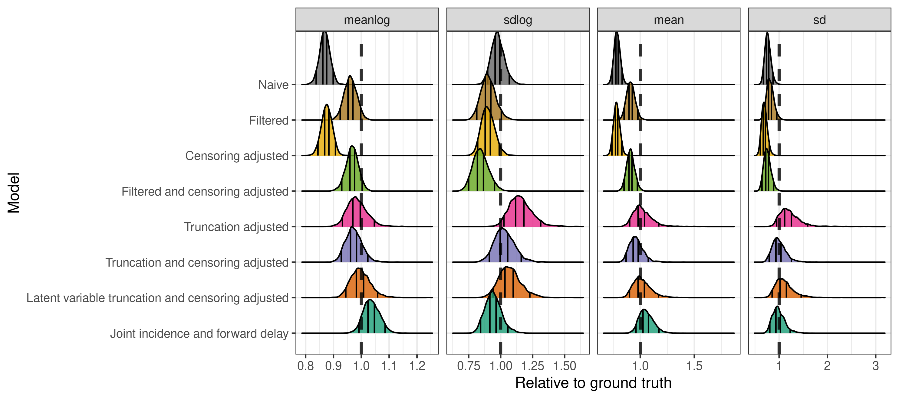
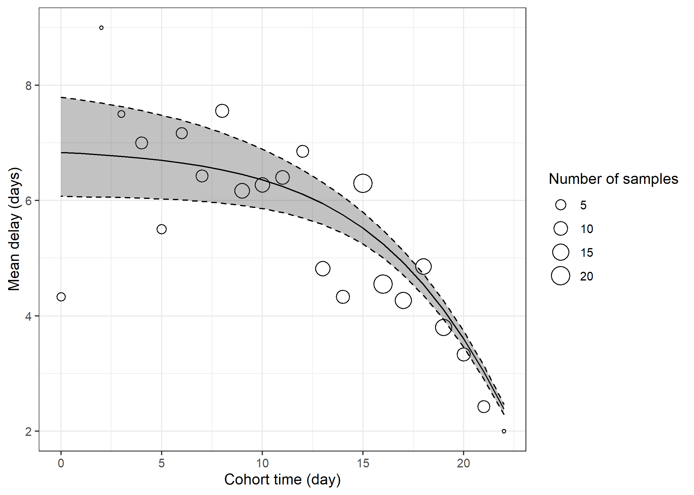

# Adjusting for common biases in infectious disease data when estimating distributions.

## A simple example

First load our analysis (from GitHub or locally using
`devtools::load_all()`) package and other required packages.

``` r
library(dynamicaltruncation)
library(data.table)
library(purrr)
library(ggplot2)
```

### Simulate the data

Simulate data from an outbreak.

``` r
outbreak <- simulate_gillespie(seed = 101)
```

Define the secondary distribution to use in the simulation

``` r
secondary_dist <- data.table(
  meanlog = 1.8, sdlog = 0.5
) |>
  add_natural_scale_mean_sd()
```

Simulate an observation process during the growth phase for a secondary
event using a lognormal distribution, and finally simulate observing
this event.

``` r
obs <- outbreak |>
  simulate_secondary(
    meanlog = secondary_dist$meanlog[[1]],
    sdlog = secondary_dist$sdlog[[1]]
  ) |>
  observe_process()
```

Observe the outbreak after 25 days and take 100 samples.

``` r
truncated_obs <- obs |>
  filter_obs_by_obs_time(obs_time = 25) |>
  DT(sample(1:.N, 200, replace = FALSE))
```

Plot primary cases (columns), and secondary cases (dots) by the
observation time of their secondary events. This reflects would could be
observed in real-time.

``` r
truncated_cases <- construct_cases_by_obs_window(
  obs, windows = c(25), obs_type = "stime"
)

plot_cases_by_obs_window(truncated_cases)
```



We can alternatively plot the observed data based on primary events.
This corresponds to a retrospective cohort based view of the data.

``` r
truncated_cases <- construct_cases_by_obs_window(
  obs, windows = c(25), obs_type = "ptime"
)

plot_cases_by_obs_window(truncated_cases)
```



Plot the true continuous delay distribution and the empirical observed
distribution for each observation window.

``` r
combined_obs <- combine_obs(truncated_obs, obs)

plot_empirical_delay(
  combined_obs, meanlog = secondary_dist$meanlog[[1]],
  sdlog = secondary_dist$sdlog[[1]]
)
```



Plot the mean difference between continuous and discrete event time:

``` r
censor_delay <- calculate_censor_delay(truncated_obs)
plot_censor_delay(censor_delay)
```



### Models

First fit a naive lognormal model with no adjustment.

``` r
naive_fit <- naive_delay(data = truncated_obs, cores = 4, refresh = 0)
#> Running MCMC with 4 parallel chains...
#> 
#> Chain 1 finished in 0.2 seconds.
#> Chain 2 finished in 0.2 seconds.
#> Chain 3 finished in 0.1 seconds.
#> Chain 4 finished in 0.1 seconds.
#> 
#> All 4 chains finished successfully.
#> Mean chain execution time: 0.1 seconds.
#> Total execution time: 0.3 seconds.
```

Estimate the delay after filtering out the most recent data as crude
adjustement for right truncation.

``` r
filtered_fit <- filtered_naive_delay(
  data = truncated_obs, cores = 4, refresh = 0
)
#> Running MCMC with 4 parallel chains...
#> 
#> Chain 1 finished in 0.1 seconds.
#> Chain 2 finished in 0.1 seconds.
#> Chain 3 finished in 0.1 seconds.
#> Chain 4 finished in 0.1 seconds.
#> 
#> All 4 chains finished successfully.
#> Mean chain execution time: 0.1 seconds.
#> Total execution time: 0.2 seconds.
```

Adjust for date censoring.

``` r
censored_fit <- censoring_adjusted_delay(
  data = truncated_obs, cores = 4, refresh = 0
)
#> Running MCMC with 4 parallel chains...
#> 
#> Chain 1 finished in 0.5 seconds.
#> Chain 2 finished in 0.6 seconds.
#> Chain 4 finished in 0.5 seconds.
#> Chain 3 finished in 0.6 seconds.
#> 
#> All 4 chains finished successfully.
#> Mean chain execution time: 0.6 seconds.
#> Total execution time: 0.8 seconds.
```

Adjust for censoring and filter to crudely adjust for right truncation.

``` r
filtered_censored_fit <- filtered_censoring_adjusted_delay(
  data = truncated_obs, cores = 4, refresh = 0
)
#> Running MCMC with 4 parallel chains...
#> 
#> Chain 1 finished in 0.4 seconds.
#> Chain 2 finished in 0.3 seconds.
#> Chain 3 finished in 0.3 seconds.
#> Chain 4 finished in 0.3 seconds.
#> 
#> All 4 chains finished successfully.
#> Mean chain execution time: 0.3 seconds.
#> Total execution time: 0.4 seconds.
```

Adjust for right truncation.

``` r
truncation_fit <- truncation_adjusted_delay(
  data = truncated_obs, cores = 4, refresh = 0
)
#> Running MCMC with 4 parallel chains...
#> 
#> Chain 1 finished in 0.7 seconds.
#> Chain 2 finished in 0.8 seconds.
#> Chain 3 finished in 0.8 seconds.
#> Chain 4 finished in 0.7 seconds.
#> 
#> All 4 chains finished successfully.
#> Mean chain execution time: 0.7 seconds.
#> Total execution time: 0.8 seconds.
```

Adjust for right truncation and date censoring.

``` r
truncation_censoring_fit <- truncation_censoring_adjusted_delay(
  data = truncated_obs, cores = 4, refresh = 0
)
#> Running MCMC with 4 parallel chains...
#> 
#> Chain 1 finished in 1.0 seconds.
#> Chain 2 finished in 1.0 seconds.
#> Chain 3 finished in 1.0 seconds.
#> Chain 4 finished in 1.1 seconds.
#> 
#> All 4 chains finished successfully.
#> Mean chain execution time: 1.0 seconds.
#> Total execution time: 1.3 seconds.
```

Adjust for right truncation and date censoring using a latent variable
approach.

``` r
latent_truncation_censoring_fit <- latent_truncation_censoring_adjusted_delay(
  data = truncated_obs, cores = 4, refresh = 0
)
#> Running MCMC with 4 parallel chains...
#> 
#> Chain 1 finished in 3.4 seconds.
#> Chain 2 finished in 3.4 seconds.
#> Chain 3 finished in 3.4 seconds.
#> Chain 4 finished in 3.3 seconds.
#> 
#> All 4 chains finished successfully.
#> Mean chain execution time: 3.4 seconds.
#> Total execution time: 3.5 seconds.
```

Fit a joint model to estimate primary incidence and the delay to
reporting secondary incidence (this is a thin wrapper around the
`epinowcast` package that is not suggested for real-world usage).

``` r
epinowcast_fit <- epinowcast_delay(
  data = truncated_obs, parallel_chains = 4, adapt_delta = 0.95,
  show_messages = FALSE, refresh = 0
)
#> Running MCMC with 4 parallel chains...
#> 
#> Chain 4 finished in 9.4 seconds.
#> Chain 2 finished in 9.6 seconds.
#> Chain 3 finished in 9.5 seconds.
#> Chain 1 finished in 9.7 seconds.
#> 
#> All 4 chains finished successfully.
#> Mean chain execution time: 9.6 seconds.
#> Total execution time: 9.8 seconds.
epinowcast_draws <- extract_epinowcast_draws(epinowcast_fit) |>
  DT(, model := "Joint incidence and forward delay")
```

### Summarise model posteriors and compare to known truth

Combine models into a named list.

``` r
models <- list(
  "Naive" = naive_fit,
  "Filtered" = filtered_fit,
  "Censoring adjusted" = censored_fit,
  "Filtered and censoring adjusted" = filtered_censored_fit,
  "Truncation adjusted" = truncation_fit,
  "Truncation and censoring adjusted" = truncation_censoring_fit,
  "Latent variable truncation and censoring adjusted" =
    latent_truncation_censoring_fit
)
```

Extract and summarise lognormal posterior estimates.

``` r
draws <- models |>
  map(extract_lognormal_draws) |>
  rbindlist(idcol = "model") |>
  rbind(epinowcast_draws, use.names = TRUE) |>
  DT(,
   model := factor(
    model, levels = c("Joint incidence and forward delay", rev(names(models)))
   )
  )

summarised_draws <- draws |>
  draws_to_long() |>
  summarise_draws(sf = 3)

knitr::kable(summarised_draws[parameter %in% c("meanlog", "sdlog")])
```

| model                                             | parameter |  mean | median |  q2.5 |    q5 |   q20 |   q35 |   q65 |   q80 |   q95 | q97.5 |
| :------------------------------------------------ | :-------- | ----: | -----: | ----: | ----: | ----: | ----: | ----: | ----: | ----: | ----: |
| Naive                                             | meanlog   | 1.560 |  1.560 | 1.500 | 1.510 | 1.540 | 1.550 | 1.580 | 1.590 | 1.620 | 1.630 |
| Filtered                                          | meanlog   | 1.730 |  1.730 | 1.650 | 1.660 | 1.700 | 1.710 | 1.750 | 1.770 | 1.800 | 1.810 |
| Censoring adjusted                                | meanlog   | 1.580 |  1.580 | 1.510 | 1.520 | 1.550 | 1.560 | 1.590 | 1.610 | 1.630 | 1.640 |
| Filtered and censoring adjusted                   | meanlog   | 1.740 |  1.740 | 1.660 | 1.670 | 1.710 | 1.730 | 1.760 | 1.770 | 1.810 | 1.820 |
| Truncation adjusted                               | meanlog   | 1.770 |  1.770 | 1.660 | 1.680 | 1.720 | 1.750 | 1.790 | 1.820 | 1.880 | 1.910 |
| Truncation and censoring adjusted                 | meanlog   | 1.750 |  1.750 | 1.660 | 1.670 | 1.710 | 1.730 | 1.770 | 1.790 | 1.840 | 1.860 |
| Latent variable truncation and censoring adjusted | meanlog   | 1.790 |  1.790 | 1.680 | 1.700 | 1.740 | 1.770 | 1.810 | 1.840 | 1.910 | 1.940 |
| Joint incidence and forward delay                 | meanlog   | 1.870 |  1.860 | 1.770 | 1.780 | 1.820 | 1.840 | 1.880 | 1.910 | 1.950 | 1.970 |
| Naive                                             | sdlog     | 0.489 |  0.487 | 0.441 | 0.449 | 0.467 | 0.478 | 0.497 | 0.510 | 0.534 | 0.544 |
| Filtered                                          | sdlog     | 0.452 |  0.450 | 0.398 | 0.407 | 0.427 | 0.440 | 0.461 | 0.475 | 0.503 | 0.513 |
| Censoring adjusted                                | sdlog     | 0.450 |  0.449 | 0.404 | 0.410 | 0.428 | 0.439 | 0.460 | 0.472 | 0.494 | 0.506 |
| Filtered and censoring adjusted                   | sdlog     | 0.422 |  0.421 | 0.367 | 0.375 | 0.396 | 0.409 | 0.433 | 0.448 | 0.476 | 0.486 |
| Truncation adjusted                               | sdlog     | 0.578 |  0.574 | 0.503 | 0.513 | 0.540 | 0.559 | 0.591 | 0.613 | 0.656 | 0.676 |
| Truncation and censoring adjusted                 | sdlog     | 0.515 |  0.512 | 0.445 | 0.456 | 0.482 | 0.498 | 0.527 | 0.547 | 0.580 | 0.599 |
| Latent variable truncation and censoring adjusted | sdlog     | 0.536 |  0.533 | 0.460 | 0.470 | 0.500 | 0.517 | 0.549 | 0.569 | 0.614 | 0.630 |
| Joint incidence and forward delay                 | sdlog     | 0.471 |  0.469 | 0.415 | 0.422 | 0.444 | 0.458 | 0.482 | 0.497 | 0.528 | 0.543 |

Plot summarised posterior estimates from each model compared to the
ground truth.

``` r
draws |>
  draws_to_long() |>
  make_relative_to_truth(draws_to_long(secondary_dist)) |>
  plot_relative_recovery(y = model, fill = model) +
  facet_wrap(vars(parameter), nrow = 1, scales = "free_x") +
  scale_fill_brewer(palette = "Dark2") +
  guides(fill = guide_none()) +
  labs(
    y = "Model", x = "Relative to ground truth"
  )
```



Finally, check the mean posterior predictions for each model against the
observed daily cohort mean.

``` r
truncated_draws <- draws |>
  calculate_truncated_means(
    obs_at = max(truncated_obs$stime_daily),
    ptime = range(truncated_obs$ptime_daily)
  ) |>
  summarise_variable(variable = "trunc_mean", by = c("obs_horizon", "model")) |>
  DT(, model := factor(
      model, levels = c("Joint incidence and forward delay", rev(names(models)))
    )
  )

truncated_draws |>
  plot_mean_posterior_pred(
    truncated_obs |>
      calculate_cohort_mean(
        type = "cohort", obs_at = max(truncated_obs$stime_daily)
      ),
    col = model, fill = model, mean = TRUE, ribbon = TRUE
  ) +
  guides(
    fill = guide_legend(title = "Model", nrow = 4),
    col = guide_legend(title = "Model", nrow = 4)
  ) +
  scale_fill_brewer(palette = "Dark2", aesthetics = c("fill", "colour")) +
  theme(legend.direction = "vertical")
```



## Analyses

This analysis in this repository has been implemented using the
[`targets`](https://docs.ropensci.org/targets/) package and associated
packages. The workflow is defined in
[`_targets.md`](https://github.com/parksw3/dynamicaltruncation/blob/main/_targets.md)
and can be explored interactively using
[`_targets.Rmd`](https://github.com/parksw3/dynamicaltruncation/blob/main/_targets.Rmd)
`Rmarkdown` document. The workflow can be visualised as the following
graph.

This complete analysis can be recreated using the following (note this
may take quite some time even with a fairly large amount of available
compute),

``` bash
bash bin/update-targets.sh
```

Alternative the following `targets` functions may be used to
interactively explore the workflow:

  - Run the workflow sequentially.

<!-- end list -->

``` r
targets::tar_make()
```

  - Run the workflow using all available workers.

<!-- end list -->

``` r
targets::tar_make_future(workers = future::availableCores())
```

  - Explore a graph of the workflow.

<!-- end list -->

``` r
targets::tar_visnetwork(targets_only = TRUE)
```

Watch the workflow as it runs in a `shiny` app.

``` r
targets::tar_watch(targets_only = TRUE)
```

To use our archived version of the interim results (and so avoid long
run times) use the following to download it. Note that this process has
not been rigorously tested across environments and so may not work
seamlessly).

``` r
source(here::here("R", "targets-archive.R"))
get_targets_archive()
```
