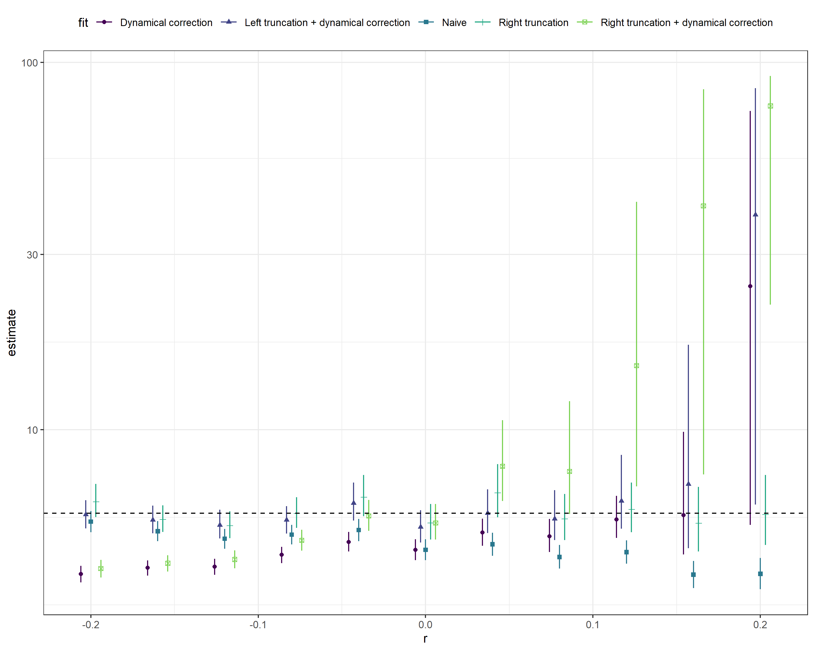

# Adjusting for common biases in infectious disease data when estimating distributions.

## Methods

Our goal is to estimate $f_s(\tau)$, where $s$ represents cohort time
(i.e., the timing of the primaruy event), from truncated data. Five
fits: \* Naive: $f_s(\tau)$ \* Right truncation:
$f_s(\tau)/F_s(t_{max}-s)$ \* Dynamical correction:
$b(\tau) = \exp(-r\tau) f_s(\tau)/(\int \exp(-r\tau) f_s(\tau) d\tau)$.
This is a bit trickier to fit because we have to do some integration.
Instead, we fit a lognormal distribution that represents $b(\tau)$ and
calculate $f_s(\tau)$ after the fit for each posterior sample. \* Right
truncation+dynamical correction: $b(\tau)/B(t_{max}-s)$ \* Left
trunction+dynamical correction: $b(\tau)/B(s-t_{min})$. Again, we fit a
single lognormal distribution with left truncation and then correct for
underlying dynamics after the fit

## Results

<!-- -->

- Naive fits are not too bad for $r < 0$ because not much right
  truncation
- Dynamical correction alone is not so good for $r < 0$ because we’re
  missing left truncation (because we’re starting from high incidence at
  $t=0$ and neglecting infections starting $t < 0$)
- Right truncation is good
- Right truncation + dynamical correction overcompensates and goes crazy
- Left truncation + dynamical correction is as good as right truncation
  but starts to give super wide CIs for high $r$ values. Need to check
  integration step.

<!-- -->

- Doubly censored likelihood performs just as well as if we knew exact
  time points
- Couldn’t try negative binomial with truncation because it takes
  forever

## Flow

Makefile currently doesn’t work because I had to switch to my Windows pc
to run brms. I’m saving rda files to the rdacache directory so that I
can move between machines (which you don’t need to update)…

- `param.R` sets parameters
- `data_exponential.R` generates data
- `fit_exponential.R` performs fits
- `figure_exponential.R` generates the main figure

## A simple example

First load required packages and functions.

``` r
library(data.table)
library(purrr, quietly = TRUE)
library(here)
library(brms)
functions <- list.files(here("R"), full.names = TRUE)
walk(functions, source)
```

Now simulate data from an outbreak, simulate an observation process for
a secondary event using a lognormal distribution, and finally simulate
observing this event.

``` r
truncated_obs <- simulate_uniform_cases(sample_size = 1000, t = 60) |>
  simulate_secondary(
    meanlog = 1.8,
    sdlog = 0.3
  ) |>
  observe_process() |>
  filter_obs_by_obs_time(obs_time = 45)
```

First fit a naive lognormal model with no adjustment.

``` r
naive_fit <- naive_delay(data = truncated_obs, cores = 4, refresh = 0)
#> Running MCMC with 4 parallel chains...
#> 
#> Chain 1 finished in 0.4 seconds.
#> Chain 2 finished in 0.4 seconds.
#> Chain 3 finished in 0.4 seconds.
#> Chain 4 finished in 0.5 seconds.
#> 
#> All 4 chains finished successfully.
#> Mean chain execution time: 0.4 seconds.
#> Total execution time: 0.8 seconds.
summary(naive_fit)
#>  Family: lognormal 
#>   Links: mu = identity; sigma = log 
#> Formula: delay_daily ~ 1 
#>          sigma ~ 1
#>    Data: data (Number of observations: 308) 
#>   Draws: 4 chains, each with iter = 2000; warmup = 1000; thin = 1;
#>          total post-warmup draws = 4000
#> 
#> Population-Level Effects: 
#>                 Estimate Est.Error l-95% CI u-95% CI Rhat Bulk_ESS Tail_ESS
#> Intercept           1.69      0.02     1.66     1.73 1.00     3559     2885
#> sigma_Intercept    -1.12      0.04    -1.20    -1.04 1.00     3591     2685
#> 
#> Draws were sampled using sample(hmc). For each parameter, Bulk_ESS
#> and Tail_ESS are effective sample size measures, and Rhat is the potential
#> scale reduction factor on split chains (at convergence, Rhat = 1).
```

Adjust for date censoring.

``` r
censored_fit <- censoring_adjusted_delay(
  data = truncated_obs, cores = 4, refresh = 0
)
#> Running MCMC with 4 parallel chains...
#> 
#> Chain 2 finished in 1.5 seconds.
#> Chain 3 finished in 1.5 seconds.
#> Chain 1 finished in 1.6 seconds.
#> Chain 4 finished in 1.5 seconds.
#> 
#> All 4 chains finished successfully.
#> Mean chain execution time: 1.5 seconds.
#> Total execution time: 1.7 seconds.
summary(censored_fit)
#>  Family: lognormal 
#>   Links: mu = identity; sigma = log 
#> Formula: delay_lwr | cens(censored, delay_upr) ~ 1 
#>          sigma ~ 1
#>    Data: data (Number of observations: 308) 
#>   Draws: 4 chains, each with iter = 2000; warmup = 1000; thin = 1;
#>          total post-warmup draws = 4000
#> 
#> Population-Level Effects: 
#>                 Estimate Est.Error l-95% CI u-95% CI Rhat Bulk_ESS Tail_ESS
#> Intercept           1.70      0.02     1.66     1.74 1.00     3378     2640
#> sigma_Intercept    -1.19      0.05    -1.28    -1.09 1.00     3136     2372
#> 
#> Draws were sampled using sample(hmc). For each parameter, Bulk_ESS
#> and Tail_ESS are effective sample size measures, and Rhat is the potential
#> scale reduction factor on split chains (at convergence, Rhat = 1).
```

Adjust for right truncation.

``` r
truncation_fit <- truncation_adjusted_delay(
  data = truncated_obs, cores = 4, refresh = 0
)
#> Running MCMC with 4 parallel chains...
#> 
#> Chain 1 finished in 1.4 seconds.
#> Chain 2 finished in 1.4 seconds.
#> Chain 3 finished in 1.4 seconds.
#> Chain 4 finished in 1.6 seconds.
#> 
#> All 4 chains finished successfully.
#> Mean chain execution time: 1.5 seconds.
#> Total execution time: 1.7 seconds.
summary(truncation_fit)
#>  Family: lognormal 
#>   Links: mu = identity; sigma = log 
#> Formula: delay_daily | trunc(lb = 0, ub = censored_obs_time) ~ 1 
#>          sigma ~ 1
#>    Data: data (Number of observations: 308) 
#>   Draws: 4 chains, each with iter = 2000; warmup = 1000; thin = 1;
#>          total post-warmup draws = 4000
#> 
#> Population-Level Effects: 
#>                 Estimate Est.Error l-95% CI u-95% CI Rhat Bulk_ESS Tail_ESS
#> Intercept           1.71      0.02     1.67     1.75 1.00     3664     2772
#> sigma_Intercept    -1.10      0.04    -1.18    -1.02 1.00     3576     2759
#> 
#> Draws were sampled using sample(hmc). For each parameter, Bulk_ESS
#> and Tail_ESS are effective sample size measures, and Rhat is the potential
#> scale reduction factor on split chains (at convergence, Rhat = 1).
```

Adjust for right truncation and date censoring.

``` r
truncation_censoring_fit <- truncation_censoring_adjusted_delay(
  data = truncated_obs, cores = 4, refresh = 0
)
#> Running MCMC with 4 parallel chains...
#> 
#> Chain 3 finished in 2.0 seconds.
#> Chain 1 finished in 2.3 seconds.
#> Chain 2 finished in 2.2 seconds.
#> Chain 4 finished in 2.3 seconds.
#> 
#> All 4 chains finished successfully.
#> Mean chain execution time: 2.2 seconds.
#> Total execution time: 2.5 seconds.
summary(truncation_censoring_fit)
#>  Family: lognormal 
#>   Links: mu = identity; sigma = log 
#> Formula: delay_lwr | cens(censored, delay_upr) + trunc(lb = 0, ub = censored_obs_time) ~ 1 
#>          sigma ~ 1
#>    Data: data (Number of observations: 308) 
#>   Draws: 4 chains, each with iter = 2000; warmup = 1000; thin = 1;
#>          total post-warmup draws = 4000
#> 
#> Population-Level Effects: 
#>                 Estimate Est.Error l-95% CI u-95% CI Rhat Bulk_ESS Tail_ESS
#> Intercept           1.71      0.02     1.67     1.75 1.00     3173     2350
#> sigma_Intercept    -1.17      0.05    -1.26    -1.07 1.00     3188     2921
#> 
#> Draws were sampled using sample(hmc). For each parameter, Bulk_ESS
#> and Tail_ESS are effective sample size measures, and Rhat is the potential
#> scale reduction factor on split chains (at convergence, Rhat = 1).
```

Adjust for right truncation and date censoring using a latent variable
approach.

``` r
latent_truncation_censoring_fit <- latent_truncation_censoring_adjusted_delay(
  data = truncated_obs, cores = 4, refresh = 0
)
#> Running MCMC with 4 parallel chains...
#> 
#> Chain 2 finished in 49.3 seconds.
#> Chain 1 finished in 50.2 seconds.
#> Chain 3 finished in 50.6 seconds.
#> Chain 4 finished in 50.5 seconds.
#> 
#> All 4 chains finished successfully.
#> Mean chain execution time: 50.1 seconds.
#> Total execution time: 50.8 seconds.
summary(latent_truncation_censoring_fit)
#>  Family: latent_lognormal 
#>   Links: mu = identity; sigma = log; pwindow = identity; swindow = identity 
#> Formula: ptime | vreal(stime, obs_at) ~ 1 
#>          sigma ~ 1
#>          pwindow ~ 0 + as.factor(id)
#>          swindow ~ 0 + as.factor(id)
#>    Data: data (Number of observations: 308) 
#>   Draws: 4 chains, each with iter = 2000; warmup = 1000; thin = 1;
#>          total post-warmup draws = 4000
#> 
#> Population-Level Effects: 
#>                        Estimate Est.Error l-95% CI u-95% CI Rhat Bulk_ESS
#> Intercept                  1.79      0.02     1.76     1.82 1.00     5256
#> sigma_Intercept           -1.25      0.04    -1.34    -1.17 1.00     4841
#> pwindow_as.factorid1       0.43      0.27     0.02     0.95 1.00     5681
#> pwindow_as.factorid2       0.43      0.28     0.02     0.96 1.00     4499
#> pwindow_as.factorid3       0.51      0.28     0.03     0.97 1.00     5613
#> pwindow_as.factorid4       0.55      0.28     0.03     0.98 1.00     4789
#> pwindow_as.factorid5       0.41      0.28     0.01     0.96 1.00     4771
#> pwindow_as.factorid6       0.52      0.29     0.02     0.98 1.00     5199
#> pwindow_as.factorid7       0.48      0.28     0.02     0.97 1.00     4767
#> pwindow_as.factorid8       0.52      0.29     0.03     0.97 1.00     4623
#> pwindow_as.factorid9       0.52      0.28     0.03     0.97 1.00     5291
#> pwindow_as.factorid10      0.52      0.29     0.03     0.98 1.00     4599
#> pwindow_as.factorid11      0.56      0.29     0.04     0.98 1.00     5600
#> pwindow_as.factorid12      0.49      0.28     0.03     0.97 1.00     5416
#> pwindow_as.factorid13      0.49      0.29     0.02     0.98 1.00     5622
#> pwindow_as.factorid14      0.49      0.29     0.02     0.98 1.00     4896
#> pwindow_as.factorid15      0.54      0.29     0.03     0.98 1.00     4971
#> pwindow_as.factorid16      0.55      0.29     0.04     0.98 1.00     5481
#> pwindow_as.factorid17      0.40      0.27     0.02     0.95 1.00     5386
#> pwindow_as.factorid18      0.53      0.29     0.03     0.98 1.00     4848
#> pwindow_as.factorid19      0.50      0.29     0.03     0.97 1.00     4283
#> pwindow_as.factorid20      0.51      0.29     0.02     0.98 1.00     3513
#> pwindow_as.factorid21      0.55      0.29     0.03     0.98 1.00     5506
#> pwindow_as.factorid22      0.47      0.28     0.02     0.96 1.00     4978
#> pwindow_as.factorid23      0.54      0.29     0.03     0.98 1.00     4931
#> pwindow_as.factorid24      0.52      0.29     0.03     0.98 1.00     5096
#> pwindow_as.factorid25      0.56      0.28     0.03     0.98 1.00     4976
#> pwindow_as.factorid26      0.49      0.28     0.02     0.97 1.00     5454
#> pwindow_as.factorid27      0.49      0.29     0.03     0.97 1.00     4711
#> pwindow_as.factorid28      0.53      0.29     0.03     0.98 1.00     4010
#> pwindow_as.factorid29      0.55      0.28     0.04     0.98 1.00     6332
#> pwindow_as.factorid30      0.55      0.29     0.04     0.98 1.00     4263
#> pwindow_as.factorid31      0.52      0.29     0.03     0.98 1.00     6043
#> pwindow_as.factorid32      0.50      0.29     0.03     0.98 1.00     5099
#> pwindow_as.factorid33      0.53      0.29     0.03     0.98 1.00     5048
#> pwindow_as.factorid34      0.57      0.28     0.04     0.98 1.00     5832
#> pwindow_as.factorid35      0.54      0.29     0.03     0.98 1.00     5232
#> pwindow_as.factorid36      0.57      0.29     0.03     0.99 1.00     4664
#> pwindow_as.factorid37      0.43      0.28     0.01     0.96 1.00     4449
#> pwindow_as.factorid38      0.50      0.29     0.03     0.98 1.00     6298
#> pwindow_as.factorid39      0.53      0.29     0.02     0.98 1.00     4591
#> pwindow_as.factorid40      0.56      0.28     0.04     0.98 1.00     5876
#> pwindow_as.factorid41      0.45      0.28     0.02     0.96 1.00     5234
#> pwindow_as.factorid42      0.50      0.29     0.03     0.97 1.00     4983
#> pwindow_as.factorid43      0.53      0.29     0.03     0.98 1.00     5271
#> pwindow_as.factorid44      0.46      0.28     0.02     0.97 1.00     6376
#> pwindow_as.factorid45      0.52      0.28     0.03     0.98 1.00     5178
#> pwindow_as.factorid46      0.43      0.28     0.02     0.96 1.00     5557
#> pwindow_as.factorid47      0.43      0.28     0.02     0.96 1.00     4336
#> pwindow_as.factorid48      0.51      0.28     0.03     0.97 1.00     4330
#> pwindow_as.factorid49      0.48      0.28     0.03     0.97 1.00     4641
#> pwindow_as.factorid50      0.54      0.28     0.04     0.98 1.00     5873
#> pwindow_as.factorid51      0.51      0.28     0.03     0.97 1.00     6150
#> pwindow_as.factorid52      0.55      0.29     0.04     0.98 1.00     4971
#> pwindow_as.factorid53      0.52      0.29     0.03     0.97 1.00     5004
#> pwindow_as.factorid54      0.54      0.28     0.04     0.98 1.00     5356
#> pwindow_as.factorid55      0.48      0.29     0.02     0.97 1.00     5208
#> pwindow_as.factorid56      0.53      0.29     0.03     0.98 1.00     4996
#> pwindow_as.factorid57      0.53      0.29     0.04     0.98 1.00     4962
#> pwindow_as.factorid58      0.44      0.28     0.02     0.96 1.00     4431
#> pwindow_as.factorid59      0.48      0.28     0.03     0.97 1.00     4704
#> pwindow_as.factorid60      0.45      0.28     0.02     0.96 1.00     5703
#> pwindow_as.factorid61      0.47      0.28     0.03     0.96 1.00     5704
#> pwindow_as.factorid62      0.47      0.28     0.03     0.96 1.00     4561
#> pwindow_as.factorid63      0.56      0.28     0.05     0.98 1.00     5935
#> pwindow_as.factorid64      0.53      0.29     0.03     0.98 1.00     4985
#> pwindow_as.factorid65      0.52      0.29     0.03     0.98 1.00     4601
#> pwindow_as.factorid66      0.55      0.29     0.03     0.98 1.00     4471
#> pwindow_as.factorid67      0.55      0.28     0.04     0.98 1.00     6759
#> pwindow_as.factorid68      0.42      0.28     0.01     0.95 1.00     5071
#> pwindow_as.factorid69      0.37      0.27     0.01     0.93 1.00     4717
#> pwindow_as.factorid70      0.48      0.28     0.02     0.97 1.00     5840
#> pwindow_as.factorid71      0.53      0.28     0.03     0.98 1.00     4821
#> pwindow_as.factorid72      0.54      0.29     0.03     0.98 1.00     4685
#> pwindow_as.factorid73      0.47      0.28     0.02     0.97 1.00     4423
#> pwindow_as.factorid74      0.43      0.28     0.02     0.95 1.00     5637
#> pwindow_as.factorid75      0.46      0.28     0.02     0.96 1.00     5358
#> pwindow_as.factorid76      0.53      0.29     0.03     0.98 1.00     4721
#> pwindow_as.factorid77      0.51      0.29     0.03     0.98 1.00     5692
#> pwindow_as.factorid78      0.51      0.29     0.03     0.98 1.00     5703
#> pwindow_as.factorid79      0.46      0.28     0.02     0.96 1.00     5058
#> pwindow_as.factorid80      0.51      0.29     0.03     0.98 1.00     5754
#> pwindow_as.factorid81      0.53      0.29     0.03     0.98 1.00     5259
#> pwindow_as.factorid82      0.53      0.29     0.02     0.98 1.00     4174
#> pwindow_as.factorid83      0.44      0.28     0.02     0.96 1.00     5187
#> pwindow_as.factorid84      0.51      0.29     0.03     0.97 1.00     5680
#> pwindow_as.factorid85      0.56      0.29     0.03     0.98 1.00     5251
#> pwindow_as.factorid86      0.54      0.29     0.03     0.98 1.00     4779
#> pwindow_as.factorid87      0.46      0.28     0.02     0.97 1.00     4520
#> pwindow_as.factorid88      0.56      0.29     0.04     0.99 1.00     5445
#> pwindow_as.factorid89      0.56      0.28     0.04     0.98 1.00     5528
#> pwindow_as.factorid90      0.53      0.29     0.03     0.97 1.00     4419
#> pwindow_as.factorid91      0.53      0.28     0.04     0.97 1.00     5043
#> pwindow_as.factorid92      0.49      0.28     0.03     0.97 1.00     5209
#> pwindow_as.factorid93      0.48      0.29     0.02     0.97 1.00     4629
#> pwindow_as.factorid94      0.54      0.29     0.03     0.99 1.00     4590
#> pwindow_as.factorid95      0.54      0.28     0.03     0.99 1.00     5096
#> pwindow_as.factorid96      0.55      0.28     0.03     0.98 1.00     5095
#> pwindow_as.factorid97      0.50      0.28     0.03     0.97 1.00     5646
#> pwindow_as.factorid98      0.51      0.29     0.03     0.97 1.00     4917
#> pwindow_as.factorid99      0.50      0.29     0.02     0.98 1.00     5860
#> pwindow_as.factorid100     0.39      0.27     0.02     0.93 1.00     5006
#> pwindow_as.factorid101     0.56      0.29     0.04     0.98 1.00     5240
#> pwindow_as.factorid102     0.55      0.29     0.03     0.98 1.00     5932
#> pwindow_as.factorid103     0.47      0.29     0.02     0.97 1.00     5152
#> pwindow_as.factorid104     0.50      0.28     0.03     0.97 1.00     5366
#> pwindow_as.factorid105     0.52      0.28     0.03     0.98 1.00     5660
#> pwindow_as.factorid106     0.39      0.27     0.02     0.94 1.00     5178
#> pwindow_as.factorid107     0.37      0.27     0.01     0.93 1.00     5117
#> pwindow_as.factorid108     0.50      0.29     0.02     0.98 1.00     5664
#> pwindow_as.factorid109     0.49      0.28     0.03     0.97 1.00     5687
#> pwindow_as.factorid110     0.51      0.29     0.03     0.97 1.00     4966
#> pwindow_as.factorid111     0.53      0.29     0.03     0.98 1.00     5768
#> pwindow_as.factorid112     0.49      0.29     0.02     0.97 1.00     4987
#> pwindow_as.factorid113     0.56      0.28     0.04     0.98 1.00     5088
#> pwindow_as.factorid114     0.49      0.29     0.03     0.97 1.00     4383
#> pwindow_as.factorid115     0.45      0.29     0.02     0.97 1.01     5865
#> pwindow_as.factorid116     0.53      0.29     0.03     0.98 1.00     4680
#> pwindow_as.factorid117     0.42      0.28     0.02     0.94 1.00     3816
#> pwindow_as.factorid118     0.55      0.29     0.03     0.98 1.00     4625
#> pwindow_as.factorid119     0.50      0.29     0.03     0.97 1.00     4838
#> pwindow_as.factorid120     0.55      0.29     0.03     0.98 1.00     5736
#> pwindow_as.factorid121     0.55      0.29     0.04     0.98 1.00     5826
#> pwindow_as.factorid122     0.44      0.28     0.02     0.97 1.00     4706
#> pwindow_as.factorid123     0.53      0.29     0.03     0.98 1.01     5174
#> pwindow_as.factorid124     0.54      0.29     0.03     0.98 1.00     4352
#> pwindow_as.factorid125     0.52      0.29     0.03     0.98 1.00     5235
#> pwindow_as.factorid126     0.50      0.29     0.03     0.98 1.00     4090
#> pwindow_as.factorid127     0.53      0.28     0.03     0.98 1.00     5272
#> pwindow_as.factorid128     0.49      0.29     0.03     0.98 1.00     5045
#> pwindow_as.factorid129     0.50      0.29     0.03     0.97 1.00     3716
#> pwindow_as.factorid130     0.50      0.28     0.03     0.97 1.00     4539
#> pwindow_as.factorid131     0.48      0.29     0.02     0.97 1.00     5068
#> pwindow_as.factorid132     0.47      0.28     0.02     0.97 1.00     4714
#> pwindow_as.factorid133     0.55      0.29     0.04     0.98 1.00     4498
#> pwindow_as.factorid134     0.51      0.29     0.03     0.98 1.00     4429
#> pwindow_as.factorid135     0.38      0.27     0.02     0.93 1.00     5108
#> pwindow_as.factorid136     0.53      0.28     0.03     0.98 1.00     4843
#> pwindow_as.factorid137     0.47      0.29     0.02     0.97 1.00     4529
#> pwindow_as.factorid138     0.46      0.29     0.02     0.97 1.00     4771
#> pwindow_as.factorid139     0.54      0.29     0.03     0.98 1.00     5237
#> pwindow_as.factorid140     0.53      0.28     0.03     0.98 1.00     5724
#> pwindow_as.factorid141     0.49      0.28     0.03     0.97 1.00     5003
#> pwindow_as.factorid142     0.47      0.28     0.02     0.97 1.00     5795
#> pwindow_as.factorid143     0.48      0.29     0.03     0.97 1.00     4392
#> pwindow_as.factorid144     0.53      0.28     0.03     0.98 1.00     5176
#> pwindow_as.factorid145     0.56      0.28     0.04     0.98 1.00     5126
#> pwindow_as.factorid146     0.49      0.29     0.03     0.98 1.00     5080
#> pwindow_as.factorid147     0.40      0.27     0.02     0.95 1.00     5324
#> pwindow_as.factorid148     0.52      0.29     0.03     0.98 1.00     4886
#> pwindow_as.factorid149     0.45      0.28     0.02     0.96 1.00     5232
#> pwindow_as.factorid150     0.48      0.29     0.03     0.97 1.00     5758
#> pwindow_as.factorid151     0.50      0.29     0.02     0.97 1.01     4854
#> pwindow_as.factorid152     0.53      0.28     0.03     0.98 1.00     4635
#> pwindow_as.factorid153     0.56      0.29     0.03     0.98 1.00     4605
#> pwindow_as.factorid154     0.42      0.28     0.02     0.96 1.00     5271
#> pwindow_as.factorid155     0.52      0.29     0.03     0.98 1.00     5199
#> pwindow_as.factorid156     0.49      0.29     0.02     0.98 1.00     5216
#> pwindow_as.factorid157     0.54      0.29     0.03     0.98 1.00     4953
#> pwindow_as.factorid158     0.46      0.28     0.02     0.97 1.00     5027
#> pwindow_as.factorid159     0.48      0.29     0.03     0.97 1.00     5309
#> pwindow_as.factorid160     0.54      0.29     0.03     0.98 1.00     5528
#> pwindow_as.factorid161     0.55      0.28     0.03     0.98 1.00     5376
#> pwindow_as.factorid162     0.49      0.29     0.03     0.97 1.01     5871
#> pwindow_as.factorid163     0.54      0.28     0.03     0.98 1.00     5012
#> pwindow_as.factorid164     0.54      0.29     0.03     0.98 1.01     5001
#> pwindow_as.factorid165     0.43      0.27     0.02     0.94 1.00     5289
#> pwindow_as.factorid166     0.52      0.29     0.03     0.97 1.00     5590
#> pwindow_as.factorid167     0.46      0.28     0.03     0.97 1.00     5216
#> pwindow_as.factorid168     0.57      0.28     0.04     0.98 1.00     5347
#> pwindow_as.factorid169     0.52      0.29     0.03     0.98 1.00     4604
#> pwindow_as.factorid170     0.51      0.29     0.03     0.98 1.00     3894
#> pwindow_as.factorid171     0.53      0.29     0.04     0.98 1.00     6141
#> pwindow_as.factorid172     0.49      0.28     0.03     0.97 1.00     4611
#> pwindow_as.factorid173     0.56      0.29     0.03     0.98 1.00     4752
#> pwindow_as.factorid174     0.44      0.29     0.02     0.96 1.00     4327
#> pwindow_as.factorid175     0.55      0.28     0.04     0.98 1.00     6005
#> pwindow_as.factorid176     0.56      0.29     0.04     0.98 1.00     5937
#> pwindow_as.factorid177     0.53      0.29     0.03     0.98 1.00     4153
#> pwindow_as.factorid178     0.53      0.28     0.03     0.98 1.00     5476
#> pwindow_as.factorid179     0.37      0.26     0.02     0.93 1.00     4471
#> pwindow_as.factorid180     0.28      0.23     0.01     0.85 1.00     4323
#> pwindow_as.factorid181     0.54      0.28     0.04     0.98 1.00     5052
#> pwindow_as.factorid182     0.46      0.28     0.02     0.97 1.01     4745
#> pwindow_as.factorid183     0.50      0.29     0.02     0.98 1.00     4122
#> pwindow_as.factorid184     0.51      0.29     0.03     0.98 1.00     5743
#> pwindow_as.factorid185     0.50      0.29     0.02     0.98 1.00     4400
#> pwindow_as.factorid186     0.54      0.28     0.03     0.97 1.00     5172
#> pwindow_as.factorid187     0.54      0.28     0.03     0.98 1.00     5525
#> pwindow_as.factorid188     0.42      0.28     0.02     0.96 1.00     5436
#> pwindow_as.factorid189     0.39      0.27     0.01     0.94 1.00     4647
#> pwindow_as.factorid190     0.47      0.28     0.02     0.97 1.00     5218
#> pwindow_as.factorid191     0.55      0.28     0.04     0.98 1.00     5337
#> pwindow_as.factorid192     0.53      0.29     0.03     0.98 1.00     5301
#> pwindow_as.factorid193     0.40      0.27     0.01     0.94 1.00     3955
#> pwindow_as.factorid194     0.52      0.29     0.03     0.98 1.00     4752
#> pwindow_as.factorid195     0.54      0.29     0.04     0.98 1.00     5812
#> pwindow_as.factorid196     0.46      0.28     0.02     0.97 1.00     4096
#> pwindow_as.factorid197     0.52      0.28     0.03     0.98 1.00     5102
#> pwindow_as.factorid198     0.48      0.29     0.03     0.97 1.00     4994
#> pwindow_as.factorid199     0.37      0.26     0.01     0.93 1.00     4883
#> pwindow_as.factorid200     0.53      0.28     0.04     0.98 1.00     5316
#> pwindow_as.factorid201     0.39      0.27     0.02     0.93 1.00     5728
#> pwindow_as.factorid202     0.52      0.29     0.03     0.98 1.00     4526
#> pwindow_as.factorid203     0.50      0.29     0.03     0.97 1.00     5121
#> pwindow_as.factorid204     0.48      0.28     0.03     0.97 1.00     4669
#> pwindow_as.factorid205     0.50      0.28     0.03     0.97 1.00     6004
#> pwindow_as.factorid206     0.53      0.28     0.03     0.98 1.00     5079
#> pwindow_as.factorid207     0.50      0.29     0.02     0.98 1.00     5090
#> pwindow_as.factorid208     0.53      0.29     0.03     0.98 1.00     4793
#> pwindow_as.factorid209     0.50      0.29     0.03     0.98 1.00     4662
#> pwindow_as.factorid210     0.51      0.28     0.03     0.98 1.00     5497
#> pwindow_as.factorid211     0.56      0.28     0.04     0.98 1.00     5541
#> pwindow_as.factorid212     0.46      0.29     0.02     0.97 1.00     4318
#> pwindow_as.factorid213     0.52      0.29     0.03     0.98 1.00     5321
#> pwindow_as.factorid214     0.49      0.29     0.02     0.97 1.00     4764
#> pwindow_as.factorid215     0.54      0.29     0.03     0.98 1.00     6161
#> pwindow_as.factorid216     0.51      0.29     0.02     0.98 1.00     3576
#> pwindow_as.factorid217     0.53      0.28     0.04     0.97 1.00     4640
#> pwindow_as.factorid218     0.56      0.29     0.03     0.98 1.00     4013
#> pwindow_as.factorid219     0.43      0.28     0.02     0.96 1.00     4335
#> pwindow_as.factorid220     0.45      0.28     0.02     0.97 1.00     4868
#> pwindow_as.factorid221     0.54      0.29     0.03     0.98 1.00     4252
#> pwindow_as.factorid222     0.51      0.29     0.03     0.98 1.00     4605
#> pwindow_as.factorid223     0.56      0.28     0.04     0.98 1.00     4501
#> pwindow_as.factorid224     0.57      0.29     0.04     0.98 1.00     5295
#> pwindow_as.factorid225     0.50      0.29     0.02     0.97 1.00     5389
#> pwindow_as.factorid226     0.51      0.29     0.02     0.98 1.00     5045
#> pwindow_as.factorid227     0.52      0.29     0.03     0.98 1.00     5228
#> pwindow_as.factorid228     0.32      0.24     0.01     0.89 1.00     4393
#> pwindow_as.factorid229     0.54      0.28     0.03     0.98 1.00     4877
#> pwindow_as.factorid230     0.38      0.27     0.01     0.94 1.01     4982
#> pwindow_as.factorid231     0.56      0.28     0.04     0.98 1.00     5779
#> pwindow_as.factorid232     0.55      0.28     0.04     0.98 1.00     5931
#> pwindow_as.factorid233     0.56      0.28     0.03     0.98 1.00     4491
#> pwindow_as.factorid234     0.51      0.29     0.03     0.98 1.00     5702
#> pwindow_as.factorid235     0.45      0.28     0.02     0.96 1.00     4977
#> pwindow_as.factorid236     0.47      0.29     0.02     0.97 1.00     4524
#> pwindow_as.factorid237     0.35      0.26     0.01     0.94 1.00     4105
#> pwindow_as.factorid238     0.54      0.28     0.04     0.98 1.00     4901
#> pwindow_as.factorid239     0.57      0.28     0.04     0.98 1.00     5387
#> pwindow_as.factorid240     0.55      0.28     0.05     0.98 1.01     6087
#> pwindow_as.factorid241     0.44      0.28     0.02     0.96 1.00     5436
#> pwindow_as.factorid242     0.49      0.29     0.02     0.98 1.00     5483
#> pwindow_as.factorid243     0.55      0.29     0.03     0.98 1.00     4411
#> pwindow_as.factorid244     0.54      0.29     0.03     0.98 1.00     6185
#> pwindow_as.factorid245     0.55      0.28     0.03     0.98 1.00     5159
#> pwindow_as.factorid246     0.49      0.28     0.02     0.97 1.00     5413
#> pwindow_as.factorid247     0.54      0.28     0.03     0.98 1.00     4941
#> pwindow_as.factorid248     0.52      0.28     0.03     0.98 1.00     3892
#> pwindow_as.factorid249     0.51      0.29     0.03     0.98 1.00     4697
#> pwindow_as.factorid250     0.48      0.29     0.03     0.97 1.00     4976
#> pwindow_as.factorid251     0.51      0.29     0.03     0.98 1.00     4305
#> pwindow_as.factorid252     0.36      0.26     0.01     0.93 1.00     5542
#> pwindow_as.factorid253     0.53      0.29     0.03     0.98 1.00     5424
#> pwindow_as.factorid254     0.50      0.29     0.03     0.98 1.00     6025
#> pwindow_as.factorid255     0.50      0.29     0.03     0.98 1.00     5041
#> pwindow_as.factorid256     0.53      0.29     0.03     0.98 1.00     4354
#> pwindow_as.factorid257     0.44      0.28     0.02     0.96 1.00     5455
#> pwindow_as.factorid258     0.50      0.29     0.02     0.98 1.00     4634
#> pwindow_as.factorid259     0.53      0.28     0.03     0.98 1.00     5366
#> pwindow_as.factorid260     0.46      0.28     0.02     0.96 1.00     4677
#> pwindow_as.factorid261     0.50      0.28     0.03     0.97 1.00     5075
#> pwindow_as.factorid262     0.55      0.29     0.04     0.98 1.00     4818
#> pwindow_as.factorid263     0.44      0.28     0.02     0.96 1.00     4744
#> pwindow_as.factorid264     0.50      0.29     0.03     0.97 1.00     5113
#> pwindow_as.factorid265     0.55      0.29     0.02     0.98 1.00     4086
#> pwindow_as.factorid266     0.48      0.28     0.02     0.97 1.00     4690
#> pwindow_as.factorid267     0.54      0.28     0.03     0.98 1.00     5251
#> pwindow_as.factorid268     0.56      0.28     0.04     0.98 1.00     4668
#> pwindow_as.factorid269     0.44      0.28     0.02     0.96 1.00     4918
#> pwindow_as.factorid270     0.43      0.28     0.02     0.96 1.00     4158
#> pwindow_as.factorid271     0.51      0.29     0.03     0.98 1.00     5457
#> pwindow_as.factorid272     0.51      0.29     0.03     0.98 1.00     3965
#> pwindow_as.factorid273     0.48      0.28     0.03     0.97 1.00     5601
#> pwindow_as.factorid274     0.47      0.29     0.02     0.97 1.00     4566
#> pwindow_as.factorid275     0.51      0.29     0.02     0.98 1.00     4675
#> pwindow_as.factorid276     0.50      0.29     0.02     0.98 1.00     3843
#> pwindow_as.factorid277     0.56      0.28     0.04     0.98 1.00     5065
#> pwindow_as.factorid278     0.49      0.28     0.02     0.97 1.00     4555
#> pwindow_as.factorid279     0.52      0.28     0.03     0.97 1.00     5065
#> pwindow_as.factorid280     0.44      0.28     0.02     0.96 1.00     4128
#> pwindow_as.factorid281     0.55      0.28     0.04     0.98 1.01     5008
#> pwindow_as.factorid282     0.44      0.29     0.02     0.96 1.00     5277
#> pwindow_as.factorid283     0.51      0.29     0.03     0.97 1.00     3822
#> pwindow_as.factorid284     0.54      0.29     0.03     0.98 1.00     5299
#> pwindow_as.factorid285     0.50      0.28     0.03     0.97 1.00     4911
#> pwindow_as.factorid286     0.50      0.28     0.03     0.97 1.00     7061
#> pwindow_as.factorid287     0.53      0.28     0.04     0.97 1.00     4993
#> pwindow_as.factorid288     0.51      0.29     0.03     0.98 1.00     4539
#> pwindow_as.factorid289     0.56      0.28     0.04     0.98 1.00     5888
#> pwindow_as.factorid290     0.51      0.28     0.03     0.97 1.00     5309
#> pwindow_as.factorid291     0.50      0.28     0.03     0.97 1.00     6449
#> pwindow_as.factorid292     0.46      0.28     0.02     0.97 1.00     6078
#> pwindow_as.factorid293     0.51      0.29     0.03     0.97 1.00     4761
#> pwindow_as.factorid294     0.54      0.28     0.03     0.98 1.00     4741
#> pwindow_as.factorid295     0.48      0.28     0.02     0.97 1.00     5283
#> pwindow_as.factorid296     0.52      0.29     0.03     0.98 1.00     4838
#> pwindow_as.factorid297     0.54      0.29     0.04     0.98 1.00     5092
#> pwindow_as.factorid298     0.53      0.29     0.03     0.98 1.00     4799
#> pwindow_as.factorid299     0.52      0.29     0.03     0.98 1.00     4907
#> pwindow_as.factorid300     0.51      0.28     0.03     0.97 1.00     6187
#> pwindow_as.factorid301     0.52      0.28     0.03     0.98 1.00     5484
#> pwindow_as.factorid302     0.48      0.28     0.03     0.97 1.00     4804
#> pwindow_as.factorid303     0.33      0.25     0.01     0.90 1.00     4362
#> pwindow_as.factorid304     0.52      0.29     0.02     0.98 1.00     4018
#> pwindow_as.factorid305     0.50      0.29     0.03     0.97 1.00     4786
#> pwindow_as.factorid306     0.50      0.29     0.02     0.98 1.00     5611
#> pwindow_as.factorid307     0.37      0.26     0.01     0.93 1.00     5784
#> pwindow_as.factorid308     0.53      0.28     0.03     0.98 1.00     4973
#> swindow_as.factorid1       0.57      0.28     0.04     0.99 1.00     5550
#> swindow_as.factorid2       0.57      0.28     0.04     0.98 1.00     4509
#> swindow_as.factorid3       0.49      0.29     0.03     0.97 1.00     5655
#> swindow_as.factorid4       0.45      0.29     0.02     0.97 1.00     4792
#> swindow_as.factorid5       0.60      0.28     0.04     0.99 1.00     4978
#> swindow_as.factorid6       0.48      0.29     0.02     0.97 1.00     5745
#> swindow_as.factorid7       0.52      0.28     0.03     0.98 1.00     4500
#> swindow_as.factorid8       0.48      0.28     0.02     0.97 1.00     5051
#> swindow_as.factorid9       0.49      0.29     0.02     0.97 1.00     5788
#> swindow_as.factorid10      0.48      0.28     0.03     0.97 1.00     5358
#> swindow_as.factorid11      0.44      0.28     0.02     0.96 1.00     5195
#> swindow_as.factorid12      0.51      0.28     0.03     0.97 1.00     5086
#> swindow_as.factorid13      0.51      0.29     0.03     0.98 1.00     4479
#> swindow_as.factorid14      0.52      0.28     0.03     0.97 1.00     5009
#> swindow_as.factorid15      0.46      0.29     0.02     0.97 1.00     4521
#> swindow_as.factorid16      0.45      0.29     0.02     0.97 1.00     4962
#> swindow_as.factorid17      0.59      0.28     0.04     0.98 1.00     5248
#> swindow_as.factorid18      0.46      0.29     0.02     0.97 1.00     5375
#> swindow_as.factorid19      0.50      0.29     0.03     0.98 1.00     5894
#> swindow_as.factorid20      0.49      0.29     0.02     0.97 1.00     4841
#> swindow_as.factorid21      0.44      0.29     0.02     0.96 1.00     4899
#> swindow_as.factorid22      0.54      0.29     0.02     0.98 1.00     4540
#> swindow_as.factorid23      0.47      0.29     0.02     0.97 1.00     5686
#> swindow_as.factorid24      0.48      0.28     0.02     0.98 1.00     4176
#> swindow_as.factorid25      0.45      0.29     0.02     0.97 1.00     5291
#> swindow_as.factorid26      0.51      0.29     0.04     0.97 1.00     5414
#> swindow_as.factorid27      0.50      0.29     0.02     0.98 1.00     4648
#> swindow_as.factorid28      0.47      0.29     0.02     0.97 1.00     5178
#> swindow_as.factorid29      0.45      0.29     0.02     0.96 1.00     5272
#> swindow_as.factorid30      0.44      0.28     0.02     0.96 1.00     5384
#> swindow_as.factorid31      0.47      0.28     0.03     0.96 1.00     5816
#> swindow_as.factorid32      0.50      0.29     0.03     0.98 1.01     5214
#> swindow_as.factorid33      0.47      0.29     0.02     0.97 1.00     3925
#> swindow_as.factorid34      0.44      0.28     0.02     0.95 1.00     5669
#> swindow_as.factorid35      0.47      0.29     0.02     0.98 1.00     5073
#> swindow_as.factorid36      0.44      0.28     0.02     0.96 1.00     4712
#> swindow_as.factorid37      0.56      0.27     0.05     0.98 1.00     5037
#> swindow_as.factorid38      0.51      0.29     0.03     0.97 1.00     6272
#> swindow_as.factorid39      0.47      0.29     0.02     0.96 1.00     4423
#> swindow_as.factorid40      0.45      0.28     0.02     0.97 1.00     4985
#> swindow_as.factorid41      0.55      0.28     0.04     0.98 1.00     5805
#> swindow_as.factorid42      0.50      0.29     0.03     0.97 1.00     5102
#> swindow_as.factorid43      0.47      0.29     0.02     0.97 1.00     4810
#> swindow_as.factorid44      0.54      0.28     0.04     0.98 1.00     5636
#> swindow_as.factorid45      0.47      0.29     0.02     0.96 1.00     5691
#> swindow_as.factorid46      0.56      0.28     0.04     0.98 1.00     5003
#> swindow_as.factorid47      0.58      0.28     0.05     0.98 1.00     6411
#> swindow_as.factorid48      0.48      0.28     0.02     0.97 1.00     4949
#> swindow_as.factorid49      0.52      0.29     0.03     0.98 1.00     5136
#> swindow_as.factorid50      0.46      0.29     0.02     0.97 1.00     5569
#> swindow_as.factorid51      0.48      0.29     0.03     0.97 1.00     5680
#> swindow_as.factorid52      0.46      0.29     0.02     0.97 1.00     6021
#> swindow_as.factorid53      0.49      0.28     0.03     0.97 1.00     6025
#> swindow_as.factorid54      0.47      0.28     0.03     0.97 1.00     5181
#> swindow_as.factorid55      0.52      0.29     0.03     0.98 1.00     5316
#> swindow_as.factorid56      0.47      0.28     0.02     0.97 1.00     5049
#> swindow_as.factorid57      0.48      0.29     0.03     0.97 1.00     5822
#> swindow_as.factorid58      0.56      0.28     0.03     0.98 1.00     4857
#> swindow_as.factorid59      0.53      0.29     0.03     0.98 1.00     4564
#> swindow_as.factorid60      0.56      0.28     0.04     0.98 1.00     4339
#> swindow_as.factorid61      0.53      0.28     0.04     0.98 1.00     4769
#> swindow_as.factorid62      0.53      0.28     0.03     0.98 1.00     5136
#> swindow_as.factorid63      0.45      0.29     0.02     0.97 1.00     4625
#> swindow_as.factorid64      0.47      0.29     0.02     0.97 1.00     5631
#> swindow_as.factorid65      0.47      0.29     0.02     0.97 1.00     4237
#> swindow_as.factorid66      0.46      0.29     0.02     0.96 1.00     4982
#> swindow_as.factorid67      0.46      0.29     0.02     0.98 1.00     5579
#> swindow_as.factorid68      0.58      0.28     0.05     0.99 1.00     4923
#> swindow_as.factorid69      0.64      0.26     0.08     0.99 1.00     4424
#> swindow_as.factorid70      0.51      0.29     0.02     0.98 1.01     4844
#> swindow_as.factorid71      0.47      0.28     0.03     0.97 1.00     6034
#> swindow_as.factorid72      0.47      0.29     0.02     0.97 1.00     4898
#> swindow_as.factorid73      0.53      0.29     0.03     0.98 1.00     5521
#> swindow_as.factorid74      0.57      0.28     0.05     0.98 1.00     4814
#> swindow_as.factorid75      0.54      0.28     0.04     0.98 1.00     4852
#> swindow_as.factorid76      0.46      0.29     0.02     0.97 1.00     4122
#> swindow_as.factorid77      0.49      0.28     0.03     0.97 1.00     4968
#> swindow_as.factorid78      0.49      0.29     0.02     0.97 1.00     4726
#> swindow_as.factorid79      0.53      0.29     0.03     0.98 1.00     5170
#> swindow_as.factorid80      0.48      0.29     0.03     0.97 1.00     4914
#> swindow_as.factorid81      0.46      0.29     0.02     0.97 1.00     5359
#> swindow_as.factorid82      0.47      0.29     0.02     0.97 1.00     5032
#> swindow_as.factorid83      0.56      0.29     0.04     0.98 1.00     4785
#> swindow_as.factorid84      0.50      0.28     0.03     0.97 1.00     6343
#> swindow_as.factorid85      0.45      0.29     0.02     0.97 1.00     4988
#> swindow_as.factorid86      0.46      0.29     0.02     0.96 1.00     4456
#> swindow_as.factorid87      0.55      0.28     0.05     0.98 1.00     5205
#> swindow_as.factorid88      0.44      0.29     0.02     0.96 1.00     4452
#> swindow_as.factorid89      0.45      0.29     0.02     0.97 1.00     5226
#> swindow_as.factorid90      0.48      0.28     0.02     0.98 1.00     4651
#> swindow_as.factorid91      0.46      0.29     0.02     0.97 1.00     5807
#> swindow_as.factorid92      0.51      0.28     0.03     0.97 1.00     4954
#> swindow_as.factorid93      0.50      0.29     0.02     0.98 1.00     5250
#> swindow_as.factorid94      0.46      0.28     0.02     0.97 1.00     3973
#> swindow_as.factorid95      0.46      0.29     0.02     0.97 1.00     4397
#> swindow_as.factorid96      0.44      0.28     0.02     0.96 1.00     5521
#> swindow_as.factorid97      0.51      0.29     0.03     0.98 1.00     4544
#> swindow_as.factorid98      0.49      0.28     0.02     0.97 1.00     4588
#> swindow_as.factorid99      0.50      0.29     0.02     0.98 1.00     5324
#> swindow_as.factorid100     0.61      0.27     0.06     0.98 1.00     4224
#> swindow_as.factorid101     0.44      0.28     0.02     0.96 1.00     5533
#> swindow_as.factorid102     0.46      0.29     0.02     0.97 1.01     4137
#> swindow_as.factorid103     0.53      0.29     0.03     0.98 1.00     5794
#> swindow_as.factorid104     0.50      0.29     0.02     0.98 1.00     6116
#> swindow_as.factorid105     0.48      0.28     0.02     0.97 1.00     4820
#> swindow_as.factorid106     0.61      0.27     0.05     0.99 1.00     5416
#> swindow_as.factorid107     0.64      0.26     0.08     0.99 1.00     4650
#> swindow_as.factorid108     0.50      0.29     0.03     0.97 1.00     5580
#> swindow_as.factorid109     0.50      0.29     0.03     0.97 1.00     4673
#> swindow_as.factorid110     0.49      0.29     0.02     0.97 1.00     5570
#> swindow_as.factorid111     0.47      0.29     0.02     0.97 1.00     4370
#> swindow_as.factorid112     0.51      0.29     0.03     0.97 1.00     4897
#> swindow_as.factorid113     0.43      0.29     0.02     0.96 1.00     5077
#> swindow_as.factorid114     0.51      0.29     0.02     0.98 1.00     5489
#> swindow_as.factorid115     0.55      0.28     0.03     0.98 1.00     5078
#> swindow_as.factorid116     0.47      0.29     0.02     0.97 1.00     5290
#> swindow_as.factorid117     0.57      0.28     0.05     0.98 1.00     4946
#> swindow_as.factorid118     0.45      0.29     0.02     0.97 1.00     5134
#> swindow_as.factorid119     0.50      0.29     0.02     0.98 1.00     4768
#> swindow_as.factorid120     0.45      0.28     0.02     0.96 1.00     5013
#> swindow_as.factorid121     0.45      0.29     0.02     0.96 1.00     4885
#> swindow_as.factorid122     0.57      0.28     0.04     0.98 1.00     5549
#> swindow_as.factorid123     0.45      0.29     0.02     0.97 1.00     5447
#> swindow_as.factorid124     0.47      0.29     0.02     0.97 1.00     3639
#> swindow_as.factorid125     0.48      0.29     0.02     0.97 1.00     5785
#> swindow_as.factorid126     0.50      0.29     0.03     0.98 1.00     5168
#> swindow_as.factorid127     0.48      0.28     0.02     0.97 1.00     4618
#> swindow_as.factorid128     0.52      0.29     0.03     0.98 1.00     4856
#> swindow_as.factorid129     0.50      0.29     0.03     0.97 1.00     5048
#> swindow_as.factorid130     0.49      0.28     0.03     0.96 1.00     5193
#> swindow_as.factorid131     0.53      0.29     0.04     0.98 1.00     4522
#> swindow_as.factorid132     0.53      0.28     0.04     0.98 1.00     3869
#> swindow_as.factorid133     0.45      0.28     0.02     0.95 1.00     5835
#> swindow_as.factorid134     0.49      0.29     0.02     0.98 1.00     5805
#> swindow_as.factorid135     0.62      0.26     0.07     0.98 1.00     4447
#> swindow_as.factorid136     0.48      0.29     0.02     0.98 1.00     4892
#> swindow_as.factorid137     0.54      0.29     0.03     0.98 1.00     5925
#> swindow_as.factorid138     0.55      0.28     0.05     0.98 1.00     5517
#> swindow_as.factorid139     0.46      0.29     0.02     0.97 1.00     5180
#> swindow_as.factorid140     0.46      0.28     0.02     0.96 1.00     5314
#> swindow_as.factorid141     0.52      0.28     0.03     0.98 1.00     5264
#> swindow_as.factorid142     0.53      0.28     0.04     0.98 1.00     4819
#> swindow_as.factorid143     0.52      0.29     0.03     0.98 1.00     4684
#> swindow_as.factorid144     0.47      0.29     0.02     0.97 1.00     5182
#> swindow_as.factorid145     0.43      0.28     0.02     0.96 1.00     5265
#> swindow_as.factorid146     0.51      0.28     0.03     0.97 1.01     4801
#> swindow_as.factorid147     0.60      0.27     0.06     0.98 1.00     5906
#> swindow_as.factorid148     0.48      0.29     0.02     0.98 1.00     3839
#> swindow_as.factorid149     0.54      0.28     0.04     0.97 1.00     5363
#> swindow_as.factorid150     0.53      0.28     0.03     0.98 1.00     4843
#> swindow_as.factorid151     0.50      0.29     0.02     0.97 1.00     4669
#> swindow_as.factorid152     0.46      0.29     0.02     0.97 1.00     5310
#> swindow_as.factorid153     0.44      0.28     0.02     0.96 1.00     5424
#> swindow_as.factorid154     0.58      0.28     0.04     0.98 1.00     5271
#> swindow_as.factorid155     0.48      0.29     0.02     0.97 1.01     5302
#> swindow_as.factorid156     0.50      0.28     0.03     0.97 1.00     5103
#> swindow_as.factorid157     0.46      0.29     0.02     0.97 1.00     6179
#> swindow_as.factorid158     0.55      0.28     0.04     0.98 1.00     4982
#> swindow_as.factorid159     0.53      0.28     0.03     0.98 1.00     4955
#> swindow_as.factorid160     0.46      0.28     0.02     0.97 1.00     4651
#> swindow_as.factorid161     0.45      0.28     0.02     0.96 1.00     5686
#> swindow_as.factorid162     0.51      0.29     0.03     0.98 1.00     5607
#> swindow_as.factorid163     0.45      0.29     0.02     0.96 1.00     4771
#> swindow_as.factorid164     0.45      0.28     0.03     0.96 1.01     5077
#> swindow_as.factorid165     0.57      0.28     0.04     0.98 1.00     6125
#> swindow_as.factorid166     0.49      0.28     0.03     0.97 1.00     4802
#> swindow_as.factorid167     0.53      0.29     0.03     0.98 1.00     4651
#> swindow_as.factorid168     0.44      0.28     0.02     0.97 1.00     5657
#> swindow_as.factorid169     0.48      0.29     0.03     0.97 1.00     4451
#> swindow_as.factorid170     0.50      0.28     0.03     0.97 1.00     5218
#> swindow_as.factorid171     0.47      0.28     0.02     0.97 1.00     4970
#> swindow_as.factorid172     0.49      0.28     0.03     0.97 1.00     5197
#> swindow_as.factorid173     0.44      0.28     0.02     0.96 1.00     5611
#> swindow_as.factorid174     0.56      0.28     0.04     0.98 1.00     5696
#> swindow_as.factorid175     0.44      0.29     0.01     0.97 1.00     5945
#> swindow_as.factorid176     0.44      0.28     0.02     0.96 1.00     5627
#> swindow_as.factorid177     0.46      0.28     0.02     0.96 1.00     5127
#> swindow_as.factorid178     0.47      0.29     0.02     0.97 1.00     4869
#> swindow_as.factorid179     0.63      0.27     0.07     0.99 1.00     5069
#> swindow_as.factorid180     0.72      0.22     0.18     0.99 1.00     4923
#> swindow_as.factorid181     0.47      0.29     0.02     0.96 1.00     4677
#> swindow_as.factorid182     0.55      0.28     0.03     0.98 1.00     5194
#> swindow_as.factorid183     0.49      0.30     0.02     0.97 1.00     4620
#> swindow_as.factorid184     0.50      0.29     0.02     0.98 1.00     4627
#> swindow_as.factorid185     0.50      0.28     0.03     0.97 1.00     4687
#> swindow_as.factorid186     0.47      0.29     0.02     0.97 1.00     5523
#> swindow_as.factorid187     0.46      0.29     0.02     0.96 1.00     4900
#> swindow_as.factorid188     0.58      0.28     0.04     0.98 1.00     5227
#> swindow_as.factorid189     0.61      0.27     0.07     0.98 1.00     5231
#> swindow_as.factorid190     0.53      0.28     0.04     0.97 1.00     4464
#> swindow_as.factorid191     0.45      0.28     0.02     0.97 1.00     5275
#> swindow_as.factorid192     0.47      0.29     0.02     0.97 1.00     4689
#> swindow_as.factorid193     0.60      0.27     0.05     0.99 1.00     4812
#> swindow_as.factorid194     0.48      0.28     0.02     0.96 1.00     5680
#> swindow_as.factorid195     0.46      0.29     0.02     0.97 1.00     5730
#> swindow_as.factorid196     0.54      0.30     0.03     0.98 1.00     5805
#> swindow_as.factorid197     0.48      0.28     0.02     0.97 1.00     5578
#> swindow_as.factorid198     0.51      0.29     0.03     0.97 1.00     5297
#> swindow_as.factorid199     0.63      0.27     0.06     0.99 1.00     4788
#> swindow_as.factorid200     0.48      0.28     0.03     0.97 1.00     6570
#> swindow_as.factorid201     0.60      0.27     0.05     0.98 1.00     5984
#> swindow_as.factorid202     0.49      0.28     0.02     0.97 1.00     5090
#> swindow_as.factorid203     0.51      0.29     0.03     0.98 1.00     5278
#> swindow_as.factorid204     0.51      0.28     0.03     0.97 1.00     5582
#> swindow_as.factorid205     0.51      0.29     0.03     0.98 1.00     5805
#> swindow_as.factorid206     0.47      0.29     0.02     0.97 1.00     4901
#> swindow_as.factorid207     0.48      0.29     0.02     0.97 1.00     4335
#> swindow_as.factorid208     0.47      0.28     0.02     0.97 1.00     5910
#> swindow_as.factorid209     0.49      0.29     0.03     0.97 1.00     4785
#> swindow_as.factorid210     0.49      0.29     0.03     0.97 1.00     6223
#> swindow_as.factorid211     0.45      0.29     0.02     0.96 1.00     4980
#> swindow_as.factorid212     0.54      0.29     0.03     0.98 1.00     4038
#> swindow_as.factorid213     0.49      0.28     0.02     0.97 1.00     5006
#> swindow_as.factorid214     0.51      0.29     0.03     0.98 1.00     5465
#> swindow_as.factorid215     0.46      0.28     0.03     0.96 1.00     5035
#> swindow_as.factorid216     0.49      0.29     0.03     0.97 1.00     5155
#> swindow_as.factorid217     0.47      0.29     0.02     0.97 1.00     6076
#> swindow_as.factorid218     0.45      0.29     0.02     0.97 1.00     5259
#> swindow_as.factorid219     0.57      0.28     0.05     0.99 1.00     4909
#> swindow_as.factorid220     0.56      0.28     0.04     0.98 1.00     5092
#> swindow_as.factorid221     0.46      0.28     0.02     0.96 1.00     4377
#> swindow_as.factorid222     0.49      0.29     0.03     0.97 1.00     4707
#> swindow_as.factorid223     0.44      0.28     0.02     0.96 1.01     4652
#> swindow_as.factorid224     0.44      0.28     0.02     0.96 1.00     4552
#> swindow_as.factorid225     0.50      0.28     0.03     0.97 1.00     5561
#> swindow_as.factorid226     0.49      0.29     0.03     0.98 1.00     5897
#> swindow_as.factorid227     0.48      0.29     0.02     0.97 1.00     6655
#> swindow_as.factorid228     0.69      0.24     0.13     0.99 1.00     4520
#> swindow_as.factorid229     0.46      0.29     0.02     0.96 1.00     4759
#> swindow_as.factorid230     0.62      0.27     0.05     0.99 1.00     4312
#> swindow_as.factorid231     0.44      0.29     0.02     0.97 1.00     4930
#> swindow_as.factorid232     0.45      0.28     0.03     0.96 1.00     4669
#> swindow_as.factorid233     0.44      0.29     0.01     0.96 1.00     4770
#> swindow_as.factorid234     0.49      0.29     0.02     0.98 1.00     5222
#> swindow_as.factorid235     0.55      0.28     0.03     0.98 1.00     5328
#> swindow_as.factorid236     0.53      0.28     0.03     0.98 1.00     5330
#> swindow_as.factorid237     0.65      0.25     0.09     0.99 1.00     5562
#> swindow_as.factorid238     0.46      0.28     0.02     0.97 1.00     5167
#> swindow_as.factorid239     0.43      0.28     0.02     0.95 1.00     5863
#> swindow_as.factorid240     0.44      0.28     0.02     0.97 1.00     5051
#> swindow_as.factorid241     0.55      0.28     0.05     0.97 1.00     4305
#> swindow_as.factorid242     0.51      0.28     0.03     0.97 1.00     3807
#> swindow_as.factorid243     0.45      0.28     0.02     0.97 1.00     3978
#> swindow_as.factorid244     0.46      0.29     0.02     0.96 1.00     5946
#> swindow_as.factorid245     0.45      0.29     0.02     0.97 1.00     4477
#> swindow_as.factorid246     0.51      0.28     0.03     0.97 1.00     4876
#> swindow_as.factorid247     0.46      0.28     0.02     0.97 1.00     5862
#> swindow_as.factorid248     0.49      0.29     0.02     0.97 1.00     5021
#> swindow_as.factorid249     0.48      0.29     0.02     0.97 1.00     4116
#> swindow_as.factorid250     0.52      0.29     0.03     0.99 1.00     4831
#> swindow_as.factorid251     0.49      0.29     0.03     0.97 1.00     5275
#> swindow_as.factorid252     0.63      0.27     0.07     0.99 1.00     5518
#> swindow_as.factorid253     0.47      0.29     0.02     0.97 1.00     3729
#> swindow_as.factorid254     0.50      0.29     0.03     0.97 1.00     5293
#> swindow_as.factorid255     0.51      0.29     0.03     0.98 1.00     4414
#> swindow_as.factorid256     0.47      0.28     0.03     0.96 1.00     5460
#> swindow_as.factorid257     0.56      0.28     0.05     0.98 1.00     4317
#> swindow_as.factorid258     0.49      0.29     0.02     0.98 1.00     4022
#> swindow_as.factorid259     0.46      0.28     0.02     0.97 1.00     4829
#> swindow_as.factorid260     0.54      0.28     0.04     0.98 1.00     5564
#> swindow_as.factorid261     0.49      0.29     0.02     0.97 1.00     5058
#> swindow_as.factorid262     0.45      0.28     0.02     0.96 1.01     4864
#> swindow_as.factorid263     0.56      0.28     0.04     0.98 1.00     5586
#> swindow_as.factorid264     0.51      0.29     0.02     0.98 1.00     5259
#> swindow_as.factorid265     0.46      0.29     0.02     0.97 1.00     4831
#> swindow_as.factorid266     0.51      0.29     0.03     0.98 1.00     4933
#> swindow_as.factorid267     0.47      0.29     0.02     0.97 1.00     4974
#> swindow_as.factorid268     0.45      0.29     0.02     0.97 1.00     5185
#> swindow_as.factorid269     0.57      0.28     0.05     0.98 1.00     5804
#> swindow_as.factorid270     0.57      0.28     0.04     0.98 1.00     5253
#> swindow_as.factorid271     0.50      0.29     0.02     0.97 1.00     5041
#> swindow_as.factorid272     0.48      0.29     0.02     0.97 1.00     4369
#> swindow_as.factorid273     0.52      0.29     0.03     0.97 1.00     4636
#> swindow_as.factorid274     0.53      0.29     0.03     0.98 1.00     5199
#> swindow_as.factorid275     0.49      0.29     0.02     0.98 1.00     5274
#> swindow_as.factorid276     0.51      0.29     0.03     0.97 1.00     5085
#> swindow_as.factorid277     0.45      0.28     0.02     0.97 1.00     4893
#> swindow_as.factorid278     0.50      0.29     0.02     0.97 1.00     5605
#> swindow_as.factorid279     0.48      0.29     0.02     0.97 1.00     4540
#> swindow_as.factorid280     0.56      0.28     0.04     0.99 1.00     4702
#> swindow_as.factorid281     0.45      0.29     0.02     0.96 1.00     6378
#> swindow_as.factorid282     0.56      0.28     0.04     0.98 1.00     5488
#> swindow_as.factorid283     0.49      0.28     0.02     0.97 1.00     5084
#> swindow_as.factorid284     0.46      0.29     0.02     0.97 1.00     6046
#> swindow_as.factorid285     0.51      0.28     0.03     0.97 1.00     5684
#> swindow_as.factorid286     0.50      0.29     0.03     0.97 1.00     4462
#> swindow_as.factorid287     0.46      0.28     0.02     0.97 1.00     4808
#> swindow_as.factorid288     0.49      0.29     0.02     0.97 1.00     5559
#> swindow_as.factorid289     0.43      0.29     0.02     0.96 1.00     5417
#> swindow_as.factorid290     0.48      0.29     0.02     0.97 1.00     4587
#> swindow_as.factorid291     0.50      0.29     0.03     0.97 1.00     4766
#> swindow_as.factorid292     0.55      0.28     0.03     0.98 1.00     4262
#> swindow_as.factorid293     0.49      0.29     0.02     0.97 1.00     4914
#> swindow_as.factorid294     0.46      0.29     0.02     0.98 1.00     5539
#> swindow_as.factorid295     0.52      0.29     0.03     0.98 1.00     5837
#> swindow_as.factorid296     0.47      0.29     0.02     0.97 1.00     4831
#> swindow_as.factorid297     0.46      0.28     0.02     0.96 1.00     5419
#> swindow_as.factorid298     0.46      0.29     0.02     0.97 1.00     3949
#> swindow_as.factorid299     0.49      0.29     0.02     0.97 1.00     4706
#> swindow_as.factorid300     0.49      0.29     0.02     0.98 1.00     4624
#> swindow_as.factorid301     0.48      0.29     0.02     0.97 1.00     4378
#> swindow_as.factorid302     0.52      0.29     0.03     0.98 1.00     4834
#> swindow_as.factorid303     0.67      0.25     0.09     0.99 1.00     5326
#> swindow_as.factorid304     0.49      0.29     0.02     0.97 1.00     5381
#> swindow_as.factorid305     0.49      0.29     0.03     0.97 1.01     5987
#> swindow_as.factorid306     0.51      0.29     0.03     0.98 1.00     4678
#> swindow_as.factorid307     0.63      0.27     0.06     0.99 1.00     4655
#> swindow_as.factorid308     0.47      0.29     0.02     0.97 1.00     4754
#>                        Tail_ESS
#> Intercept                  3289
#> sigma_Intercept            2984
#> pwindow_as.factorid1       2850
#> pwindow_as.factorid2       2316
#> pwindow_as.factorid3       2023
#> pwindow_as.factorid4       2170
#> pwindow_as.factorid5       2220
#> pwindow_as.factorid6       2518
#> pwindow_as.factorid7       2249
#> pwindow_as.factorid8       2256
#> pwindow_as.factorid9       2365
#> pwindow_as.factorid10      2469
#> pwindow_as.factorid11      2643
#> pwindow_as.factorid12      2422
#> pwindow_as.factorid13      2701
#> pwindow_as.factorid14      2653
#> pwindow_as.factorid15      2519
#> pwindow_as.factorid16      2336
#> pwindow_as.factorid17      2481
#> pwindow_as.factorid18      2169
#> pwindow_as.factorid19      2591
#> pwindow_as.factorid20      2266
#> pwindow_as.factorid21      2545
#> pwindow_as.factorid22      2454
#> pwindow_as.factorid23      2292
#> pwindow_as.factorid24      2478
#> pwindow_as.factorid25      2493
#> pwindow_as.factorid26      2622
#> pwindow_as.factorid27      2750
#> pwindow_as.factorid28      2200
#> pwindow_as.factorid29      2592
#> pwindow_as.factorid30      2457
#> pwindow_as.factorid31      2639
#> pwindow_as.factorid32      2387
#> pwindow_as.factorid33      2781
#> pwindow_as.factorid34      2540
#> pwindow_as.factorid35      2210
#> pwindow_as.factorid36      2472
#> pwindow_as.factorid37      1753
#> pwindow_as.factorid38      2681
#> pwindow_as.factorid39      2341
#> pwindow_as.factorid40      2688
#> pwindow_as.factorid41      2281
#> pwindow_as.factorid42      1935
#> pwindow_as.factorid43      2381
#> pwindow_as.factorid44      2464
#> pwindow_as.factorid45      2242
#> pwindow_as.factorid46      2358
#> pwindow_as.factorid47      2421
#> pwindow_as.factorid48      2416
#> pwindow_as.factorid49      2271
#> pwindow_as.factorid50      3043
#> pwindow_as.factorid51      2533
#> pwindow_as.factorid52      2352
#> pwindow_as.factorid53      2541
#> pwindow_as.factorid54      2610
#> pwindow_as.factorid55      2387
#> pwindow_as.factorid56      2337
#> pwindow_as.factorid57      2657
#> pwindow_as.factorid58      2125
#> pwindow_as.factorid59      2296
#> pwindow_as.factorid60      2560
#> pwindow_as.factorid61      2460
#> pwindow_as.factorid62      2234
#> pwindow_as.factorid63      2645
#> pwindow_as.factorid64      2073
#> pwindow_as.factorid65      2415
#> pwindow_as.factorid66      2475
#> pwindow_as.factorid67      2530
#> pwindow_as.factorid68      2382
#> pwindow_as.factorid69      2314
#> pwindow_as.factorid70      2335
#> pwindow_as.factorid71      2511
#> pwindow_as.factorid72      2144
#> pwindow_as.factorid73      2240
#> pwindow_as.factorid74      2474
#> pwindow_as.factorid75      2615
#> pwindow_as.factorid76      2353
#> pwindow_as.factorid77      2586
#> pwindow_as.factorid78      2297
#> pwindow_as.factorid79      2333
#> pwindow_as.factorid80      2474
#> pwindow_as.factorid81      2337
#> pwindow_as.factorid82      2028
#> pwindow_as.factorid83      2499
#> pwindow_as.factorid84      2536
#> pwindow_as.factorid85      2558
#> pwindow_as.factorid86      2326
#> pwindow_as.factorid87      2218
#> pwindow_as.factorid88      2272
#> pwindow_as.factorid89      2480
#> pwindow_as.factorid90      2044
#> pwindow_as.factorid91      2775
#> pwindow_as.factorid92      2356
#> pwindow_as.factorid93      1917
#> pwindow_as.factorid94      2333
#> pwindow_as.factorid95      2061
#> pwindow_as.factorid96      2275
#> pwindow_as.factorid97      2811
#> pwindow_as.factorid98      2457
#> pwindow_as.factorid99      2430
#> pwindow_as.factorid100     2745
#> pwindow_as.factorid101     2740
#> pwindow_as.factorid102     2248
#> pwindow_as.factorid103     2584
#> pwindow_as.factorid104     2696
#> pwindow_as.factorid105     2106
#> pwindow_as.factorid106     2572
#> pwindow_as.factorid107     2399
#> pwindow_as.factorid108     2359
#> pwindow_as.factorid109     2787
#> pwindow_as.factorid110     2270
#> pwindow_as.factorid111     2236
#> pwindow_as.factorid112     2602
#> pwindow_as.factorid113     2185
#> pwindow_as.factorid114     2089
#> pwindow_as.factorid115     2508
#> pwindow_as.factorid116     2745
#> pwindow_as.factorid117     2151
#> pwindow_as.factorid118     2381
#> pwindow_as.factorid119     2101
#> pwindow_as.factorid120     2061
#> pwindow_as.factorid121     2585
#> pwindow_as.factorid122     2360
#> pwindow_as.factorid123     2363
#> pwindow_as.factorid124     2007
#> pwindow_as.factorid125     2454
#> pwindow_as.factorid126     2050
#> pwindow_as.factorid127     2491
#> pwindow_as.factorid128     2415
#> pwindow_as.factorid129     2509
#> pwindow_as.factorid130     2367
#> pwindow_as.factorid131     2346
#> pwindow_as.factorid132     2630
#> pwindow_as.factorid133     2688
#> pwindow_as.factorid134     2301
#> pwindow_as.factorid135     2438
#> pwindow_as.factorid136     2317
#> pwindow_as.factorid137     2231
#> pwindow_as.factorid138     2474
#> pwindow_as.factorid139     2552
#> pwindow_as.factorid140     2429
#> pwindow_as.factorid141     2522
#> pwindow_as.factorid142     2735
#> pwindow_as.factorid143     2304
#> pwindow_as.factorid144     2624
#> pwindow_as.factorid145     2584
#> pwindow_as.factorid146     2470
#> pwindow_as.factorid147     2673
#> pwindow_as.factorid148     2385
#> pwindow_as.factorid149     2101
#> pwindow_as.factorid150     2585
#> pwindow_as.factorid151     2343
#> pwindow_as.factorid152     2454
#> pwindow_as.factorid153     2205
#> pwindow_as.factorid154     2552
#> pwindow_as.factorid155     2613
#> pwindow_as.factorid156     2743
#> pwindow_as.factorid157     2532
#> pwindow_as.factorid158     2056
#> pwindow_as.factorid159     2003
#> pwindow_as.factorid160     2417
#> pwindow_as.factorid161     2560
#> pwindow_as.factorid162     2121
#> pwindow_as.factorid163     2321
#> pwindow_as.factorid164     2413
#> pwindow_as.factorid165     2214
#> pwindow_as.factorid166     2424
#> pwindow_as.factorid167     2287
#> pwindow_as.factorid168     2602
#> pwindow_as.factorid169     2539
#> pwindow_as.factorid170     1797
#> pwindow_as.factorid171     2424
#> pwindow_as.factorid172     2548
#> pwindow_as.factorid173     2313
#> pwindow_as.factorid174     2587
#> pwindow_as.factorid175     2756
#> pwindow_as.factorid176     2424
#> pwindow_as.factorid177     2250
#> pwindow_as.factorid178     2506
#> pwindow_as.factorid179     2218
#> pwindow_as.factorid180     2271
#> pwindow_as.factorid181     2363
#> pwindow_as.factorid182     2432
#> pwindow_as.factorid183     2523
#> pwindow_as.factorid184     2512
#> pwindow_as.factorid185     2303
#> pwindow_as.factorid186     2559
#> pwindow_as.factorid187     2328
#> pwindow_as.factorid188     2500
#> pwindow_as.factorid189     2045
#> pwindow_as.factorid190     2247
#> pwindow_as.factorid191     2588
#> pwindow_as.factorid192     2286
#> pwindow_as.factorid193     2373
#> pwindow_as.factorid194     2003
#> pwindow_as.factorid195     2636
#> pwindow_as.factorid196     2489
#> pwindow_as.factorid197     2651
#> pwindow_as.factorid198     2521
#> pwindow_as.factorid199     2326
#> pwindow_as.factorid200     2187
#> pwindow_as.factorid201     2374
#> pwindow_as.factorid202     2150
#> pwindow_as.factorid203     2761
#> pwindow_as.factorid204     2715
#> pwindow_as.factorid205     2608
#> pwindow_as.factorid206     2695
#> pwindow_as.factorid207     2026
#> pwindow_as.factorid208     2406
#> pwindow_as.factorid209     2562
#> pwindow_as.factorid210     2407
#> pwindow_as.factorid211     2733
#> pwindow_as.factorid212     2314
#> pwindow_as.factorid213     2255
#> pwindow_as.factorid214     2491
#> pwindow_as.factorid215     2214
#> pwindow_as.factorid216     2104
#> pwindow_as.factorid217     2755
#> pwindow_as.factorid218     2484
#> pwindow_as.factorid219     2376
#> pwindow_as.factorid220     2278
#> pwindow_as.factorid221     2408
#> pwindow_as.factorid222     2131
#> pwindow_as.factorid223     2403
#> pwindow_as.factorid224     2370
#> pwindow_as.factorid225     2613
#> pwindow_as.factorid226     2552
#> pwindow_as.factorid227     2042
#> pwindow_as.factorid228     1978
#> pwindow_as.factorid229     2084
#> pwindow_as.factorid230     2313
#> pwindow_as.factorid231     1902
#> pwindow_as.factorid232     2387
#> pwindow_as.factorid233     2365
#> pwindow_as.factorid234     2693
#> pwindow_as.factorid235     2067
#> pwindow_as.factorid236     2431
#> pwindow_as.factorid237     1659
#> pwindow_as.factorid238     2194
#> pwindow_as.factorid239     2118
#> pwindow_as.factorid240     2434
#> pwindow_as.factorid241     2325
#> pwindow_as.factorid242     2049
#> pwindow_as.factorid243     2056
#> pwindow_as.factorid244     2380
#> pwindow_as.factorid245     2708
#> pwindow_as.factorid246     2443
#> pwindow_as.factorid247     2234
#> pwindow_as.factorid248     2389
#> pwindow_as.factorid249     2642
#> pwindow_as.factorid250     2319
#> pwindow_as.factorid251     2305
#> pwindow_as.factorid252     2005
#> pwindow_as.factorid253     2450
#> pwindow_as.factorid254     2982
#> pwindow_as.factorid255     2751
#> pwindow_as.factorid256     2252
#> pwindow_as.factorid257     2563
#> pwindow_as.factorid258     2551
#> pwindow_as.factorid259     2546
#> pwindow_as.factorid260     2218
#> pwindow_as.factorid261     2376
#> pwindow_as.factorid262     2517
#> pwindow_as.factorid263     2538
#> pwindow_as.factorid264     2578
#> pwindow_as.factorid265     2469
#> pwindow_as.factorid266     2505
#> pwindow_as.factorid267     2689
#> pwindow_as.factorid268     2214
#> pwindow_as.factorid269     2401
#> pwindow_as.factorid270     2415
#> pwindow_as.factorid271     2449
#> pwindow_as.factorid272     2098
#> pwindow_as.factorid273     2575
#> pwindow_as.factorid274     2567
#> pwindow_as.factorid275     2283
#> pwindow_as.factorid276     2125
#> pwindow_as.factorid277     2252
#> pwindow_as.factorid278     2328
#> pwindow_as.factorid279     2583
#> pwindow_as.factorid280     1804
#> pwindow_as.factorid281     2326
#> pwindow_as.factorid282     2561
#> pwindow_as.factorid283     2313
#> pwindow_as.factorid284     2307
#> pwindow_as.factorid285     2294
#> pwindow_as.factorid286     2335
#> pwindow_as.factorid287     2645
#> pwindow_as.factorid288     2223
#> pwindow_as.factorid289     2614
#> pwindow_as.factorid290     2475
#> pwindow_as.factorid291     2493
#> pwindow_as.factorid292     2621
#> pwindow_as.factorid293     2329
#> pwindow_as.factorid294     2356
#> pwindow_as.factorid295     2485
#> pwindow_as.factorid296     2392
#> pwindow_as.factorid297     2009
#> pwindow_as.factorid298     2201
#> pwindow_as.factorid299     2152
#> pwindow_as.factorid300     2265
#> pwindow_as.factorid301     2671
#> pwindow_as.factorid302     1904
#> pwindow_as.factorid303     2283
#> pwindow_as.factorid304     2425
#> pwindow_as.factorid305     2378
#> pwindow_as.factorid306     1960
#> pwindow_as.factorid307     2524
#> pwindow_as.factorid308     2116
#> swindow_as.factorid1       2467
#> swindow_as.factorid2       2006
#> swindow_as.factorid3       2617
#> swindow_as.factorid4       2591
#> swindow_as.factorid5       1816
#> swindow_as.factorid6       2486
#> swindow_as.factorid7       2414
#> swindow_as.factorid8       2510
#> swindow_as.factorid9       2478
#> swindow_as.factorid10      2285
#> swindow_as.factorid11      2578
#> swindow_as.factorid12      2676
#> swindow_as.factorid13      2177
#> swindow_as.factorid14      2470
#> swindow_as.factorid15      2269
#> swindow_as.factorid16      1839
#> swindow_as.factorid17      2473
#> swindow_as.factorid18      2236
#> swindow_as.factorid19      2592
#> swindow_as.factorid20      2536
#> swindow_as.factorid21      2389
#> swindow_as.factorid22      2191
#> swindow_as.factorid23      2160
#> swindow_as.factorid24      2285
#> swindow_as.factorid25      2400
#> swindow_as.factorid26      2689
#> swindow_as.factorid27      2305
#> swindow_as.factorid28      2328
#> swindow_as.factorid29      2513
#> swindow_as.factorid30      2439
#> swindow_as.factorid31      2784
#> swindow_as.factorid32      2302
#> swindow_as.factorid33      2266
#> swindow_as.factorid34      2786
#> swindow_as.factorid35      2877
#> swindow_as.factorid36      2318
#> swindow_as.factorid37      2706
#> swindow_as.factorid38      2731
#> swindow_as.factorid39      2173
#> swindow_as.factorid40      2030
#> swindow_as.factorid41      2626
#> swindow_as.factorid42      1941
#> swindow_as.factorid43      2297
#> swindow_as.factorid44      2424
#> swindow_as.factorid45      2430
#> swindow_as.factorid46      2633
#> swindow_as.factorid47      2608
#> swindow_as.factorid48      2505
#> swindow_as.factorid49      2361
#> swindow_as.factorid50      2618
#> swindow_as.factorid51      2496
#> swindow_as.factorid52      2524
#> swindow_as.factorid53      2561
#> swindow_as.factorid54      2501
#> swindow_as.factorid55      2396
#> swindow_as.factorid56      2243
#> swindow_as.factorid57      2666
#> swindow_as.factorid58      2384
#> swindow_as.factorid59      2272
#> swindow_as.factorid60      2350
#> swindow_as.factorid61      2530
#> swindow_as.factorid62      2311
#> swindow_as.factorid63      2484
#> swindow_as.factorid64      2528
#> swindow_as.factorid65      2476
#> swindow_as.factorid66      2364
#> swindow_as.factorid67      2293
#> swindow_as.factorid68      2464
#> swindow_as.factorid69      2511
#> swindow_as.factorid70      2161
#> swindow_as.factorid71      2517
#> swindow_as.factorid72      2238
#> swindow_as.factorid73      2194
#> swindow_as.factorid74      2188
#> swindow_as.factorid75      2459
#> swindow_as.factorid76      2669
#> swindow_as.factorid77      2647
#> swindow_as.factorid78      2111
#> swindow_as.factorid79      2248
#> swindow_as.factorid80      2625
#> swindow_as.factorid81      2530
#> swindow_as.factorid82      2199
#> swindow_as.factorid83      2225
#> swindow_as.factorid84      2399
#> swindow_as.factorid85      2313
#> swindow_as.factorid86      2127
#> swindow_as.factorid87      2692
#> swindow_as.factorid88      2082
#> swindow_as.factorid89      2308
#> swindow_as.factorid90      2592
#> swindow_as.factorid91      2696
#> swindow_as.factorid92      2832
#> swindow_as.factorid93      2273
#> swindow_as.factorid94      2010
#> swindow_as.factorid95      2048
#> swindow_as.factorid96      2117
#> swindow_as.factorid97      2088
#> swindow_as.factorid98      2121
#> swindow_as.factorid99      2118
#> swindow_as.factorid100     2217
#> swindow_as.factorid101     1982
#> swindow_as.factorid102     2405
#> swindow_as.factorid103     2240
#> swindow_as.factorid104     2381
#> swindow_as.factorid105     2261
#> swindow_as.factorid106     2506
#> swindow_as.factorid107     2514
#> swindow_as.factorid108     2326
#> swindow_as.factorid109     2498
#> swindow_as.factorid110     2513
#> swindow_as.factorid111     2638
#> swindow_as.factorid112     2545
#> swindow_as.factorid113     2120
#> swindow_as.factorid114     2587
#> swindow_as.factorid115     2290
#> swindow_as.factorid116     2431
#> swindow_as.factorid117     2639
#> swindow_as.factorid118     2055
#> swindow_as.factorid119     2392
#> swindow_as.factorid120     2077
#> swindow_as.factorid121     2242
#> swindow_as.factorid122     2605
#> swindow_as.factorid123     2254
#> swindow_as.factorid124     2235
#> swindow_as.factorid125     2381
#> swindow_as.factorid126     2360
#> swindow_as.factorid127     2687
#> swindow_as.factorid128     2401
#> swindow_as.factorid129     2585
#> swindow_as.factorid130     2677
#> swindow_as.factorid131     2451
#> swindow_as.factorid132     2324
#> swindow_as.factorid133     2687
#> swindow_as.factorid134     2548
#> swindow_as.factorid135     2541
#> swindow_as.factorid136     2351
#> swindow_as.factorid137     2341
#> swindow_as.factorid138     2462
#> swindow_as.factorid139     2594
#> swindow_as.factorid140     2547
#> swindow_as.factorid141     2620
#> swindow_as.factorid142     1784
#> swindow_as.factorid143     2527
#> swindow_as.factorid144     2456
#> swindow_as.factorid145     2346
#> swindow_as.factorid146     2267
#> swindow_as.factorid147     2850
#> swindow_as.factorid148     2080
#> swindow_as.factorid149     2444
#> swindow_as.factorid150     2476
#> swindow_as.factorid151     2009
#> swindow_as.factorid152     2270
#> swindow_as.factorid153     2765
#> swindow_as.factorid154     2415
#> swindow_as.factorid155     2396
#> swindow_as.factorid156     2524
#> swindow_as.factorid157     2401
#> swindow_as.factorid158     2237
#> swindow_as.factorid159     2263
#> swindow_as.factorid160     2270
#> swindow_as.factorid161     2672
#> swindow_as.factorid162     2732
#> swindow_as.factorid163     2398
#> swindow_as.factorid164     2523
#> swindow_as.factorid165     2599
#> swindow_as.factorid166     2333
#> swindow_as.factorid167     2218
#> swindow_as.factorid168     2223
#> swindow_as.factorid169     2614
#> swindow_as.factorid170     2369
#> swindow_as.factorid171     2411
#> swindow_as.factorid172     2340
#> swindow_as.factorid173     2436
#> swindow_as.factorid174     2420
#> swindow_as.factorid175     2410
#> swindow_as.factorid176     2331
#> swindow_as.factorid177     2527
#> swindow_as.factorid178     2659
#> swindow_as.factorid179     2547
#> swindow_as.factorid180     2391
#> swindow_as.factorid181     2460
#> swindow_as.factorid182     2454
#> swindow_as.factorid183     2454
#> swindow_as.factorid184     2216
#> swindow_as.factorid185     2118
#> swindow_as.factorid186     2574
#> swindow_as.factorid187     2513
#> swindow_as.factorid188     2439
#> swindow_as.factorid189     2966
#> swindow_as.factorid190     2340
#> swindow_as.factorid191     2527
#> swindow_as.factorid192     2223
#> swindow_as.factorid193     2283
#> swindow_as.factorid194     2408
#> swindow_as.factorid195     2236
#> swindow_as.factorid196     2510
#> swindow_as.factorid197     2372
#> swindow_as.factorid198     2498
#> swindow_as.factorid199     2420
#> swindow_as.factorid200     2405
#> swindow_as.factorid201     2342
#> swindow_as.factorid202     2319
#> swindow_as.factorid203     2317
#> swindow_as.factorid204     2599
#> swindow_as.factorid205     2214
#> swindow_as.factorid206     2349
#> swindow_as.factorid207     2305
#> swindow_as.factorid208     2639
#> swindow_as.factorid209     2372
#> swindow_as.factorid210     2854
#> swindow_as.factorid211     2599
#> swindow_as.factorid212     2284
#> swindow_as.factorid213     2211
#> swindow_as.factorid214     2360
#> swindow_as.factorid215     2651
#> swindow_as.factorid216     2686
#> swindow_as.factorid217     2798
#> swindow_as.factorid218     2487
#> swindow_as.factorid219     2570
#> swindow_as.factorid220     2600
#> swindow_as.factorid221     2527
#> swindow_as.factorid222     2178
#> swindow_as.factorid223     2372
#> swindow_as.factorid224     2340
#> swindow_as.factorid225     2437
#> swindow_as.factorid226     2219
#> swindow_as.factorid227     2398
#> swindow_as.factorid228     2254
#> swindow_as.factorid229     2275
#> swindow_as.factorid230     2127
#> swindow_as.factorid231     2143
#> swindow_as.factorid232     2405
#> swindow_as.factorid233     2021
#> swindow_as.factorid234     1842
#> swindow_as.factorid235     2679
#> swindow_as.factorid236     2664
#> swindow_as.factorid237     2238
#> swindow_as.factorid238     2420
#> swindow_as.factorid239     3168
#> swindow_as.factorid240     2211
#> swindow_as.factorid241     2456
#> swindow_as.factorid242     2057
#> swindow_as.factorid243     2390
#> swindow_as.factorid244     2274
#> swindow_as.factorid245     2533
#> swindow_as.factorid246     2253
#> swindow_as.factorid247     2768
#> swindow_as.factorid248     2436
#> swindow_as.factorid249     2261
#> swindow_as.factorid250     2394
#> swindow_as.factorid251     2690
#> swindow_as.factorid252     2651
#> swindow_as.factorid253     2204
#> swindow_as.factorid254     2568
#> swindow_as.factorid255     2490
#> swindow_as.factorid256     2257
#> swindow_as.factorid257     2396
#> swindow_as.factorid258     1922
#> swindow_as.factorid259     2233
#> swindow_as.factorid260     2537
#> swindow_as.factorid261     2788
#> swindow_as.factorid262     2624
#> swindow_as.factorid263     1965
#> swindow_as.factorid264     2392
#> swindow_as.factorid265     2465
#> swindow_as.factorid266     2412
#> swindow_as.factorid267     2587
#> swindow_as.factorid268     2517
#> swindow_as.factorid269     2625
#> swindow_as.factorid270     1952
#> swindow_as.factorid271     2225
#> swindow_as.factorid272     1898
#> swindow_as.factorid273     2057
#> swindow_as.factorid274     2293
#> swindow_as.factorid275     2271
#> swindow_as.factorid276     2406
#> swindow_as.factorid277     2730
#> swindow_as.factorid278     2243
#> swindow_as.factorid279     1923
#> swindow_as.factorid280     2621
#> swindow_as.factorid281     2452
#> swindow_as.factorid282     2204
#> swindow_as.factorid283     2236
#> swindow_as.factorid284     2497
#> swindow_as.factorid285     2420
#> swindow_as.factorid286     2230
#> swindow_as.factorid287     2005
#> swindow_as.factorid288     2328
#> swindow_as.factorid289     2294
#> swindow_as.factorid290     2369
#> swindow_as.factorid291     2273
#> swindow_as.factorid292     2507
#> swindow_as.factorid293     2612
#> swindow_as.factorid294     2207
#> swindow_as.factorid295     2139
#> swindow_as.factorid296     2306
#> swindow_as.factorid297     2631
#> swindow_as.factorid298     2136
#> swindow_as.factorid299     2509
#> swindow_as.factorid300     2149
#> swindow_as.factorid301     2311
#> swindow_as.factorid302     2362
#> swindow_as.factorid303     2695
#> swindow_as.factorid304     2477
#> swindow_as.factorid305     2008
#> swindow_as.factorid306     2755
#> swindow_as.factorid307     2188
#> swindow_as.factorid308     2206
#> 
#> Draws were sampled using sample(hmc). For each parameter, Bulk_ESS
#> and Tail_ESS are effective sample size measures, and Rhat is the potential
#> scale reduction factor on split chains (at convergence, Rhat = 1).
```

## Analyses

This analysis in this repository has been implemented using the
[`targets`](https://docs.ropensci.org/targets/) package and associated
packages. The workflow is defined in
[`_targets.md`](https://github.com/parksw3/dynamicaltruncation/blob/main/_targets.md)
and can be explored interactively using
[`_targets.Rmd`](https://github.com/parksw3/dynamicaltruncation/blob/main/_targets.Rmd)
`Rmarkdown` document. The workflow can be visualised as the following
graph.

This complete analysis can be recreated using the following (note this
may take quite some time even with a fairly large amount of available
compute),

``` bash
bash bin/update-targets.sh
```

Alternative the following `targets` functions may be used to
interactively explore the workflow:

- Run the workflow sequentially.

``` r
targets::tar_make()
```

- Run the workflow using all available workers.

``` r
targets::tar_make_future(workers = future::availableCores())
```

- Explore a graph of the workflow.

``` r
targets::tar_visnetwork(targets_only = TRUE)
```

Watch the workflow as it runs in a `shiny` app.

``` r
targets::tar_watch(targets_only = TRUE)
```

To use our archived version of the interim results (and so avoid long
run times) use the following to download it. Note that this process has
not been rigorously tested across environments and so may not work
seamlessly).

``` r
source(here::here("R", "targets-archive.R"))
get_targets_archive()
```
