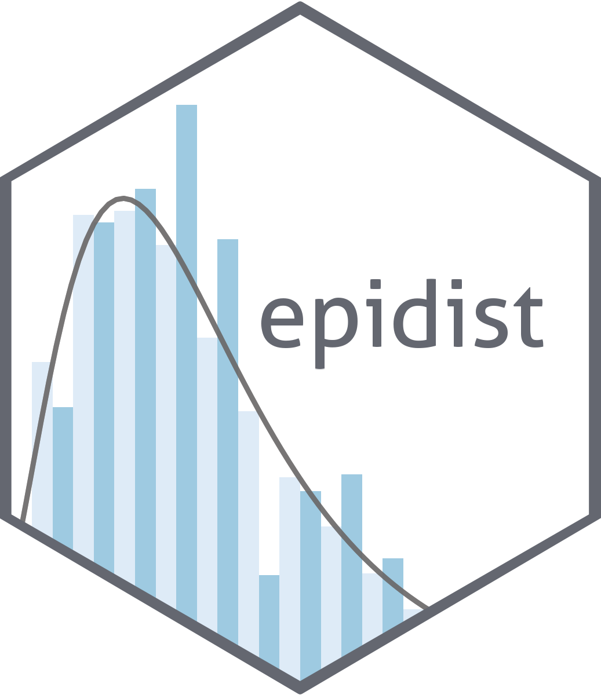

# Estimate epidemiological delay distributions for infectious diseases<a href='https://epidist.epinowcast.org'></a>

<!-- badges: start -->

[](https://www.tidyverse.org/lifecycle/#experimental)
[](https://github.com/epinowcast/epidist/actions/workflows/R-CMD-check.yaml)
[](https://app.codecov.io/gh/epinowcast/epidist)
</br>
[](https://epinowcast.r-universe.dev/epidist)
[](https://github.com/epinowcast/epidist/blob/master/LICENSE.md/)
[](https://github.com/epinowcast/epidist/graphs/contributors)
</br>
[](https://zenodo.org/badge/latestdoi/422611952)
<!-- badges: end -->

*Warning: This package is a prototype and is under active development.
Breaking changes are likely.*

## Summary

Understanding and accurately estimating epidemiological delay
distributions is important for public health policy. These estimates
directly influence epidemic situational awareness, control strategies,
and resource allocation. In this package, we provide methods to address
the key challenges in estimating these distributions, including
truncation, interval censoring, and dynamical biases. Despite their
importance, these issues are frequently overlooked, often resulting in
biased conclusions.

## Installation

<details>
<summary>
Installing the package
</summary>

You can install the latest released version using the normal `R`
function, though you need to point to `r-universe` instead of CRAN:

``` r
install.packages(
  "epidist", repos = "https://epinowcast.r-universe.dev"
)
```

Alternatively, you can use the [`remotes`
package](https://remotes.r-lib.org/) to install the development version
from Github (warning! this version may contain breaking changes and/or
bugs):

``` r
remotes::install_github(
  "epinowcast/epidist", dependencies = TRUE
)
```

Similarly, you can install historical versions by specifying the release
tag (e.g. this installs
[`0.1.0`](https://github.com/epinowcast/epidist/releases/tag/v0.1.0)):

``` r
remotes::install_github(
  "epinowcast/epidist", dependencies = TRUE, ref = "v0.2.0"
)
```

*Note: You can also use that last approach to install a specific commit
if needed, e.g. if you want to try out a specific unreleased feature,
but not the absolute latest developmental version.*

</details>
<details>
<summary>
Installing CmdStan
</summary>

If you wish to do model fitting and nowcasting, you will need to install
[CmdStan](https://mc-stan.org/users/interfaces/cmdstan), which also
entails having a suitable C++ toolchain setup. We recommend using the
[`cmdstanr` package](https://mc-stan.org/cmdstanr/). The Stan team
provides instructions in the [*Getting started with
`cmdstanr`*](https://mc-stan.org/cmdstanr/articles/cmdstanr.html)
vignette, with other details and support at the [package
site](https://mc-stan.org/cmdstanr/), but the brief version is:

``` r
# if you not yet installed `epinowcast`, or you installed it without `Suggests` dependencies
install.packages("cmdstanr", repos = c("https://mc-stan.org/r-packages/", getOption("repos")))
# once `cmdstanr` is installed:
cmdstanr::install_cmdstan()
```

*Note: You can speed up CmdStan installation using the `cores` argument.
If you are installing a particular version of `epinowcast`, you may also
need to install a past version of CmdStan, which you can do with the
`version` argument.*

</details>
<details>
<summary>
Alternative: Docker
</summary>

We also provide a [Docker](https://www.docker.com/get-started/) image
with [`epinowcast` and all dependencies
installed](https://github.com/orgs/epinowcast/packages/container/package/epidist).
You can use this image to run `epidist` without installing dependencies.

</details>

## Resources

<details>
<summary>
Organisation Website
</summary>

Our [organisation website](https://www.epinowcast.org/) includes links
to other resources, [guest posts](https://www.epinowcast.org/blog.html),
and [seminar schedule](https://www.epinowcast.org/seminars.html) for
both upcoming and past recordings.

</details>
<details>
<summary>
Community Forum
</summary>

Our [community forum](https://community.epinowcast.org/) has areas for
[question and answer](https://community.epinowcast.org/c/interface/15)
and [considering new methods and
tools](https://community.epinowcast.org/c/projects/11), among others. If
you are generally interested in real-time analysis of infectious
disease, you may find this useful even if do not use `epinowcast`.

</details>

## Contributing

We welcome contributions and new contributors! We particularly
appreciate help on [identifying and identified
issues](https://github.com/epinowcast/epidist/issues). Please check and
add to the issues, and/or add a [pull
request](https://github.com/epinowcast/epidist/pulls) and see our
[contributing guide](CONTRIBUTING.md) for more information.

### How to make a bug report or feature request

Please briefly describe your problem and what output you expect in an
[issue](https://github.com/epinowcast/epidist/issues). If you have a
question, please don’t open an issue. Instead, ask on our [Q and A
page](https://github.com/epinowcast/dist/discussions/categories/q-a).
See our [contributing guide](CONTRIBUTING.md) for more information.

### Code of Conduct

Please note that the `epidist` project is released with a [Contributor
Code of Conduct](CODE_OF_CONDUCT.md). By contributing to this project,
you agree to abide by its terms.

## Citation

If making use of our methodology or the methodology on which ours is
based, please cite the relevant papers from our [model
outline](https://epidist.epinowcast.org/articles/model.html). If you use
`epidist` in your work, please consider citing it with
`citation("epidist")`.

## Contributors

<!-- ALL-CONTRIBUTORS-LIST:START - Do not remove or modify this section -->
<!-- prettier-ignore-start -->
<!-- markdownlint-disable -->

All contributions to this project are gratefully acknowledged using the
[`allcontributors`
package](https://github.com/ropenscilabs/allcontributors) following the
[all-contributors](https://allcontributors.org) specification.
Contributions of any kind are welcome!

### Code

<a href="https://github.com/epinowcast/epidist/commits?author=seabbs">seabbs</a>,
<a href="https://github.com/epinowcast/epidist/commits?author=athowes">athowes</a>,
<a href="https://github.com/epinowcast/epidist/commits?author=parksw3">parksw3</a>,
<a href="https://github.com/epinowcast/epidist/commits?author=medewitt">medewitt</a>

### Issue Authors

<a href="https://github.com/epinowcast/epidist/issues?q=is%3Aissue+author%3Akgostic">kgostic</a>,
<a href="https://github.com/epinowcast/epidist/issues?q=is%3Aissue+author%3ATimTaylor">TimTaylor</a>

### Issue Contributors

<a href="https://github.com/epinowcast/epidist/issues?q=is%3Aissue+commenter%3Apearsonca">pearsonca</a>,
<a href="https://github.com/epinowcast/epidist/issues?q=is%3Aissue+commenter%3Asbfnk">sbfnk</a>

<!-- markdownlint-enable -->
<!-- prettier-ignore-end -->
<!-- ALL-CONTRIBUTORS-LIST:END -->
