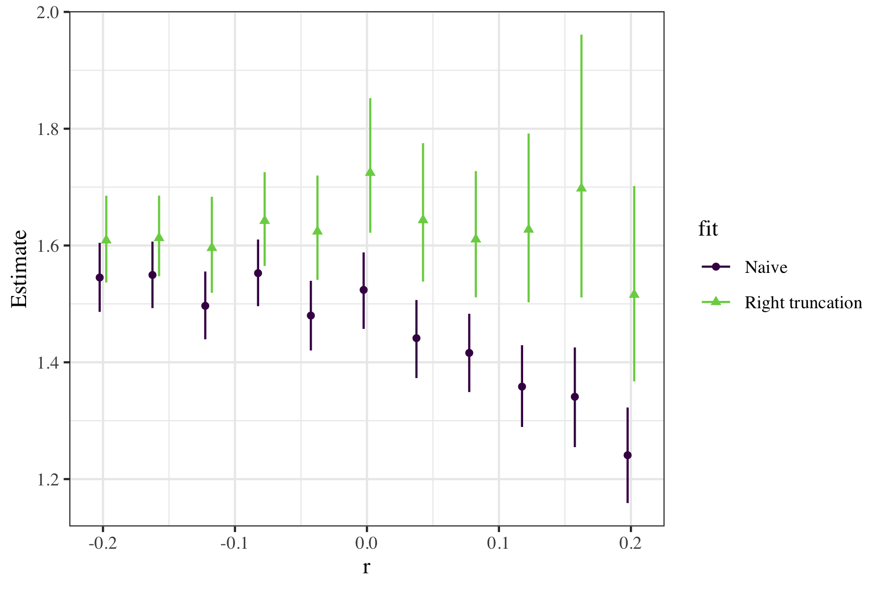

# Dynamical and truncation biases are equivalent

## Methods

Our goal is to estimate $f_s(\tau)$, where $s$ represents cohort time (i.e., the timing of the primaruy event), from truncated data. Five fits:
* Naive: $f_s(\tau)$
* Right truncation: $f_s(\tau)/F_s(t_{max}-s)$
* Dynamical correction: $b(\tau) = \exp(-r\tau) f_s(\tau)/(\int \exp(-r\tau) f_s(\tau) d\tau)$. This is a bit trickier to fit because we have to do some integration. Instead, we fit a lognormal distribution that represents $b(\tau)$ and calculate $f_s(\tau)$ after the fit for each posterior sample.
* Right truncation+dynamical correction: $b(\tau)/B(t_{max}-s)$
* Left trunction+dynamical correction: $b(\tau)/B(s-t_{min})$. Again, we fit a single lognormal distribution with left truncation and then correct for underlying dynamics after the fit

## Results

<!-- -->

* Naive fits are not too bad for $r < 0$ because not much right truncation
* Dynamical correction alone is not so good for $r < 0$ because we're missing left truncation (because we're starting from high incidence at $t=0$ and neglecting infections starting $t < 0$)
* Right truncation is good
* Right truncation + dynamical correction overcompensates and goes crazy
* Left truncation + dynamical correction is as good as right truncation but starts to give super wide CIs for high $r$ values. Need to check integration step.

## Flow
Makefile currently doesn't work because I had to switch to my Windows pc to run brms. I'm saving rda files to the rdacache directory so that I can move between machines (which you don't need to update)...

* `param.R` sets parameters
* `data_exponential.R` generates data
* `fit_exponential.R` performs fits
* `figure_exponential.R` generates the main figure
