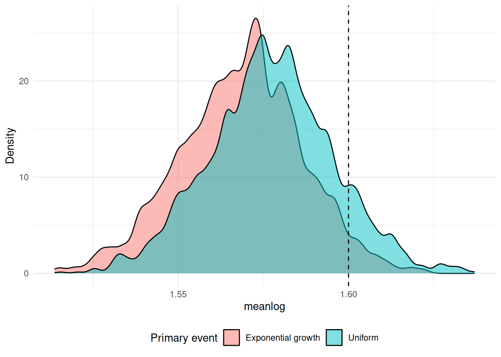
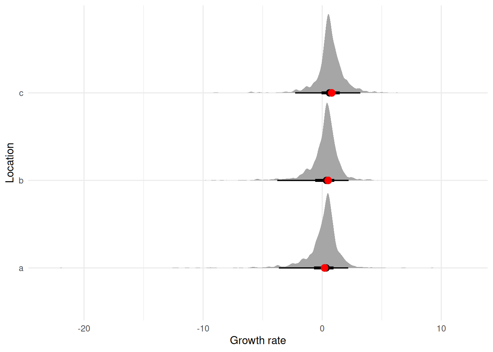

# Primary event distributions

## 1 Background

An event reported on a date could have happened at any point that day.
Models in `epidist` need an assumption about where, which we call the
primary event distribution.

The default assumes it is equally likely at any point in the window.
That holds when incidence is flat. It does not when incidence is growing
or shrinking quickly. The event is then more likely towards one end of
the window, and ignoring that biases the delay estimate ([Charniga et
al. 2024](#ref-charniga2024best)).

The primary event distributions come from
[`primarycensored`](https://primarycensored.epinowcast.org/) ([Abbott et
al. 2025](#ref-primarycensored)).
[`vignette("model")`](https://epidist.epinowcast.org/articles/model.md)
gives the mathematical treatment.

``` r

library(epidist)
library(dplyr)
library(ggplot2)
library(brms)
```

## 2 Simulating from a growing epidemic

[`simulate_exponential_cases()`](https://epidist.epinowcast.org/reference/simulate_exponential_cases.md)
draws primary events from an exponentially growing epidemic at rate `r`.
Here we use a rate of 0.5 and a lognormal delay. Both events are then
censored to daily windows.

``` r

set.seed(101)

meanlog <- 1.6
sdlog <- 0.4
growth_rate <- 0.5

obs <- simulate_exponential_cases(r = growth_rate, sample_size = 500) |>
  simulate_secondary(meanlog = meanlog, sdlog = sdlog) |>
  simulate_dates(outbreak_start_date = as.Date("2024-01-01"))

linelist <- as_epidist_linelist_data(obs)
```

## 3 Uniform against exponential growth

The marginal model takes the primary event distribution when the data
are converted.

``` r

uniform <- as_epidist_marginal_model(linelist)
growing <- as_epidist_marginal_model(linelist, primary = "expgrowth")
```

With `primary = "expgrowth"` the growth rate becomes a distributional
parameter called `pgrowth`. It takes a formula and a prior in the same
way as `mu` and `sigma`.

The delays carry little information about the growth rate, so the prior
does the work. Epidemic growth is normally estimated separately, from
case counts over the same period. That estimate is then passed here as
an informative prior centred on it, which is the approach taken in Brand
et al. ([2026](#ref-brand2026scalable)). The prior below is centred on
the rate used to simulate.

``` r

fit_uniform <- epidist(
  uniform,
  chains = 2, cores = 2, refresh = 0, silent = 2
)

fit_growing <- epidist(
  growing,
  formula = bf(mu ~ 1, pgrowth ~ 1),
  prior = prior(normal(0.5, 0.1), class = "Intercept", dpar = "pgrowth"),
  chains = 2, cores = 2, refresh = 0, silent = 2
)
```

The posterior for the rate stays close to the prior, which is expected.

``` r

summary(fit_growing)$fixed[
  "pgrowth_Intercept", c("Estimate", "l-95% CI", "u-95% CI")
]
#>                    Estimate  l-95% CI  u-95% CI
#> pgrowth_Intercept 0.5043456 0.3130026 0.7013424
```

Both are compared against the delay used to simulate.

``` r

uniform_draws <- ungroup(delay_parameter_draws(fit_uniform))
growing_draws <- ungroup(delay_parameter_draws(fit_growing))

draws <- bind_rows(
  mutate(uniform_draws, model = "Uniform"),
  mutate(growing_draws, model = "Exponential growth")
)

draws |>
  ggplot(aes(x = mu, fill = model)) +
  geom_density(alpha = 0.5) +
  geom_vline(xintercept = meanlog, linetype = "dashed") +
  labs(x = "meanlog", y = "Density", fill = "Primary event") +
  theme_minimal() +
  theme(legend.position = "bottom")
```



## 4 A growth rate that varies

`pgrowth` takes a formula, so the rate can vary. Here each location has
its own rate, drawn around the shared value.

``` r

locations <- c(a = 0.2, b = 0.5, c = 0.8)

by_location <- purrr::imap(locations, function(r, location) {
  sim <- simulate_exponential_cases(r = r, sample_size = 300, seed = 1) |>
    simulate_secondary(meanlog = meanlog, sdlog = sdlog) |>
    simulate_dates(outbreak_start_date = as.Date("2024-01-01"))
  return(mutate(sim, location = location))
})
by_location <- bind_rows(by_location)

linelist_locations <- as_epidist_linelist_data(by_location)
```

A random effect on `pgrowth` lets the rate differ by location while
sharing information across them. The marginal model is used here. The
latent model samples an event time per observation and would be slow at
this size.

``` r

marginal_locations <- as_epidist_marginal_model(
  linelist_locations,
  primary = "expgrowth"
)

fit_locations <- epidist(
  marginal_locations,
  formula = bf(mu ~ 1, pgrowth ~ 1 + (1 | location)),
  prior = prior(normal(0.5, 0.2), class = "Intercept", dpar = "pgrowth"),
  chains = 2, cores = 2, refresh = 0, silent = 2
)
```

Here the prior is shared across locations and the random effect lets
each depart from it.

``` r

# epidist_newdata() adds the observation process columns the marginal model
# needs (pwindow, swindow, relative_obs_time, delay_min) alongside location.
newdata <- epidist_newdata(marginal_locations, location = names(locations))

epred <- tidybayes::add_epred_draws(newdata, fit_locations, dpar = "pgrowth")

epred |>
  ggplot(aes(x = pgrowth, y = location)) +
  tidybayes::stat_halfeye() +
  geom_point(
    data = tibble(location = names(locations), pgrowth = locations),
    colour = "red", size = 3
  ) +
  labs(x = "Growth rate", y = "Location") +
  theme_minimal()
```



## References

Abbott, Sam, Sam Brand, James Mba Azam, Carl Pearson, Sebastian Funk,
and Kelly Charniga. 2025. *Primarycensored: Primary Event Censored
Distributions*. <https://doi.org/10.5281/zenodo.13632839>.

Brand, Samuel P. C., Barbora Nemcova, Carl A. B. Pearson, et al. 2026.
“A Scalable Marginalisation Approach for Double Interval Censored
Epidemiological Delays.” Unpublished manuscript.

Charniga, Kelly, Sang Woo Park, Andrei R. Akhmetzhanov, et al. 2024.
“Best Practices for Estimating and Reporting Epidemiological Delay
Distributions of Infectious Diseases.” *PLOS Computational Biology* 20
(10): 1–21. <https://doi.org/10.1371/journal.pcbi.1012520>.
