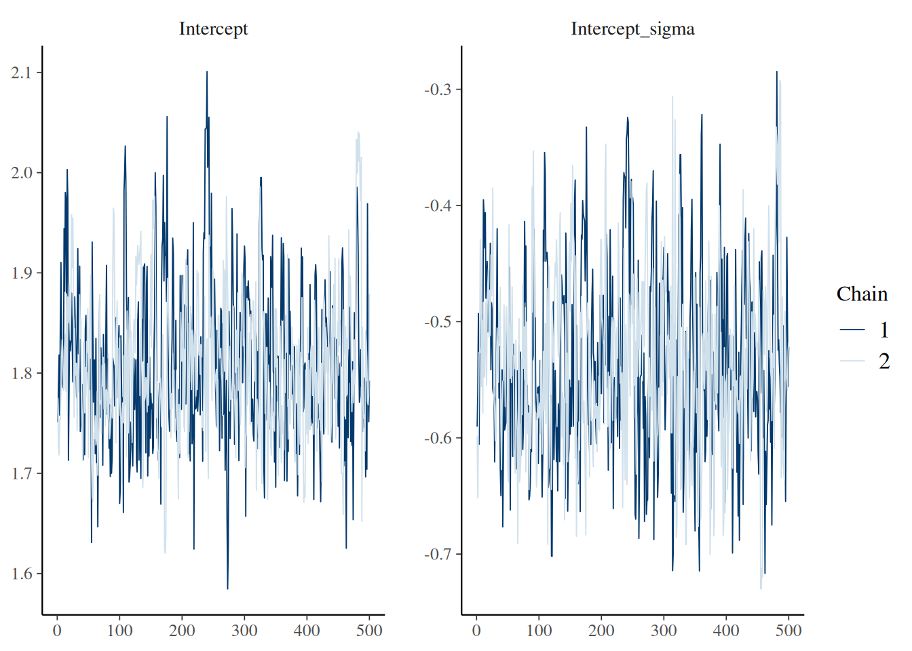
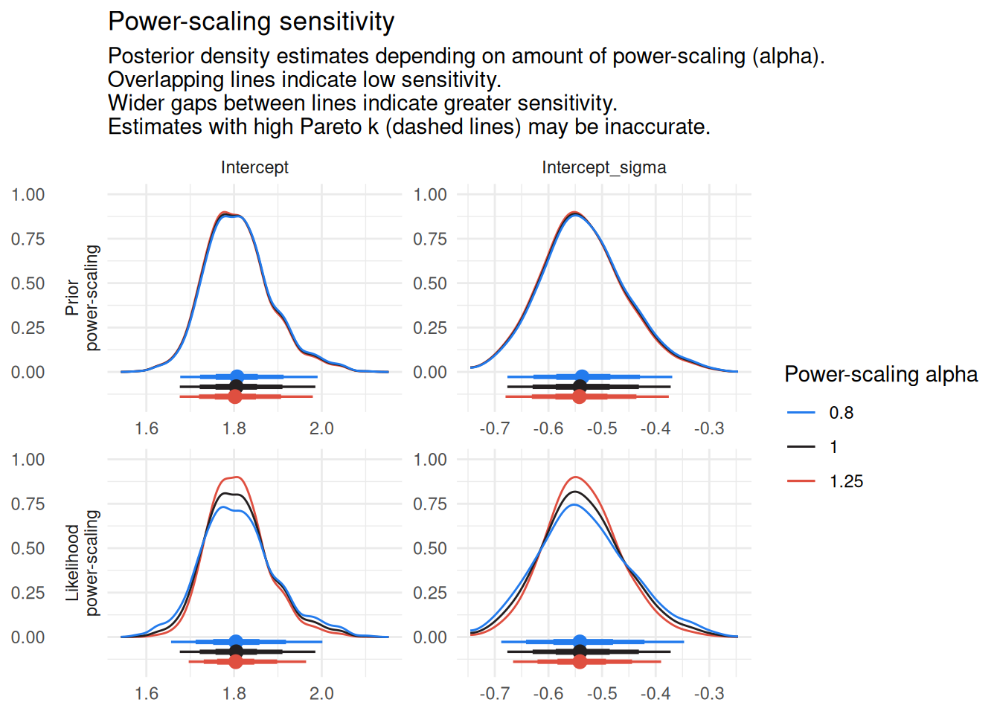
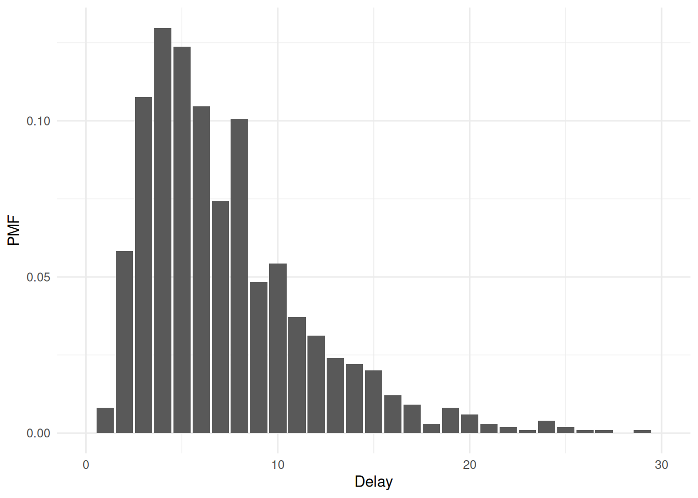

# Frequently asked questions and tips

Here we provide tips for working with the `epidist` package, and answers
to frequently asked questions. If you have a question about using the
package, please create an
[issue](https://github.com/epinowcast/epidist/issues). We will endeavour
to respond promptly!

Click to expand for code to reproduce the examples in this vignette

``` r
library(epidist)
library(brms)
library(dplyr)
library(ggplot2)
library(scales)
library(tidyr)

set.seed(1)

# Define different parameters for each location
meanlog_0 <- 1.6
sdlog_0 <- 0.4
meanlog_1 <- 2.1
sdlog_1 <- 0.6

obs_time <- 25
sample_size <- 200

# Create base data with location assignments
base_data <- simulate_gillespie(seed = 101)
base_data$location <- rbinom(n = nrow(base_data), size = 1, prob = 0.5)

# Create location 0 data
location_0_data <- base_data |>
  filter(location == 0) |>
  simulate_secondary(
    meanlog = meanlog_0,
    sdlog = sdlog_0
  ) |>
  select(case, ptime, delay, stime, location)

# Create location 1 data
location_1_data <- base_data |>
  filter(location == 1) |>
  simulate_secondary(
    meanlog = meanlog_1,
    sdlog = sdlog_1
  ) |>
  select(case, ptime, delay, stime, location)

# Combine datasets
obs_cens_trunc_samp <- bind_rows(location_0_data, location_1_data) |>
  mutate(
    ptime_lwr = floor(.data$ptime),
    ptime_upr = .data$ptime_lwr + 1,
    stime_lwr = floor(.data$stime),
    stime_upr = .data$stime_lwr + 1,
    obs_time = obs_time
  ) |>
  filter(.data$stime_upr <= .data$obs_time) |>
  slice_sample(n = sample_size, replace = FALSE)

linelist_data <- as_epidist_linelist_data(
  obs_cens_trunc_samp$ptime_lwr,
  obs_cens_trunc_samp$ptime_upr,
  obs_cens_trunc_samp$stime_lwr,
  obs_cens_trunc_samp$stime_upr,
  obs_time = obs_cens_trunc_samp$obs_time,
  covariates = data.frame(location = obs_cens_trunc_samp$location)
)
data <- as_epidist_marginal_model(linelist_data)

fit <- epidist(
  data,
  formula = mu ~ 1,
  seed = 1,
  chains = 2,
  cores = 2,
  refresh = ifelse(interactive(), 250, 0),
  iter = 1000,
  backend = "cmdstanr"
)

fit_location <- epidist(
  data,
  formula = bf(mu ~ location, sigma ~ location),
  seed = 1,
  chains = 2,
  cores = 2,
  refresh = ifelse(interactive(), 250, 0),
  iter = 1000,
  backend = "cmdstanr"
)
```

### Working with posterior samples

The output of a call to `epidist` is compatible with typical Stan
workflows. We recommend use of the
[`posterior`](https://mc-stan.org/posterior/) package for working with
samples.

#### Getting a `data.frame` of posterior samples

The function
[`posterior::as_draws_df()`](https://mc-stan.org/posterior/reference/draws_df.html)
may be used to obtain a dataframe of MCMC draws for specified
parameters.

``` r
library(posterior)
draws <- as_draws_df(fit, variable = c("Intercept", "Intercept_sigma"))
head(draws)
```

    ## # A draws_df: 6 iterations, 1 chains, and 2 variables
    ##   Intercept Intercept_sigma
    ## 1       1.8           -0.59
    ## 2       1.8           -0.56
    ## 3       1.8           -0.49
    ## 4       1.8           -0.61
    ## 5       1.9           -0.53
    ## 6       1.9           -0.52
    ## # ... hidden reserved variables {'.chain', '.iteration', '.draw'}

#### Using random variables (`rvars`) for uncertainty propagation

The `posterior` package also provides the `rvar` class for working with
posterior samples as random variables. This approach allows you to
perform mathematical operations directly with posterior distributions
while propagating uncertainty.

``` r
library(posterior)
# Convert model parameters to rvars
rv <- as_draws_rvars(fit_location)

# Look at the intercept in rvar form
rv$b_Intercept
```

    ## rvar<500,2>[1] mean ± sd:
    ## [1] 1.6 ± 0.063

``` r
# Calculate the mean delay (on natural scale) for each location
mean_delay_loc0 <- exp(rv$b_Intercept + 0.5 * exp(rv$b_sigma_Intercept)^2)
mean_delay_loc1 <- exp(rv$b_Intercept +
  rv$b_location + 0.5 * (exp(rv$b_sigma_Intercept + rv$b_sigma_location))^2)

# Summarize the distributions
summary(mean_delay_loc0)
```

    ## # A tibble: 1 × 10
    ##   variable         mean median    sd   mad    q5   q95  rhat ess_bulk ess_tail
    ##   <chr>           <dbl>  <dbl> <dbl> <dbl> <dbl> <dbl> <dbl>    <dbl>    <dbl>
    ## 1 mean_delay_loc0  5.54   5.48 0.449 0.389  4.95  6.32  1.00     661.     685.

``` r
summary(mean_delay_loc1)
```

    ## # A tibble: 1 × 10
    ##   variable         mean median    sd   mad    q5   q95  rhat ess_bulk ess_tail
    ##   <chr>           <dbl>  <dbl> <dbl> <dbl> <dbl> <dbl> <dbl>    <dbl>    <dbl>
    ## 1 mean_delay_loc1  12.8   11.4  5.45  2.82  8.24  21.4  1.01     208.     197.

``` r
# Calculate the difference between locations
delay_diff <- mean_delay_loc1 - mean_delay_loc0
delay_diff
```

    ## rvar<500,2>[1] mean ± sd:
    ## [1] 7.3 ± 5.5

For more details, see the [`posterior` package
documentation](https://mc-stan.org/posterior/articles/rvar.html).

### How can I assess whether sampling has converged?

The output of a call to `epidist` is compatible with typical Stan
workflows. We recommend use of the
[`bayesplot`](http://mc-stan.org/bayesplot/) package for sampling
diagnostic plots. For example, the function
[`bayesplot::mcmc_trace()`](https://mc-stan.org/bayesplot/reference/MCMC-traces.html)
can be used to produce traceplots for specified parameters.

``` r
library(bayesplot)
mcmc_trace(fit, pars = c("Intercept", "Intercept_sigma"))
```



We also provide a function
[`epidist_diagnostics()`](https://epidist.epinowcast.org/dev/reference/epidist_diagnostics.md)
which can be used to obtain common diagnostics used to assess the
quality of a fitted model.

``` r
epidist_diagnostics(fit)
```

    ## # A tibble: 1 × 8
    ##    time samples max_rhat divergent_transitions per_divergent_transitions
    ##   <dbl>   <dbl>    <dbl>                 <dbl>                     <dbl>
    ## 1  2.55    1000     1.00                     0                         0
    ## # ℹ 3 more variables: max_treedepth <dbl>, no_at_max_treedepth <int>,
    ## #   per_at_max_treedepth <dbl>

### How can I perform posterior predictive checks?

Posterior predictive checks are a useful tool for assessing model fit by
comparing observed data to simulated data from the posterior predictive
distribution.
[`brms::pp_check()`](https://mc-stan.org/bayesplot/reference/pp_check.html)
is a convenient function for this, but it does not automatically handle
the aggregated/weighted data structure used by `epidist` models. Because
[`brms::pp_check()`](https://mc-stan.org/bayesplot/reference/pp_check.html)
ignores the `weights` argument when plotting observed data, passing
aggregated data directly will result in an incorrect comparison between
observed and predicted distributions.

To use
[`pp_check()`](https://mc-stan.org/bayesplot/reference/pp_check.html)
correctly with aggregated data, you must first expand the data to an
individual-level format (one row per observation) using
[`tidyr::uncount()`](https://tidyr.tidyverse.org/reference/uncount.html).
Then, pass this expanded data to the `newdata` argument of
[`pp_check()`](https://mc-stan.org/bayesplot/reference/pp_check.html).

``` r
# Expand the aggregated data to individual-level data
# Note: We must ensure the weight column 'n' is present but set to 1
data_expanded <- data |>
  tidyr::uncount(weights = n) |>
  mutate(n = 1)

# Run pp_check with the expanded data
pp_check(fit, newdata = data_expanded, ndraws = 100)
```


For more advanced custom visualizations, you can also use
[`tidybayes::add_predicted_draws()`](https://mjskay.github.io/tidybayes/reference/add_predicted_draws.html)
as demonstrated in the [“Advanced features with Ebola
data”](https://epidist.epinowcast.org/articles/ebola.html) vignette.

### I’d like to run a simulation study

We recommend use of the [`purrr`](https://purrr.tidyverse.org/) package
for running many `epidist` models, for example as a part of a simulation
study. We particularly highlight two functions which might be useful:

1.  [`purrr::map()`](https://purrr.tidyverse.org/reference/map.html)
    (and other similar functions) for iterating over a list of inputs.
2.  [`purrr::safely()`](https://purrr.tidyverse.org/reference/safely.html)
    which ensures that the function called “always succeeds”. In other
    words, if there is an error it will be captured and output, rather
    than ending computation (and potentially disrupting a call to
    [`purrr::map()`](https://purrr.tidyverse.org/reference/map.html)).

For an example use of these functions, have a look at the
[`epidist-paper`](https://github.com/parksw3/epidist-paper) repository
containing the code for Park et al. ([2024](#ref-park2024estimating)).
(Note that in that codebase, we use `map` as a part of a
[`targets`](https://books.ropensci.org/targets/) pipeline.)

### How are the default priors for `epidist` chosen?

[`brms`](http://paulbuerkner.com/brms/) provides default priors for all
parameters. However, some of those priors do not make sense in the
context of our application. Instead, we used [prior predictive
checking](https://mc-stan.org/docs/stan-users-guide/posterior-predictive-checks.html)
to set `epidist`-specific default priors which produce epidemiological
delay distribution mean and standard deviation parameters in a
reasonable range.

For example, for the
[`brms::lognormal()`](https://paulbuerkner.com/brms/reference/brmsfamily.html)
latent individual model, we suggest the following prior distributions
for the `brms` `mu` and `sigma` intercept parameters:

``` r
# Note that we export lognormal() as part of epidist hence no need for brms::
family <- lognormal()

epidist_family <- epidist_family(data, family)
epidist_formula <- epidist_formula(
  data,
  family = epidist_family,
  formula = mu ~ 1
)

# NULL here means no replacing priors from the user!
epidist_prior <- epidist_prior(
  data = data,
  family = family,
  formula = epidist_formula,
  prior = NULL
)

epidist_prior
```

    ##                 prior     class coef group resp  dpar nlpar lb ub tag  source
    ##    student_t(3, 5, 3) Intercept                                       default
    ##  student_t(3, 0, 2.5) Intercept                 sigma                 default

(Note that the functions
[`epidist_family()`](https://epidist.epinowcast.org/dev/reference/epidist_family.md)
and
[`epidist_prior()`](https://epidist.epinowcast.org/dev/reference/epidist_prior.md)
are mostly for internal use!)

Here are the distributions on the delay distribution mean and standard
deviation parameters that these prior distributions imply:

``` r
set.seed(1)
fit_ppc <- epidist(
  data = data,
  formula = mu ~ 1,
  family = lognormal(),
  sample_prior = "only",
  seed = 1,
  backend = "cmdstanr"
)
```

``` r
pred <- predict_delay_parameters(fit_ppc)

pred |>
  as.data.frame() |>
  pivot_longer(
    cols = c("mu", "sigma", "mean", "sd"),
    names_to = "parameter",
    values_to = "value"
  ) |>
  filter(parameter %in% c("mean", "sd")) |>
  ggplot(aes(x = value, y = after_stat(density))) +
  geom_histogram() +
  facet_wrap(. ~ parameter, scales = "free") +
  labs(x = "", y = "Density") +
  theme_minimal() +
  scale_x_log10(labels = comma)
```

    ## `stat_bin()` using `bins = 30`. Pick better value `binwidth`.


``` r
quantile(pred$mean, c(0.01, 0.1, 0.25, 0.5, 0.75, 0.9, 0.99))
```

    ##         1%        10%        25%        50%        75%        90%        99% 
    ##  0.3172760  0.8667011  1.6163277  3.2461963  6.6291746 12.0852973 34.0415723

``` r
quantile(pred$sd, c(0.01, 0.1, 0.25, 0.5, 0.75, 0.9, 0.99))
```

    ##         1%        10%        25%        50%        75%        90%        99% 
    ##  0.1335500  0.3950604  0.7687361  1.7107506  3.9206460  8.1670947 33.4423697

### How can I assess how sensitive the fitted posterior distribution is to the prior distribution used?

We recommend use of the
[`priorsense`](https://github.com/n-kall/priorsense) package
([Kallioinen et al. 2024](#ref-kallioinen2024detecting)) to check how
sensitive the posterior distribution is to perturbations of the prior
distribution and likelihood using power-scaling analysis:

``` r
library(priorsense)
powerscale_plot_dens(fit, variable = c("Intercept", "Intercept_sigma")) +
  theme_minimal()
```



## What do the parameters in my model output correspond to?

The `epidist` package uses [`brms`](http://paulbuerkner.com/brms/) to
fit models. This means that the model output will include `brms`-style
names for parameters. Here, we provide a table giving the correspondence
between the distributional parameter names used in `brms` and those used
in standard R functions for some common likelihood families.

| Family                                                                   | `brms` parameter | R parameter                    |
|--------------------------------------------------------------------------|------------------|--------------------------------|
| [`lognormal()`](https://paulbuerkner.com/brms/reference/brmsfamily.html) | `mu`             | `meanlog`                      |
| [`lognormal()`](https://paulbuerkner.com/brms/reference/brmsfamily.html) | `sigma`          | `sdlog`                        |
| [`Gamma()`](https://rdrr.io/r/stats/family.html)                         | `mu`             | `shape / scale`                |
| [`Gamma()`](https://rdrr.io/r/stats/family.html)                         | `shape`          | `shape`                        |
| [`weibull()`](https://paulbuerkner.com/brms/reference/brmsfamily.html)   | `mu`             | `scale * gamma(1 + 1 / shape)` |
| [`weibull()`](https://paulbuerkner.com/brms/reference/brmsfamily.html)   | `shape`          | `shape`                        |

Note that all families in `brms` are parameterised with some measure of
centrality `mu` as their first parameter. This parameter does not
necessarily correspond to the mean: hence the provision of a function
[`add_mean_sd()`](https://epidist.epinowcast.org/dev/reference/add_mean_sd.md)
within `epidist` to add columns containing the natural scale mean and
standard deviation to a `data.frame` of draws.

## How can I generate predictions with my fitted `epidist` model?

It is possible to generate predictions manually by working with [samples
from the model
output](https://epidist.epinowcast.org/articles/faq.html#i-would-like-to-work-with-the-samples-output).
However this is tricky to do, and so where possible we recommend using
the [`tidybayes`](http://mjskay.github.io/tidybayes/) package. In
particular, following functions may be useful:

1.  [`tidybayes::add_epred_draws()`](https://mjskay.github.io/tidybayes/reference/add_predicted_draws.html)
    for predictions of the expected value of a delay.
2.  [`tidybayes::add_linpred_draws()`](https://mjskay.github.io/tidybayes/reference/add_predicted_draws.html)
    for predictions of the delay distributional parameter linear
    predictors.
3.  [`tidybayes::add_predicted_draws()`](https://mjskay.github.io/tidybayes/reference/add_predicted_draws.html)
    for predictions of the observed delay.

To see these functions demonstrated in a vignette, see [“Advanced
features with Ebola
data”](https://epidist.epinowcast.org/articles/ebola.html). As a short
example, to generate 4000 predictions (equal to the number of draws) of
the delay that would be observed with a double censored observation
process (in which the primary and secondary censoring windows are both
one) then:

``` r
library(tidybayes)
```

    ## 
    ## Attaching package: 'tidybayes'

    ## The following objects are masked from 'package:brms':
    ## 
    ##     dstudent_t, pstudent_t, qstudent_t, rstudent_t

``` r
draws_pmf <- tibble::tibble(
  relative_obs_time = Inf, pwindow = 1, swindow = 1, delay_upr = NA
) |>
  add_predicted_draws(fit)
```

    ## Warning: Found infinite values in the data, which may cause issues for Stan.

``` r
ggplot(draws_pmf, aes(x = .prediction)) +
  geom_bar(aes(y = after_stat(count / sum(count)))) +
  labs(x = "Delay", y = "PMF") +
  scale_x_continuous(limits = c(0, 30)) +
  theme_minimal()
```

    ## Warning: Removed 6 rows containing non-finite outside the scale range
    ## (`stat_count()`).

    ## Warning: Removed 1 row containing missing values or values outside the scale range
    ## (`geom_bar()`).



Importantly, this functionality is only available for `epidist` models
using `brms` families that have a `log_lik_censor` method implemented
internally in `brms`. If you are using another family, consider
[submitting a pull request](https://github.com/epinowcast/epidist/pulls)
to implement these methods!

### How can I use the `marginaleffects` package with my fitted `epidist` model?

The [`marginaleffects`](https://marginaleffects.com/) package provides
tools for computing and visualising marginal effects, contrasts, and
predictions from regression models. It works with `epidist` models
because they are built on top of `brms`.

For `epidist` models with covariates, you can use `marginaleffects`
to: - Compute average marginal effects - Make comparisons between
different covariate values - Visualise model predictions across the
range of covariates

Here’s a simple example using a model that includes location as a
covariate:

``` r
library(marginaleffects)

# Compare outcomes between location categories (0 and 1)
avg_comparisons(
  fit_location,
  variables = list(location = c(0, 1))
)
```

    ## 
    ##  Estimate 2.5 % 97.5 %
    ##      5.86  2.21   20.2
    ## 
    ## Term: location
    ## Type: response
    ## Comparison: 1 - 0

For more details on the available functions and their use, see the
[`marginaleffects` documentation](https://marginaleffects.com/).

### How can I use the `cmdstanr` backend?

The `cmdstanr` backend is typically more performant than the default
`rstan` backend. To use the `cmdstanr` backend, we first need to install
CmdStan (see the README for more details). We can check we have
everything we need as follows:

``` r
cmdstanr::cmdstan_version()
```

    ## [1] "2.38.0"

### References

Kallioinen, Noa, Topi Paananen, Paul-Christian Bürkner, and Aki Vehtari.
2024. “Detecting and Diagnosing Prior and Likelihood Sensitivity with
Power-Scaling.” *Statistics and Computing* 34 (1): 57.

Park, Sang Woo, Andrei R. Akhmetzhanov, Kelly Charniga, Anne Cori,
Nicholas G. Davies, Jonathan Dushoff, Sebastian Funk, et al. 2024.
“Estimating Epidemiological Delay Distributions for Infectious
Diseases.” *medRxiv*. <https://doi.org/10.1101/2024.01.12.24301247>.
