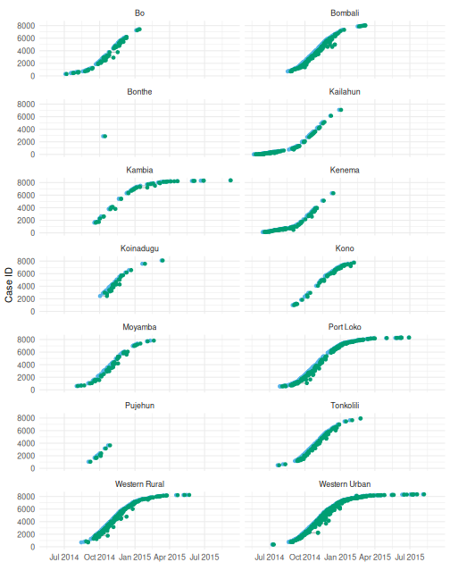
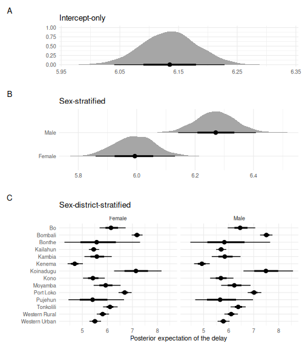
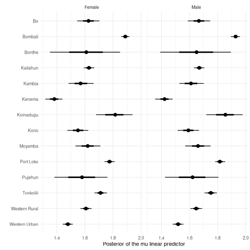
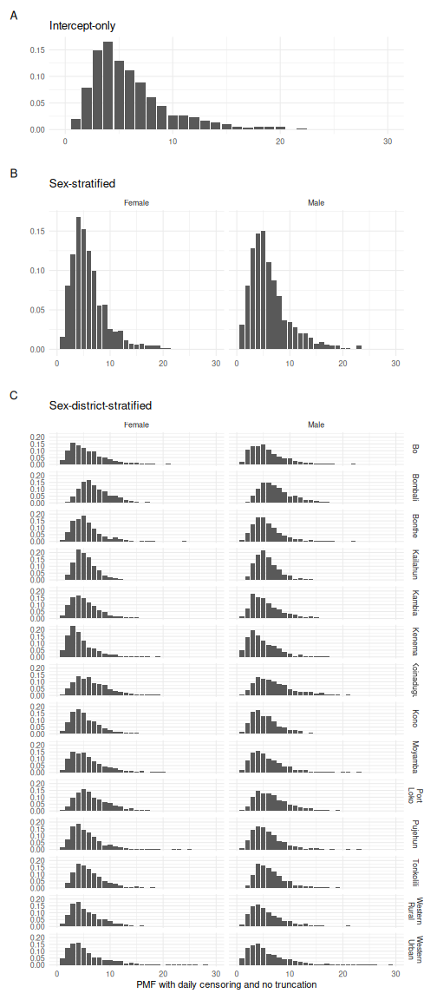
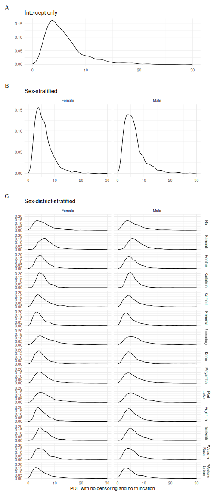

In this vignette, we use the `epidist` package to analyze line list data from the 2014-2016 outbreak of Ebola in Sierra Leone [@who_ebola_2014_2016].
These data were collated by @fang2016transmission.
We provide the data in the `epidist` package via `?sierra_leone_ebola_data`.
In analyzing this data, we demonstrate the following features of `epidist`:

1. Fitting district-sex stratified partially pooled delay distribution estimates with a lognormal delay distribution.
2. Post-processing and plotting functionality using the integration of `brms` functionality with the [`tidybayes`](http://mjskay.github.io/tidybayes/) package.

The packages used in this article are:


``` r
set.seed(123)

library(epidist)
library(brms)
library(dplyr)
library(ggplot2)
library(tidybayes) # nolint
library(patchwork) # nolint
library(cmdstanr) # nolint
```

For users new to `epidist`, before reading this article we recommend beginning with the "[Getting started with `epidist`](https://epidist.epinowcast.org/articles/epidist.html)" vignette.

# Using the cmdstanr backend

As the models explored in this vignette are relatively complex, we recommend using the `cmdstanr` backend for fitting models as it is typically more performant than the default `rstan` backend.
To use the `cmdstanr` backend, we first need to install CmdStan (see the README for more details).
We can check we have everything we need as follows:


``` r
cmdstanr::cmdstan_version()
#> [1] "2.39.0"
```

# Data preparation

We begin by loading the Ebola line list data:


``` r
data("sierra_leone_ebola_data")
```

The data has 8358 rows, each corresponding to a unique case report ID (`id`).
The columns of the data are the, age, sex, the dates of Ebola symptom onset and positive sample, and their district and chiefdom.


``` r
head(sierra_leone_ebola_data)
#> # A tibble: 6 × 7
#>      id   age sex    date_of_symptom_onset date_of_sample_tested district
#>   <int> <dbl> <chr>  <date>                <date>                <chr>
#> 1     1    20 Female 2014-05-18            2014-05-23            Kailahun
#> 2     2    42 Female 2014-05-20            2014-05-25            Kailahun
#> 3     3    45 Female 2014-05-20            2014-05-25            Kailahun
#> 4     4    15 Female 2014-05-21            2014-05-26            Kailahun
#> 5     5    19 Female 2014-05-21            2014-05-26            Kailahun
#> 6     6    55 Female 2014-05-21            2014-05-26            Kailahun
#> # ℹ 1 more variable: chiefdom <chr>

fraction <- 5
ndistrict <- length(unique(sierra_leone_ebola_data$district))
```

Figure \@ref(fig:ebola-outbreak) shows the dates of symptom onset and sample testing for cases across in each district.
(In this figure, we filter down to every 5th case in order to avoid overplotting.)
We can see that the start time and course of the epidemic varies across districts.

<details><summary>Click to expand for code to prepare outbreak plot</summary>


``` r
p_outbreak <- sierra_leone_ebola_data |>
  filter(id %% fraction == 0) |>
  ggplot() +
  geom_segment(
    aes(
      x = date_of_symptom_onset, xend = date_of_sample_tested,
      y = id, yend = id
    ),
    col = "grey"
  ) +
  geom_point(aes(x = date_of_symptom_onset, y = id), col = "#56B4E9") +
  geom_point(aes(x = date_of_sample_tested, y = id), col = "#009E73") +
  facet_wrap(district ~ ., ncol = 2) +
  labs(x = "", y = "Case ID") +
  theme_minimal()
```

</details>
(ref:ebola-outbreak) Primary and secondary event times for every 5th case, over the 14 districts of Sierra Leone.


``` r
p_outbreak
```



# Fitting sex-district stratified delay distributions

To understand the delay between time of symptom onset and time of sample testing, we fit a range of statistical models using the `epidist` package.
In some models, we vary the parameters of the delay distribution by sex or by district.
For the lognormal delay distribution these parameters are the mean and standard deviation of the underlying normal distribution.
That is, $\mu$ and $\sigma$ such that when $x \sim \mathcal{N}(\mu, \sigma)$ then $\exp(x)$ has a lognormal distribution.

## Data preparation

To prepare the data, we begin by selecting the relevant columns:


``` r
obs_cens <- select(
  sierra_leone_ebola_data,
  id, date_of_symptom_onset, date_of_sample_tested, age, sex, district
)

head(obs_cens)
#> # A tibble: 6 × 6
#>      id date_of_symptom_onset date_of_sample_tested   age sex    district
#>   <int> <date>                <date>                <dbl> <chr>  <chr>
#> 1     1 2014-05-18            2014-05-23               20 Female Kailahun
#> 2     2 2014-05-20            2014-05-25               42 Female Kailahun
#> 3     3 2014-05-20            2014-05-25               45 Female Kailahun
#> 4     4 2014-05-21            2014-05-26               15 Female Kailahun
#> 5     5 2014-05-21            2014-05-26               19 Female Kailahun
#> 6     6 2014-05-21            2014-05-26               55 Female Kailahun
```

For the time being, we filter the data to only complete cases (i.e. rows of the data which have no missing values^[An extension is needed to allow for missing data in the model - please open issue if this would be useful for you.]).


``` r
n <- nrow(obs_cens)
obs_cens <- obs_cens[complete.cases(obs_cens), ]
n_complete <- nrow(obs_cens)
```

To simulate being in the middle of an outbreak we will filter the data to only include cases up to the 31st of January 2015.
**The marginal model used in this is adjusting for truncation. To check it is working try filtering instead for the `date_of_symptom_onset` and rerunning.**


``` r
obs_cens_trunc <- filter(
  obs_cens,
  date_of_sample_tested <= as.Date("2015-01-31")
)
```

We prepare the data for use with the `epidist` package by converting the data to an `epidist_linelist_data` object:


``` r
linelist_data <- as_epidist_linelist_data(
  obs_cens_trunc,
  pdate_lwr = "date_of_symptom_onset",
  sdate_lwr = "date_of_sample_tested"
)
```

In this call to `as_epidist_linelist_data()` it has made some assumptions about the data.
First, because we did not supply upper bounds for the primary and secondary events (`pdate_upr` and `sdate_upr`), it has assumed that the upper bounds are one day after the lower bounds.
Second, because we also did not supply an observation time column (`obs_date`), it has assumed that the observation time is the maximum of the secondary event upper bounds.

## Model fitting

To prepare the data for use with the marginal model, we define the data as being a `epidist_marginal_model` model object:


``` r
obs_prep <- as_epidist_marginal_model(linelist_data, obs_time_threshold = 1)
head(obs_prep)
#> # A tibble: 6 × 22
#>   ptime_lwr ptime_upr stime_lwr stime_upr obs_time    id pdate_lwr  sdate_lwr
#>       <dbl>     <dbl>     <dbl>     <dbl>    <dbl> <int> <date>     <date>
#> 1         0         1         5         6      259     1 2014-05-18 2014-05-23
#> 2         2         3         7         8      259     2 2014-05-20 2014-05-25
#> 3         2         3         7         8      259     3 2014-05-20 2014-05-25
#> 4         3         4         8         9      259     4 2014-05-21 2014-05-26
#> 5         3         4         8         9      259     5 2014-05-21 2014-05-26
#> 6         3         4         8         9      259     6 2014-05-21 2014-05-26
#> # ℹ 14 more variables: age <dbl>, sex <chr>, district <chr>, pdate_upr <date>,
#> #   sdate_upr <date>, obs_date <date>, pwindow <dbl>, swindow <dbl>,
#> #   relative_obs_time <dbl>, orig_relative_obs_time <dbl>, delay_lwr <dbl>,
#> #   delay_upr <dbl>, n <dbl>, delay_min <dbl>
```

Now we are ready to fit the marginal model. Note that here we set `obs_time_threshold` to 1 rather than the default of 2 because we are confident that our data contains the maximum observable delay.
If we were not then the default or higher values would be sensible.
**Try out other models using `as_epidist_latent_model()` for the latent model (another approach to adjusting for truncation and censoring) and `as_epidist_naive_model()` for a naive model that doesn't account for truncation or censoring.**

### Intercept-only model

We start by fitting a single lognormal distribution to the data.
This model assumes that a single distribution describes all delays in the data, regardless of the case's location, sex, or any other covariates.
To do this, we set `formula = mu ~ 1` to place an model with only an intercept parameter (i.e. `~ 1` in R formula syntax) on the `mu` parameter of the lognormal distribution specified using `family = lognormal()`.
(Note that the lognormal distribution has two distributional parameters `mu` and `sigma`.
As a model is not explicitly placed on `sigma`, a constant model `sigma ~ 1` is assumed.)


``` r
fit <- epidist(
  data = obs_prep,
  formula = mu ~ 1,
  family = lognormal(),
  algorithm = "sampling",
  chains = 2,
  cores = 2,
  refresh = ifelse(interactive(), 250, 0),
  seed = 1,
  backend = "cmdstanr"
)
#> Running MCMC with 2 parallel chains...
#> Chain 2 finished in 5.8 seconds.
#> Chain 1 finished in 6.0 seconds.
#>
#> Both chains finished successfully.
#> Mean chain execution time: 5.9 seconds.
#> Total execution time: 6.0 seconds.
```

The `fit` object is a [`brmsfit`](https://paulbuerkner.com/brms/reference/brmsfit-class.html) object, and has the associated range of methods.
See `methods(class = "brmsfit")` for more details.
For example, we may use `summary()` to view information about the fitted model, including posterior estimates for the regression coefficients:


``` r
summary(fit)
#>  Family: marginal_lognormal
#>   Links: mu = identity; sigma = log
#> Formula: delay_lwr | weights(n) + vreal(relative_obs_time, pwindow, swindow, delay_upr, delay_min) ~ 1
#>          sigma ~ 1
#>    Data: transformed_data (Number of observations: 380)
#>   Draws: 2 chains, each with iter = 2000; warmup = 1000; thin = 1;
#>          total post-warmup draws = 2000
#>
#> Regression Coefficients:
#>                 Estimate Est.Error l-95% CI u-95% CI Rhat Bulk_ESS Tail_ESS
#> Intercept           1.65      0.01     1.64     1.67 1.00     1935     1157
#> sigma_Intercept    -0.56      0.01    -0.58    -0.54 1.00     1406     1202
#>
#> Draws were sampled using sample(hmc). For each parameter, Bulk_ESS
#> and Tail_ESS are effective sample size measures, and Rhat is the potential
#> scale reduction factor on split chains (at convergence, Rhat = 1).
```

### Sex-stratified model

To fit a model which varies the parameters of the fitted lognormal distribution, `mu` and `sigma`, by sex we alter the `formula` specification to include fixed effects for sex `~ 1 + sex` as follows:


``` r
fit_sex <- epidist(
  data = obs_prep,
  formula = bf(mu ~ 1 + sex, sigma ~ 1 + sex),
  family = lognormal(),
  algorithm = "sampling",
  chains = 2,
  cores = 2,
  refresh = ifelse(interactive(), 250, 0),
  seed = 1,
  backend = "cmdstanr"
)
#> Running MCMC with 2 parallel chains...
#> Chain 2 finished in 12.2 seconds.
#> Chain 1 finished in 12.6 seconds.
#>
#> Both chains finished successfully.
#> Mean chain execution time: 12.4 seconds.
#> Total execution time: 12.8 seconds.
```

A summary of the model shows that males tend to have longer delays (the posterior mean of `sexMale` is 0.04) and greater delay variation (the posterior mean of `sigma_sexMale` is 0.02).
For the `sexMale` effect, the 95% credible interval is greater than zero, whereas for the `sigma_sexMale` effect the 95% credible interval includes zero.
It is important to note that the estimates represent an average of the observed data, and individual delays between men and women vary significantly.


``` r
summary(fit_sex)
#>  Family: marginal_lognormal
#>   Links: mu = identity; sigma = log
#> Formula: delay_lwr | weights(n) + vreal(relative_obs_time, pwindow, swindow, delay_upr, delay_min) ~ sex
#>          sigma ~ 1 + sex
#>    Data: transformed_data (Number of observations: 584)
#>   Draws: 2 chains, each with iter = 2000; warmup = 1000; thin = 1;
#>          total post-warmup draws = 2000
#>
#> Regression Coefficients:
#>                 Estimate Est.Error l-95% CI u-95% CI Rhat Bulk_ESS Tail_ESS
#> Intercept           1.63      0.01     1.61     1.65 1.00     2375     1418
#> sigma_Intercept    -0.58      0.01    -0.60    -0.55 1.00     2010     1437
#> sexMale             0.04      0.01     0.01     0.07 1.00     2401     1451
#> sigma_sexMale       0.02      0.02    -0.02     0.06 1.00     2289     1570
#>
#> Draws were sampled using sample(hmc). For each parameter, Bulk_ESS
#> and Tail_ESS are effective sample size measures, and Rhat is the potential
#> scale reduction factor on split chains (at convergence, Rhat = 1).
```

### Sex-district stratified model

Finally, we will fit a model which also varies by district.
To do this, we will use district level random effects, assumed to be drawn from a shared normal distribution, within the model for both the `mu` and `sigma` parameters.
These random effects are specified by including `(1 | district)` in the formulas:


``` r
fit_sex_district <- epidist(
  data = obs_prep,
  formula = bf(
    mu ~ 1 + sex + (1 | district),
    sigma ~ 1 + sex + (1 | district)
  ),
  family = lognormal(),
  algorithm = "sampling",
  chains = 2,
  cores = 2,
  iter = 1000,
  refresh = ifelse(interactive(), 250, 0),
  seed = 1,
  backend = "cmdstanr"
)
#> Running MCMC with 2 parallel chains...
#> Chain 1 finished in 166.5 seconds.
#> Chain 2 finished in 184.8 seconds.
#>
#> Both chains finished successfully.
#> Mean chain execution time: 175.6 seconds.
#> Total execution time: 185.0 seconds.
```

**As this is a longer running model (~ 2 minutes) we have reduced the number of iterations but for real world use cases this may not be sufficient.**

For this model, along with looking at the `summary()`, we may also use the `brms::ranef()` function to look at the estimates of the random effects:


``` r
summary(fit_sex_district)
#>  Family: marginal_lognormal
#>   Links: mu = identity; sigma = log
#> Formula: delay_lwr | weights(n) + vreal(relative_obs_time, pwindow, swindow, delay_upr, delay_min) ~ sex + (1 | district)
#>          sigma ~ 1 + sex + (1 | district)
#>    Data: transformed_data (Number of observations: 1296)
#>   Draws: 2 chains, each with iter = 1000; warmup = 500; thin = 1;
#>          total post-warmup draws = 1000
#>
#> Multilevel Hyperparameters:
#> ~district (Number of levels: 14)
#>                     Estimate Est.Error l-95% CI u-95% CI Rhat Bulk_ESS Tail_ESS
#> sd(Intercept)           0.16      0.04     0.10     0.26 1.01      243      425
#> sd(sigma_Intercept)     0.20      0.05     0.13     0.33 1.00      320      544
#>
#> Regression Coefficients:
#>                 Estimate Est.Error l-95% CI u-95% CI Rhat Bulk_ESS Tail_ESS
#> Intercept           1.63      0.05     1.53     1.73 1.01      203      229
#> sigma_Intercept    -0.66      0.06    -0.78    -0.55 1.00      180      475
#> sexMale             0.04      0.01     0.02     0.07 1.00     1155      711
#> sigma_sexMale       0.02      0.02    -0.02     0.06 1.00     1046      717
#>
#> Draws were sampled using sample(hmc). For each parameter, Bulk_ESS
#> and Tail_ESS are effective sample size measures, and Rhat is the potential
#> scale reduction factor on split chains (at convergence, Rhat = 1).
ranef(fit_sex_district)
#> $district
#> , , Intercept
#>
#>                   Estimate  Est.Error        Q2.5       Q97.5
#> Bo            -0.004734519 0.06053815 -0.12442781  0.11376508
#> Bombali        0.257345374 0.05117867  0.15151442  0.35946819
#> Bonthe        -0.022324727 0.13050027 -0.27022801  0.23445881
#> Kailahun      -0.001974225 0.05185061 -0.10456039  0.10976209
#> Kambia        -0.059364435 0.06267521 -0.18155077  0.06619807
#> Kenema        -0.249843953 0.05602416 -0.36410389 -0.14078391
#> Koinadugu      0.181596312 0.07955986  0.03722483  0.34475640
#> Kono          -0.079611313 0.05983969 -0.19577006  0.04451104
#> Moyamba       -0.010432806 0.06624814 -0.14170206  0.12703567
#> Port Loko      0.145291432 0.05196573  0.04169572  0.24574739
#> Pujehun       -0.053640887 0.09941718 -0.25354477  0.13246247
#> Tonkolili      0.080918781 0.05311473 -0.01953644  0.18756047
#> Western Rural -0.022943546 0.05273685 -0.13024891  0.07967034
#> Western Urban -0.152138721 0.05269011 -0.26340244 -0.03901819
#>
#> , , sigma_Intercept
#>
#>                  Estimate  Est.Error        Q2.5       Q97.5
#> Bo             0.18569262 0.07369534  0.04482826  0.33737619
#> Bombali       -0.22775131 0.06437477 -0.35554116 -0.11495850
#> Bonthe        -0.12969344 0.21161946 -0.58030178  0.23547407
#> Kailahun      -0.33616645 0.06800887 -0.47243605 -0.21498099
#> Kambia         0.05750006 0.08168920 -0.09891025  0.21946416
#> Kenema         0.11012150 0.06758485 -0.01744927  0.25279819
#> Koinadugu      0.06908751 0.09597918 -0.11773948  0.26293122
#> Kono           0.03001546 0.07544342 -0.12010087  0.18096483
#> Moyamba        0.09643314 0.07632248 -0.05890960  0.25667593
#> Port Loko     -0.02593841 0.06372404 -0.15444021  0.09431119
#> Pujehun       -0.09253076 0.13856786 -0.36327888  0.19085602
#> Tonkolili     -0.15478393 0.06856191 -0.28870574 -0.02958416
#> Western Rural  0.07046308 0.06427971 -0.05123806  0.18937480
#> Western Urban  0.26692945 0.06209873  0.14346072  0.38832898
```

## Posterior expectations {#posterior-expectation}

To go further than summaries of the fitted model, we recommend using the `tidybayes` package.
For example, to obtain the posterior expectation of the delay distribution, under no censoring or truncation, we may use `epidist_newdata()` in combination with the `tidybayes::add_epred_draws()` function.
`epidist_newdata()` expands the variables we give it into a grid and adds the response and observation process variables the model uses, which saves us knowing the column names the marginal model expects.
Its defaults are no censoring and no truncation.
The `tidybayes::add_epred_draws()` function uses the `epidist_gen_posterior_predict()` function to generate a posterior prediction function for the `lognormal()` distribution.

In Figure \@ref(fig:epred) we show the posterior expectation of the delay distribution for each of the three fitted models.
Figure \@ref(fig:epred)B illustrates the higher mean of men as compared with women.

<details><summary>Click to expand for code to the posterior expectation plots</summary>


``` r
expectation_draws <- obs_prep |>
  epidist_newdata() |>
  add_epred_draws(fit, dpar = TRUE)

epred_base_figure <- expectation_draws |>
  ggplot(aes(x = .epred)) +
  stat_halfeye() +
  labs(x = "", y = "", title = "Intercept-only", tag = "A") +
  theme_minimal()

expectation_draws_sex <- obs_prep |>
  epidist_newdata(sex) |>
  add_epred_draws(fit_sex, dpar = TRUE)

epred_sex_figure <- expectation_draws_sex |>
  ggplot(aes(x = .epred, y = sex)) +
  stat_halfeye() +
  labs(x = "", y = "", title = "Sex-stratified", tag = "B") +
  theme_minimal()

expectation_draws_sex_district <- obs_prep |>
  epidist_newdata(sex, district) |>
  add_epred_draws(fit_sex_district, dpar = TRUE)

epred_sex_district_figure <- expectation_draws_sex_district |>
  ggplot(aes(x = .epred, y = district)) +
  stat_pointinterval() +
  facet_grid(. ~ sex) +
  labs(
    x = "Posterior expectation of the delay", y = "",
    title = "Sex-district-stratified", tag = "C"
  ) +
  scale_y_discrete(limits = rev) +
  theme_minimal()
```

</details>

(ref:epred) The fitted posterior expectations of the delay distribution for each model.


``` r
epred_base_figure / epred_sex_figure / epred_sex_district_figure +
  plot_layout(heights = c(1, 1.5, 2.5))
```



## Linear predictor posteriors

The `tidybayes` package also allows users to generate draws of the linear predictors for all distributional parameters using `tidybayes::add_linpred_draws()`.
For example, for the `mu` parameter in the sex-district stratified model (Figure \@ref(fig:linpred-sex-district)):

<details><summary>Click to expand for code to prepare linear predictor plot</summary>


``` r
linpred_draws_sex_district <- obs_prep |>
  epidist_newdata(sex, district) |>
  add_linpred_draws(fit_sex_district, dpar = TRUE)

p_linpred_sex_district <- linpred_draws_sex_district |>
  ggplot(aes(x = mu, y = district)) +
  stat_pointinterval() +
  facet_grid(. ~ sex) +
  labs(x = "Posterior of the mu linear predictor", y = "") +
  scale_y_discrete(limits = rev) +
  theme_minimal()
```

</details>

(ref:linpred-sex-district) The posterior distribution of the linear predictor of `mu` parameter within the sex-district stratified model. The posterior expectations in Section \@ref(posterior-expectation) are a function of both the `mu` linear predictor posterior distribution and `sigma` linear predictor posterior distribution.


``` r
p_linpred_sex_district
```



## Delay posterior distributions

Posterior predictions of the delay distribution are an important output of an analysis with the `epidist` package.
In this section, we demonstrate how to produce either a discrete probability mass function representation, or continuous probability density function representation of the delay distribution.

### Discrete probability mass function

To generate a discrete probability mass function (PMF) we predict the delay distribution that would be observed with daily censoring and no right truncation.
To do this, we set each of `pwindow` and `swindow` to 1 for daily censoring, and leave `relative_obs_time` at its default of `Inf` for no right truncation.
Figure \@ref(fig:pmf) shows the result, where the few delays greater than 30 are omitted from the figure.

<details><summary>Click to expand for code to prepare PMF plots</summary>


``` r
draws_pmf <- obs_prep |>
  epidist_newdata(pwindow = 1, swindow = 1) |>
  add_predicted_draws(fit, ndraws = 1000)

pmf_base_figure <- ggplot(draws_pmf, aes(x = .prediction)) +
  geom_bar(aes(y = after_stat(count / sum(count)))) +
  labs(x = "", y = "", title = "Intercept-only", tag = "A") +
  scale_x_continuous(limits = c(0, 30)) +
  theme_minimal()

draws_sex_pmf <- obs_prep |>
  epidist_newdata(sex, pwindow = 1, swindow = 1) |>
  add_predicted_draws(fit_sex, ndraws = 1000)

pmf_sex_figure <- draws_sex_pmf |>
  ggplot(aes(x = .prediction)) +
  geom_bar(aes(y = after_stat(
    count / ave(count, PANEL, FUN = sum)
  ))) +
  labs(x = "", y = "", title = "Sex-stratified", tag = "B") +
  facet_grid(. ~ sex) +
  scale_x_continuous(limits = c(0, 30)) +
  theme_minimal()

draws_sex_district_pmf <- obs_prep |>
  epidist_newdata(sex, district, pwindow = 1, swindow = 1) |>
  add_predicted_draws(fit_sex_district, ndraws = 1000)

pmf_sex_district_figure <- draws_sex_district_pmf |>
  mutate(
    district = case_when(
      district == "Port Loko" ~ "Port\nLoko",
      district == "Western Rural" ~ "Western\nRural",
      district == "Western Urban" ~ "Western\nUrban",
      .default = district
    )
  ) |>
  ggplot(aes(x = .prediction)) +
  geom_bar(aes(y = after_stat(count / ave(count, PANEL, FUN = sum)))) +
  labs(
    x = "PMF with daily censoring and no truncation", y = "",
    title = "Sex-district-stratified", tag = "C"
  ) +
  facet_grid(district ~ sex) +
  scale_x_continuous(limits = c(0, 30)) +
  theme_minimal()
```

</details>

(ref:pmf) Posterior predictions of the discrete probability mass function for each of the fitted models.


``` r
pmf_base_figure / pmf_sex_figure / pmf_sex_district_figure +
  plot_layout(heights = c(1, 1.5, 5.5))
```



### Continuous probability density function

The posterior predictive distribution under no truncation and no censoring.
That is to produce continuous delay times (Figure \@ref(fig:pdf)):

<details><summary>Click to expand for code to prepare PDF plots</summary>


``` r
draws_pdf <- obs_prep |>
  epidist_newdata() |>
  add_predicted_draws(fit, ndraws = 1000)

pdf_base_figure <- ggplot(draws_pdf, aes(x = .prediction)) +
  geom_density() +
  labs(x = "", y = "", title = "Intercept-only", tag = "A") +
  scale_x_continuous(limits = c(0, 30)) +
  theme_minimal()

draws_sex_pdf <- obs_prep |>
  epidist_newdata(sex) |>
  add_predicted_draws(fit_sex, ndraws = 1000)

pdf_sex_figure <- draws_sex_pdf |>
  ggplot(aes(x = .prediction)) +
  geom_density() +
  labs(x = "", y = "", title = "Sex-stratified", tag = "B") +
  facet_grid(. ~ sex) +
  scale_x_continuous(limits = c(0, 30)) +
  theme_minimal()

draws_sex_district_pdf <- obs_prep |>
  epidist_newdata(sex, district) |>
  add_predicted_draws(fit_sex_district, ndraws = 1000)

pdf_sex_district_figure <- draws_sex_district_pdf |>
  mutate(
    district = case_when(
      district == "Port Loko" ~ "Port\nLoko",
      district == "Western Rural" ~ "Western\nRural",
      district == "Western Urban" ~ "Western\nUrban",
      .default = district
    )
  ) |>
  ggplot(aes(x = .prediction)) +
  geom_density() +
  labs(
    x = "PDF with no censoring and no truncation", y = "",
    title = "Sex-district-stratified", tag = "C"
  ) +
  facet_grid(district ~ sex) +
  scale_x_continuous(limits = c(0, 30)) +
  theme_minimal()
```

</details>

(ref:pdf) Posterior predictions of the continuous probability density function for each of the fitted models.


``` r
pdf_base_figure / pdf_sex_figure / pdf_sex_district_figure +
  plot_layout(heights = c(1, 1.5, 5.5))
```



# Conclusion

In this vignette, we demonstrate how the `epidist` package can be used to fit delay distribution models.
These models can be stratified by covariates such as sex and district using fixed and random effects.
Post-processing and prediction with fitted models is possible using the `tidybayes` package.
We illustrate generating posterior expectations, the posteriors of linear predictors, as well as discrete and continuous representations of the delay distribution.

## References {-}
