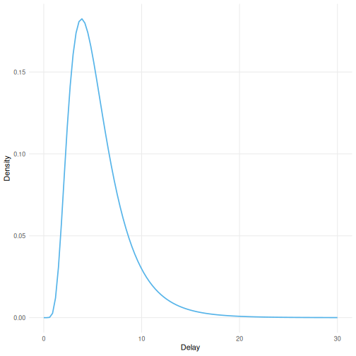
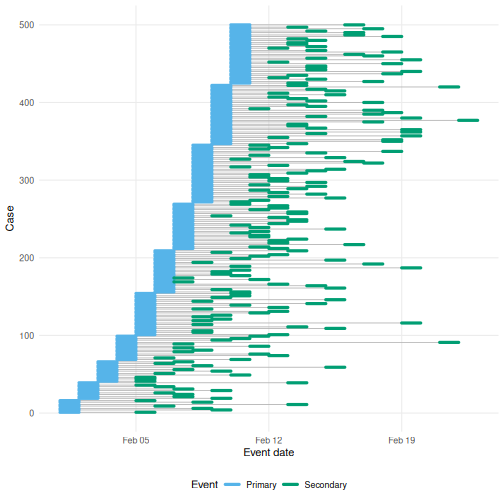
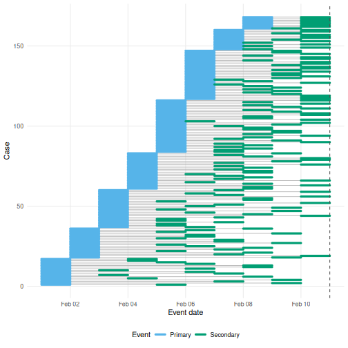
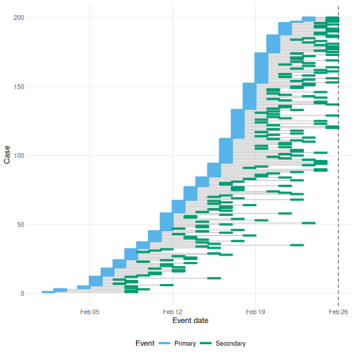
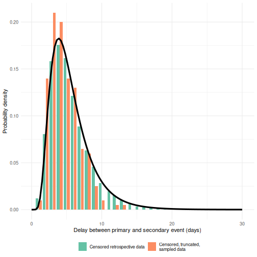
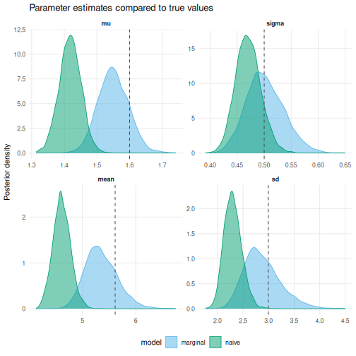
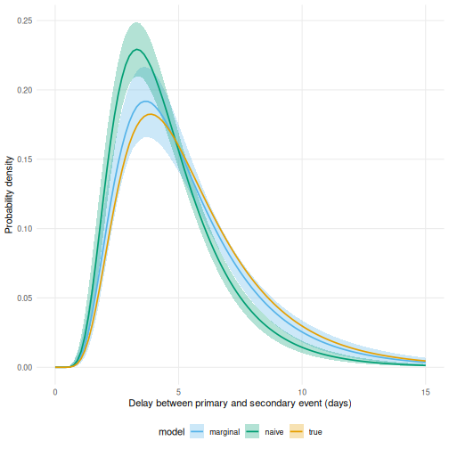

`epidist` is a toolkit for flexibly estimating epidemiological delays built on top of `brms` (Bayesian Regression Models using Stan).
`brms` provides a powerful framework for Bayesian modelling with an accessible R interface to Stan.
By building on `brms`, `epidist` inherits the ability to work within the broader `brms` ecosystem, allowing users to leverage existing tools for model diagnostics, posterior predictive checks, and model comparison while addressing the specific challenges of delay distribution estimation.
See the `vignette("faq")` for more details on the tools available in the `brms` ecosystem.

In this vignette, we will give a quick start guide to using the `epidist` package.
To get started we will introduce some of the key concepts in delay distribution estimation, and then simulate some data delay data from a stochastic outbreak that includes common biases.
Using this simulated data we will then show how to use the `epidist` package to estimate a distribution using a simple model and a model that accounts for some of the common issues in delay distribution estimation.
We will then compare the output of these models to the true delay distribution used to simulate the data again using `epidst` tools.

# Key concepts in delay distribution estimation

In epidemiology, we often need to understand the time between key events - what we call "delays".
Think about things like:

* incubation period (how long between getting infected and showing symptoms),
* serial interval (time between when one person shows symptoms and when someone they infected shows symptoms), and
* generation interval (time between when one person gets infected and when they infect someone else).

We can think of all these as the time between a "primary event" and a "secondary event".

The tricky bit? Getting accurate estimates of these delays from real-world data is a challenge. The two main challenges we typically face are:

1. interval censoring (we often only know events happened within a time window, not the exact time), and
2. right truncation (we might miss observing later events if our observation period ends).

Don't worry if these terms sound a bit technical! In Section \@ref(data), we'll walk through what these issues look like by simulating the kind of data you might see during an outbreak.
Then in Section \@ref(fit), we'll show how `epidist` helps you estimate delay distributions accurately by accounting for these issues.

::: {.alert .alert-primary}
For those interested in the technical details, `epidist` implements models following best practices in the field.
Check out @park2024estimating for a methodological overview and @charniga2024best for a practical checklist designed for applied users.
We also recommend the [nowcasting and forecasting infectious disease dynamics](https://nfidd.github.io/nfidd/) course for more hands on learning.
:::

# Setup {#setup}

To run this vignette yourself, as well as the `epidist` package, you will need the following packages:


``` r
library(epidist)
library(ggplot2)
library(dplyr)
```

# Simulating data {#data}

We simulate data from an outbreak setting where the primary event is symptom onset and the secondary event is case notification.
We assume that both events are dates and so we do not know precise event times.
This is typically the most common setting for delay distribution estimation.
This is a simplified version of the more complete setting that `epidist` supports where events can have different censoring intervals.
We also assume that we are observing a sample of cases during the outbreak.
This means that our data is both interval censored for each event and truncated for the secondary event.

We first assume that the reporting delay is lognormal with a mean log of 1.6 and a log standard deviation of 0.5.
Here we use the `add_summaries()` function to add the mean and sd to the `data.frame`.


``` r
secondary_dist <- data.frame(mu = 1.6, sigma = 0.5) |>
  add_summaries(family = "lognormal")

secondary_dist
#>    mu sigma     mean       sd
#> 1 1.6   0.5 5.612521 2.991139
```

We can visualise the delay distribution these parameters describe with `plot()` (Figure \@ref(fig:lognormal)).

(ref:lognormal) The lognormal distribution is skewed to the right. Long delay times still have some probability.


``` r
plot(secondary_dist, type = "delay", max_delay = 30)
```

<div class="figure">

<p class="caption">(\#fig:lognormal)(ref:lognormal)</p>
</div>

We then simulate the stochastic outbreak in continuous time, sample a reporting delay for each event and finally observe the events (i.e restrict them to be dates).
We assume that the outbreak has a growth rate of 0.2, that we observe the outbreak for 25 days, and that the first case was infected on the 1st of February 2024.


``` r
growth_rate <- 0.2
obs_time <- 25
outbreak_start_date <- as.Date("2024-02-01")
```

<details><summary>Click to expand for simulation details</summary>

First, we use the [Gillespie algorithm](https://en.wikipedia.org/wiki/Gillespie_algorithm) to generate infectious disease outbreak data from a stochastic compartmental model.


``` r
outbreak <- simulate_gillespie(r = growth_rate, seed = 101)
```

`outbreak` is a `data.frame` with the two columns: `case` and `ptime`.
Here `ptime` is a numeric column giving the time of infection.
In reality, it is more common to receive primary event times as a date rather than a numeric.


``` r
head(outbreak)
#>   case      ptime
#> 1    1 0.04884052
#> 2    2 0.06583120
#> 3    3 0.21857827
#> 4    4 0.24963421
#> 5    5 0.30133392
#> 6    6 0.31425010
```

To generate secondary events, we will use a lognormal distribution (Figure \@ref(fig:lognormal)) for the delay between primary and secondary events:


``` r
obs <- simulate_secondary(
  outbreak,
  dist = rlnorm,
  meanlog = secondary_dist[["mu"]],
  sdlog = secondary_dist[["sigma"]]
)
```

`obs` is now a `data.frame` with further columns for `delay` and `stime`.
The secondary event time is simply the primary event time plus the delay:


``` r
all(obs$ptime + obs$delay == obs$stime)
#> [1] TRUE
```

If we were to receive the complete data `obs` as above then it would be simple to accurately estimate the delay distribution.
However, in reality, during an outbreak we almost never receive the data as above.

First, the times of primary and secondary events will usually be censored.
This means that rather than exact event times, we observe event times within an interval.
Here we suppose that the interval is daily, meaning that only the date of the primary or secondary event, not the exact event time, is reported (Figure \@ref(fig:cens)):


``` r
obs_cens <- simulate_dates(
  obs,
  outbreak_start_date = outbreak_start_date,
  obs_time = obs_time
)

head(obs_cens)
#>   case  pdate_lwr  pdate_upr  sdate_lwr  sdate_upr   obs_date
#> 1    1 2024-02-01 2024-02-02 2024-02-05 2024-02-06 2024-02-26
#> 2    2 2024-02-01 2024-02-02 2024-02-09 2024-02-10 2024-02-26
#> 3    3 2024-02-01 2024-02-02 2024-02-07 2024-02-08 2024-02-26
#> 4    4 2024-02-01 2024-02-02 2024-02-09 2024-02-10 2024-02-26
#> 5    5 2024-02-01 2024-02-02 2024-02-04 2024-02-05 2024-02-26
#> 6    6 2024-02-01 2024-02-02 2024-02-08 2024-02-09 2024-02-26
```

`simulate_dates()` floors each event time to its reporting window, daily by default, offsets it from the date the outbreak started, and records the date of the last observation.

As a final step we rename the columns to show that `epidist` does not require particular names.


``` r
obs_data <- transmute(
  obs_cens,
  id = case,
  symptom_onset = pdate_lwr,
  case_notification = sdate_lwr,
  obs_date = obs_date
)
```

</details>

The resulting simulated data `obs_data` has 4 columns: `id`, `symptom_onset`, `case_notification`, and `obs_date`.
Where `symptom_onset` and `case_notification` are dates and `obs_date` is the date of the last observation based on case notification.


``` r
head(obs_data)
#>   id symptom_onset case_notification   obs_date
#> 1  1    2024-02-01        2024-02-05 2024-02-26
#> 2  2    2024-02-01        2024-02-09 2024-02-26
#> 3  3    2024-02-01        2024-02-07 2024-02-26
#> 4  4    2024-02-01        2024-02-09 2024-02-26
#> 5  5    2024-02-01        2024-02-04 2024-02-26
#> 6  6    2024-02-01        2024-02-08 2024-02-26
```

# Preprocessing the data {#preprocessing}

The first step in using `epidist` is to convert the data into a format that `epidist` understands.
The most common format is a linelist, which is a table with one row per case and columns for the primary and secondary event dates.

The `as_epidist_linelist_data()` function converts the data into a linelist format.
It has a few different entry points depending on the format of the data you have but the most common is to use a `data.frame` containing dates.
This dispatches to `as_epidist_linelist_data.data.frame()` which takes the column names of the primary and secondary event dates and the observation date.


``` r
linelist_all <- as_epidist_linelist_data(
  obs_data,
  pdate_lwr = "symptom_onset",
  sdate_lwr = "case_notification",
  obs_date = "obs_date"
)
#> ℹ No primary event upper bound provided, using the primary event lower bound + 1 day as the assumed upper bound.
#> ℹ No secondary event upper bound provided, using the secondary event lower bound + 1 day as the assumed upper bound.

head(linelist_all)
#> # A tibble: 6 × 11
#>   ptime_lwr ptime_upr stime_lwr stime_upr obs_time    id pdate_lwr  sdate_lwr
#>       <dbl>     <dbl>     <dbl>     <dbl>    <dbl> <int> <date>     <date>
#> 1         0         1         4         5       25     1 2024-02-01 2024-02-05
#> 2         0         1         8         9       25     2 2024-02-01 2024-02-09
#> 3         0         1         6         7       25     3 2024-02-01 2024-02-07
#> 4         0         1         8         9       25     4 2024-02-01 2024-02-09
#> 5         0         1         3         4       25     5 2024-02-01 2024-02-04
#> 6         0         1         7         8       25     6 2024-02-01 2024-02-08
#> # ℹ 3 more variables: obs_date <date>, pdate_upr <date>, sdate_upr <date>
```

Here you can see that `epidist` has assumed that the events are both daily censored as upper bounds have not been provided.
If your data was not daily censored, you can provide the upper bounds (`pdate_upr` and `sdate_upr`) to `as_epidist_linelist_data()` and it will use the correct model.
Internally this function converts the data into a relative (to the first event date) time format and creates a variable (`delay`) which contains the observed delay.
These are the variables that `epidist` will use to fit the model.

Other formats are supported, for example aggregate data (e.g. daily case counts), and there is functionality to map between these formats.
See `?as_epidist_aggregate_data()` for more details.

# The observation process {#vis}

`linelist_all` holds every case the outbreak generated.
During an outbreak we only ever see part of it.
Here we apply each part of the observation process in turn and plot what it leaves behind with `plot_events()`.

(ref:cens) Interval censoring of the primary and secondary event times obscures the delay times. A common example of this is when events are reported as daily aggregates. While daily censoring is most common, `epidist` supports the primary and secondary events having other delay intervals. Only the first 500 cases are shown, thinned to the 200 `plot_events()` draws by default, so that the daily windows stay legible.


``` r
plot_events(filter(linelist_all, .data$id <= 500))
```

<div class="figure">

<p class="caption">(\#fig:cens)(ref:cens)</p>
</div>

During an outbreak we will usually be estimating delays in real time.
The result is that only those cases with a secondary event occurring before some time will be observed.
This is called (right) truncation, and biases the observation process towards shorter delays.
In Figure \@ref(fig:trunc) we see a simulation of this process where we have restricted the data to only include cases where the secondary event occurred before day 10.

(ref:trunc) This figure duplicates Figure \@ref(fig:cens) but adds truncation at 10 days due to stopping the observation period at this point. The cases whose secondary event had not happened by the dashed line are now missing.


``` r
plot_events(
  filter(
    linelist_all,
    .data$id <= 500,
    .data$sdate_upr <= outbreak_start_date + 10
  ),
  obs_time = outbreak_start_date + 10
)
```

<div class="figure">

<p class="caption">(\#fig:trunc)(ref:trunc)</p>
</div>

Our own observation period ends after 25 days, so we truncate at the observation date.
The `dplyr` verbs keep the `epidist_linelist_data` class, so the result is still ready to fit to.


``` r
linelist_trunc <- filter(linelist_all, .data$sdate_upr <= .data$obs_date)
```

Finally, in reality, it's not possible to observe every case.
We suppose that a sample of individuals of size `sample_size` are observed:


``` r
sample_size <- 200
```

This sample size corresponds to 7.7% of the data.


``` r
linelist_data <- slice_sample(
  linelist_trunc,
  n = sample_size, replace = FALSE
)
```

<details>
<summary>Issues not considered</summary>

Another issue, which `epidist` currently does not account for, is that sometimes only the secondary event might be observed, and not the primary event.
For example, symptom onset may be reported, but start of infection unknown.
Discarding events of this type leads to what are called ascertainment biases.
Whereas each case is equally likely to appear in the sample above, under ascertainment bias some cases are more likely to appear in the data than others.

</details>

`linelist_data` is the data we will fit to (Figure \@ref(fig:linelist)).

(ref:linelist) The primary and secondary event windows of each observed case, ordered by the date of symptom onset. The dashed line is the observation date, after which no secondary event is seen. These are the 200 sampled cases, drawn from across the whole outbreak rather than the first 500 cases of Figure \@ref(fig:cens).


``` r
plot_events(linelist_data, obs_time = max(linelist_data$obs_date))
```

<div class="figure">

<p class="caption">(\#fig:linelist)(ref:linelist)</p>
</div>

<details><summary>Click to expand for code to create the observed data histogram</summary>


``` r
plot_data <- bind_rows(
  "Censored retrospective data" = as.data.frame(linelist_all),
  "Censored, truncated,\nsampled data" = as.data.frame(linelist_data),
  .id = "type"
) |>
  mutate(delay = as.numeric(.data$sdate_lwr - .data$pdate_lwr)) |>
  count(.data$type, .data$delay) |>
  group_by(.data$type) |>
  mutate(p = .data$n / sum(.data$n))

delay_histogram <- ggplot(plot_data) +
  geom_col(
    aes(x = delay, y = p, fill = type, group = type),
    position = position_dodge2(preserve = "single")
  ) +
  scale_fill_brewer(palette = "Set2") +
  geom_function(
    data = data.frame(x = c(0, 30)), aes(x = x),
    fun = dlnorm,
    args = list(
      meanlog = secondary_dist[["mu"]],
      sdlog = secondary_dist[["sigma"]]
    ),
    linewidth = 1.5
  ) +
  labs(
    x = "Delay between primary and secondary event (days)",
    y = "Probability density",
    fill = ""
  ) +
  theme_minimal() +
  theme(legend.position = "bottom")
```

</details>

(ref:obs-est) The histogram of delays from the fully observed by double interval censored data `linelist_all` is slightly biased relative to the true distribution (black line). This bias is absolute [@park2024estimating] and so will be more problematic for shorter delays. The data that was observed in real-time, `linelist_data`, is more biased still due to right truncation. This bias is relative and so will be more problematic for longer delays or when more of the data is truncated. We always recommend [@charniga2024best; Table 2] adjusting for censoring when it is present and considering if the data is also meaningfully right truncated.


``` r
delay_histogram
```

<div class="figure">

<p class="caption">(\#fig:obs-est)(ref:obs-est)</p>
</div>

# Fitting models {#fit}

Now we are ready to fit some `epidist` models.
`epidist` provides a range of models for different settings.
All `epidist` models have a `as_epidist_<model>_model()` function that can be used to convert the data into a format that the model can use.

## Fit a model that doesn't account for censoring and truncation {#naive}

We will start with the simplest model, which does not account for censoring or truncation.
Behind the scenes this model is essentially just a wrapper around the `brms` package.
To use this model we need to use the `as_epidist_naive_model()` function.


``` r
naive_data <- as_epidist_naive_model(linelist_data)
naive_data
#> # A tibble: 200 × 13
#>    ptime_lwr ptime_upr stime_lwr stime_upr obs_time    id pdate_lwr  sdate_lwr
#>        <dbl>     <dbl>     <dbl>     <dbl>    <dbl> <int> <date>     <date>
#>  1        15        16        23        24       25  1280 2024-02-16 2024-02-24
#>  2        18        19        24        25       25  2167 2024-02-19 2024-02-25
#>  3        11        12        13        14       25   743 2024-02-12 2024-02-14
#>  4        18        19        21        22       25  2257 2024-02-19 2024-02-22
#>  5        17        18        19        20       25  1820 2024-02-18 2024-02-20
#>  6        14        15        18        19       25  1107 2024-02-15 2024-02-19
#>  7        10        11        16        17       25   535 2024-02-11 2024-02-17
#>  8        10        11        11        12       25   583 2024-02-11 2024-02-12
#>  9         7         8        12        13       25   286 2024-02-08 2024-02-13
#> 10        16        17        22        23       25  1616 2024-02-17 2024-02-23
#> # ℹ 190 more rows
#> # ℹ 5 more variables: obs_date <date>, pdate_upr <date>, sdate_upr <date>,
#> #   delay <dbl>, n <dbl>
```

and now we fit the model using the No-U-Turn Sampler (NUTS) Markov chain Monte Carlo (MCMC) algorithm via the [`brms`](https://paulbuerkner.com/brms/) R package [@brms].


``` r
naive_fit <- epidist(
  naive_data,
  chains = 4, cores = 2, refresh = ifelse(interactive(), 250, 0)
)
#> ℹ Data summarised by unique combinations of:
#> * Model variables: delay bounds, observation time, and primary censoring window
#> ! Reduced from 200 to 12 rows.
#> ℹ This should improve model efficiency with no loss of information.
#> Compiling Stan program...
#>
#> Start sampling
```

::: {.alert .alert-primary}
Note that here we use the default `rstan` backend but we generally recommend using the `cmdstanr` backend for faster sampling and additional features.
This can be set using `backend = "cmdstanr"` after following the installing CmdStan instructions in the README.
:::

::: {.alert .alert-primary}
The progress output reports how many unique rows remain after aggregation.
What this is indicating is that non-unique rows (based on the user formula) have been aggregated.
This is done in several of the `epidist` models for efficiency and should have no impact on accuracy.
If you want to explore this see the documentation for the `epidist_transform_data_model()`.
:::

The `naive_fit` object is a `brmsfit` object containing MCMC samples from each of the parameters in the model, shown in the table below.
Users familiar with Stan and `brms`, can work with `fit` directly.
Any tool that supports `brms` fitted model objects will be compatible with `fit`.

For example, we can use the built in `summary()` function to summarise the posterior distribution of the parameters.


``` r
summary(naive_fit)
#>  Family: lognormal
#>   Links: mu = identity; sigma = log
#> Formula: delay | weights(n) ~ 1
#>          sigma ~ 1
#>    Data: transformed_data (Number of observations: 12)
#>   Draws: 4 chains, each with iter = 2000; warmup = 1000; thin = 1;
#>          total post-warmup draws = 4000
#>
#> Regression Coefficients:
#>                 Estimate Est.Error l-95% CI u-95% CI Rhat Bulk_ESS Tail_ESS
#> Intercept           1.42      0.03     1.35     1.48 1.00     3291     2807
#> sigma_Intercept    -0.76      0.05    -0.85    -0.66 1.00     3903     2782
#>
#> Draws were sampled using sampling(NUTS). For each parameter, Bulk_ESS
#> and Tail_ESS are effective sample size measures, and Rhat is the potential
#> scale reduction factor on split chains (at convergence, Rhat = 1).
```

Here we see some information about our model including the links used for each parameter, the formula used (this contains the formula you specified as well some additions we add for each model), summaries of the data, the posterior samples, and the regression coefficients, and some fitting diagnostics.
As we used a simple model with only an intercept (see `vignettes("ebola")` for some complex options) the `Intercept` term corresponds to the mean log of the lognormal and the `sigma_Intercept` term corresponds to the log (due to the log link) of the log standard deviation of the lognormal.

Remember that we simulated the data with a meanlog of 1.6 and a log standard deviation of 0.5.
We see that we have recovered neither of these parameters well (applying the log to the log standard deviation means our target value is ~-0.69) and that means that the resulting distribution we have estimated will not reflect the data well.
If we were going to use this estimate in additional analyses it could lead to biases and flawed decisions.

## Fit a model that accounts for biases and truncation {#marginal}

`epidist` provides a range of models that can account for biases in observed data.
In most cases, we recommend using the marginal model.
This model accounts for interval censoring of the primary and secondary events and right truncation of the secondary event.
Behind the scenes it uses a likelihood from the [`primarycensored` R package](https://primarycensored.epinowcast.org/).
This package contains exact numerical and analytical solutions for numerous double censored and truncated distributions in both Stan and R.
The documentation for `primarycensored` is a good place for learning more about this.


``` r
marginal_data <- as_epidist_marginal_model(linelist_data)
marginal_data
#> # A tibble: 200 × 19
#>    ptime_lwr ptime_upr stime_lwr stime_upr obs_time    id pdate_lwr  sdate_lwr
#>        <dbl>     <dbl>     <dbl>     <dbl>    <dbl> <int> <date>     <date>
#>  1        15        16        23        24       25  1280 2024-02-16 2024-02-24
#>  2        18        19        24        25       25  2167 2024-02-19 2024-02-25
#>  3        11        12        13        14       25   743 2024-02-12 2024-02-14
#>  4        18        19        21        22       25  2257 2024-02-19 2024-02-22
#>  5        17        18        19        20       25  1820 2024-02-18 2024-02-20
#>  6        14        15        18        19       25  1107 2024-02-15 2024-02-19
#>  7        10        11        16        17       25   535 2024-02-11 2024-02-17
#>  8        10        11        11        12       25   583 2024-02-11 2024-02-12
#>  9         7         8        12        13       25   286 2024-02-08 2024-02-13
#> 10        16        17        22        23       25  1616 2024-02-17 2024-02-23
#> # ℹ 190 more rows
#> # ℹ 11 more variables: obs_date <date>, pdate_upr <date>, sdate_upr <date>,
#> #   pwindow <dbl>, swindow <dbl>, relative_obs_time <dbl>,
#> #   orig_relative_obs_time <dbl>, delay_lwr <dbl>, delay_upr <dbl>, n <dbl>,
#> #   delay_min <dbl>
```

The `data` object now has the class `epidist_marginal_model`.
Using this `data`, we now call again `epidist()` to fit the model.
Note that because of the different `as_epidist_<model>_model()` function we have used the marginal rather than naive model will be fit.


``` r
marginal_fit <- epidist(
  data = marginal_data, chains = 4, cores = 2,
  refresh = ifelse(interactive(), 250, 0)
)
#> ℹ Data summarised by unique combinations of:
#> * Model variables: delay bounds, observation time, and primary censoring window
#> ! Reduced from 200 to 92 rows.
#> ℹ This should improve model efficiency with no loss of information.
#> Compiling Stan program...
#>
#> Start sampling
```

We again summarise the posterior using `summary()`,


``` r
summary(marginal_fit)
#>  Family: marginal_lognormal
#>   Links: mu = identity; sigma = log
#> Formula: delay_lwr | weights(n) + vreal(relative_obs_time, pwindow, swindow, delay_upr, delay_min) ~ 1
#>          sigma ~ 1
#>    Data: transformed_data (Number of observations: 92)
#>   Draws: 4 chains, each with iter = 2000; warmup = 1000; thin = 1;
#>          total post-warmup draws = 4000
#>
#> Regression Coefficients:
#>                 Estimate Est.Error l-95% CI u-95% CI Rhat Bulk_ESS Tail_ESS
#> Intercept           1.55      0.05     1.46     1.64 1.00     1846     2148
#> sigma_Intercept    -0.69      0.07    -0.82    -0.55 1.00     1923     2110
#>
#> Draws were sampled using sampling(NUTS). For each parameter, Bulk_ESS
#> and Tail_ESS are effective sample size measures, and Rhat is the potential
#> scale reduction factor on split chains (at convergence, Rhat = 1).
```

Compared to the naive fit we see good recovery of the true distribution parameters (remember these were 1.6 for the logmean and 0.5 (or ~-0.69 on the log scale)) for the log sd.

# Compare the two models estimated delay parameters {#compare}

We can compare the two models by plotting the estimated parameters from the naive and marginal models.
One way to do this is to use the `delay_summary_draws()` function.
It draws one set of delay distribution parameters for each unique combination of the predictors, and adds the natural scale mean and standard deviation of the delay so that the numbers are easier to read.
`epidist_strata()`, `delay_parameter_draws()` and `add_summaries()` are the three steps it wraps, and each is available on its own.
Here we take them separately, so that the draws from both models can be combined before the summaries are added.


``` r
predicted_parameters <- list(marginal = marginal_fit, naive = naive_fit) |>
  lapply(\(fit) delay_parameter_draws(fit, newdata = epidist_strata(fit))) |>
  bind_rows(.id = "model") |>
  mutate(model = factor(model, levels = c("naive", "marginal"))) |>
  add_summaries()

head(predicted_parameters)
#> # A tibble: 6 × 17
#> # Groups:   delay_lwr, relative_obs_time, pwindow, swindow, delay_upr,
#> #   delay_min, n, .row [1]
#>   model    delay_lwr relative_obs_time pwindow swindow delay_upr delay_min     n
#>   <fct>        <dbl>             <dbl>   <dbl>   <dbl>     <dbl>     <dbl> <dbl>
#> 1 marginal         8                10       1       1         9         0     3
#> 2 marginal         8                10       1       1         9         0     3
#> 3 marginal         8                10       1       1         9         0     3
#> 4 marginal         8                10       1       1         9         0     3
#> 5 marginal         8                10       1       1         9         0     3
#> 6 marginal         8                10       1       1         9         0     3
#> # ℹ 9 more variables: .row <int>, .chain <int>, .iteration <int>, .draw <int>,
#> #   mu <dbl>, sigma <dbl>, delay <dbl>, mean <dbl>, sd <dbl>
```

::: {.alert .alert-primary}
Note that by default `add_delay_parameter_draws()` gives draws for every row of the data passed to it.
Neither model here has covariates, so `epidist_strata()` reduces the data to the single row they all share.
This prevents repeating the same draws for each row.

Another approach to building the data to predict for is `epidist_newdata()`, which adds the response and observation process columns the models expect.
:::

We can now plot posterior draws for the summary parameters from the two models.
`plot()` draws the posterior density of each parameter in its own panel, coloured by a stratum of our choosing, and marks the true values.


``` r
true_values <- unlist(secondary_dist[c("mu", "sigma", "mean", "sd")])

p_pp_params <- plot(
  predicted_parameters,
  by = "model",
  true_values = true_values
) +
  labs(title = "Parameter estimates compared to true values")
```

(ref:pp-params) The density of posterior draws from the marginal and naive models compared to the true underlying delay distribution (vertical dashed black line).


``` r
p_pp_params
```

<div class="figure">

<p class="caption">(\#fig:pp-params)(ref:pp-params)</p>
</div>

As expected we see that the naive model has done a very poor job of recovering the true parameters and the marginal model has done a much better job.
However, it is important to note that the marginal model doesn't perfectly recover the true parameters either due to information loss in the censoring and truncation and due to the inherent uncertainty in the posterior distribution.

# Visualise posterior predictions of the true delay distribution {#postprocessing}

As a final step we can visualise the posterior predictions of the delay distribution.
This tells us how good a fit the estimated delay distribution is to the true delay distribution.

`type = "delay"` draws the delay distribution the parameters imply, as the posterior median with a ribbon between the 5% and 95% quantiles.
Adding the true parameters as a third model draws the true distribution on the same axes.


``` r
delay_draws <- bind_rows(
  predicted_parameters,
  mutate(secondary_dist, model = "true")
)

p_fitted_lognormal <- plot(
  delay_draws,
  type = "delay",
  by = "model",
  max_delay = 15
) +
  labs(
    x = "Delay between primary and secondary event (days)",
    y = "Probability density"
  )
```

(ref:fitted-lognormal) The delay distribution implied by the posterior draws of the marginal and naive models, and the true underlying delay distribution. For the two models the line is the posterior median and the ribbon spans the 5% to 95% quantiles. The naive model shows substantial bias whilst the marginal model better recovers the true distribution.


``` r
p_fitted_lognormal
```

<div class="figure">

<p class="caption">(\#fig:fitted-lognormal)(ref:fitted-lognormal)</p>
</div>

As expected based on the recovery of the parameters, the marginal model better recovers the true distribution than the naive model which has a substantially shorter mean and different shape.

# Learning more {#learning-more}

The `epidist` package provides several additional vignettes to help you learn more about the package and its capabilities:

- For more details on the different models available in `epidist`, see `vignette("model")`.
- For a real-world example using `epidist` with Ebola data and demonstrations of more complex modelling approaches, see `vignette("ebola")`.
- If you're interested in approximate inference methods for faster computation with large datasets, see `vignette("approx-inference")`.
- For answers to common questions and tips for integrating `epidist` with other packages in your workflow, see our FAQ at `vignette("faq")`.

## References {-}
