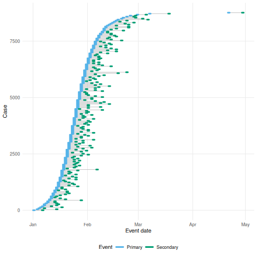
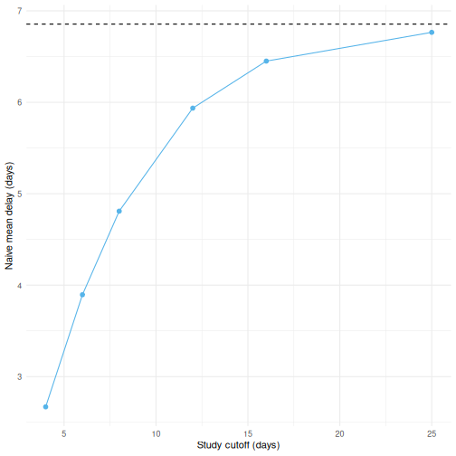
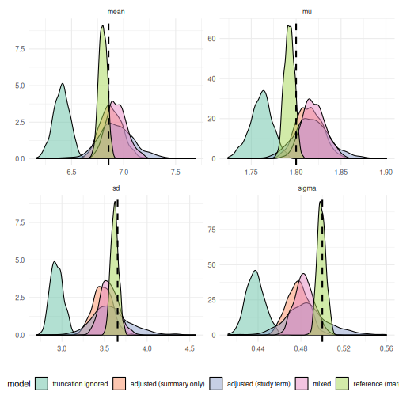
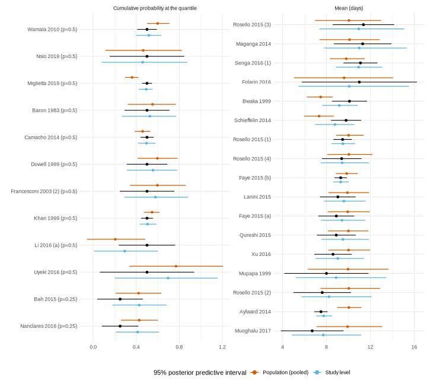
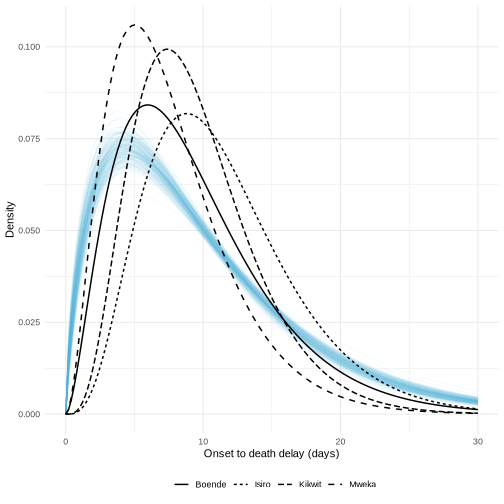

::: {.alert .alert-warning}
The meta model is experimental.
Its interface may still change in future releases.
:::

Systematic reviews of epidemiological delays mostly collect published summary values, such as a mean and standard deviation, or a median and interquartile range, rather than individual level data.
Those summaries are usually biased, because studies often do not adjust for right truncation, treat day rounded delays as if they were continuous, or only partially correct for interval censoring.
The meta model fits directly to these summarised, and potentially biased, published estimates, jointly with any individual level data we do have.
It does this by forward modelling what each study's own estimation procedure would have converged to.
Jointly synthesising individual level data and published summaries in one hierarchical model overlaps with the federated analysis approach of the [ddsynth](https://github.com/cm401/ddsynth) package.
The meta model differs in adjusting each summary for the biases of the study's own estimation procedure rather than treating it as an unbiased estimate of the continuous delay.
It also builds on `brms`, so formulas, families, priors and post-processing all carry over.

::: {.alert .alert-primary}
For a methodological overview of the biases in published delay estimates see @park2024estimating, and for a practical checklist aimed at applied users see @charniga2024best.
For individual level rows the meta model reuses the likelihood of the marginal model (`vignette("epidist")`), which relies on the [`primarycensored`](https://primarycensored.epinowcast.org/) package [@primarycensored].
It adds a forward model of the naive estimator for summary rows, so both kinds of evidence can be combined in one `brms` [@brms] model.
:::

# What we need from a study {#metadata}

Reviews rarely record exactly how a study estimated its delay.
To use a reported summary we need to know roughly how the study handled the common biases, along with the data process it saw.
The meta model supports only a few common approaches, encoded as follows.
We plan to support further biases, such as right and left censoring, across all of the models in the package.

* **How the study adjusted for censoring** (`cens_adjusted`), one of `0` if it took integer date differences and summarised them directly (the most common case), `1` if it used a method that targets the continuous delay, such as a latent variable or marginal likelihood, `2` if it adjusted only the secondary interval assuming a uniform delay within it, or `3` if it assigned each delay to the centre of the interval it was observed in.
* **Whether it adjusted for right truncation** (`trunc_adjusted`), and if not, **the observation time** (`relative_obs_time`) and **how collection stopped** (`trunc_design`).
  For a `"cohort"` design the observation time is the truncation point on the delay scale.
  For an `"accrual"` design, where collection stopped at a calendar date, it is the length of the collection window.
* **The censoring windows** (`pwindow`, `swindow`), for example 1 for daily reporting or 7 for weekly reporting.
* **The sample size** (`n`) the summary was computed from, or a reported standard error (`se`).
* **The smallest delay it counted** (`delay_min`), where the study dropped shorter delays, so that its summaries describe a left truncated delay distribution.
  Defaults to 0, meaning it counted every delay.

If you cannot tell which of these a study used, state the assumption you are making explicitly, and note it alongside any results.
See `?as_epidist_estimates_data` for the full details.

A study that cannot share its delays can go further and report a covariance matrix over the summaries it publishes, through the `vcov` argument, rather than a standard error for each one.
This is the format we recommend, because it keeps the correlation between the quantities the study reports.
`bootstrap_delay_estimates()` produces the summary vector and its covariance from a set of delays, so it is what a site with a line list it cannot release would run and publish.

# Setup {#setup}


``` r
library(epidist)
library(brms)
#> Loading required package: Rcpp
#> Loading 'brms' package (version 2.23.0). Useful instructions
#> can be found by typing help('brms'). A more detailed introduction
#> to the package is available through vignette('brms_overview').
#>
#> Attaching package: 'brms'
#> The following object is masked from 'package:stats':
#>
#>     ar
library(ggplot2)
library(dplyr)
#>
#> Attaching package: 'dplyr'
#> The following objects are masked from 'package:stats':
#>
#>     filter, lag
#> The following objects are masked from 'package:base':
#>
#>     intersect, setdiff, setequal, union
library(tidyr)
library(purrr) # nolint
library(tibble)
```

# Simulating biased published estimates {#simulate}

We simulate an outbreak exactly as in `vignette("epidist")`, a stochastic epidemic with a lognormal delay between primary (symptom onset) and secondary (case notification) events, both interval censored to a day.
Figure \@ref(fig:outbreak) shows the case counts.


``` r
set.seed(101)
meanlog <- 1.8
sdlog <- 0.5
growth_rate <- 0.2
outbreak_start_date <- as.Date("2024-01-01")

outbreak <- simulate_gillespie(r = growth_rate, seed = 101)
obs <- simulate_secondary(
  outbreak,
  dist = rlnorm, meanlog = meanlog, sdlog = sdlog
)
obs_cens <- obs |>
  simulate_dates(
    outbreak_start_date = outbreak_start_date, keep_times = TRUE
  ) |>
  mutate(
    ptime_lwr = as.numeric(.data$pdate_lwr - outbreak_start_date),
    ptime_upr = as.numeric(.data$pdate_upr - outbreak_start_date),
    stime_lwr = as.numeric(.data$sdate_lwr - outbreak_start_date),
    stime_upr = as.numeric(.data$sdate_upr - outbreak_start_date),
    delay_daily = .data$stime_lwr - .data$ptime_lwr
  )
```

(ref:outbreak) Case counts over the course of the simulated outbreak (only every 50th case is shown to avoid over-plotting).


``` r
obs_cens |>
  filter(case %% 50 == 0) |>
  ggplot(aes(x = ptime, y = case)) +
  geom_point(col = "#56B4E9") +
  labs(x = "Primary event time (day)", y = "Case number") +
  theme_minimal()
```

<div class="figure">

<p class="caption">(\#fig:outbreak)(ref:outbreak)</p>
</div>

Now imagine several studies each analysing this outbreak at a different point in time, reporting integer date differences with no adjustment for right truncation, that is `cens_adjusted = 0` and `trunc_adjusted = FALSE`.
We mimic this by taking cases whose delay is less than a study specific cutoff, since a case with a longer delay would not yet have been observed by that study.


``` r
naive_snapshot <- function(cutoff) {
  delays <- obs_cens |>
    filter(.data$delay_daily + 1 <= cutoff) |>
    pull(delay_daily)
  return(
    tibble(cutoff = cutoff, naive_mean = mean(delays), n = length(delays))
  )
}

true_mean <- exp(meanlog + sdlog^2 / 2)
bias_illustration <- map(c(4, 6, 8, 12, 16, 25), naive_snapshot) |>
  list_rbind()
```

(ref:bias) The naive mean delay from a snapshot taken with a given cutoff (points), compared to the true mean delay (dashed line). Studies analysing the outbreak earlier see a more heavily right truncated, and so more biased, sample of delays.


``` r
ggplot(bias_illustration, aes(x = cutoff, y = naive_mean)) +
  geom_line(col = "#56B4E9") +
  geom_point(col = "#56B4E9", size = 2) +
  geom_hline(yintercept = true_mean, linetype = "dashed") +
  labs(x = "Study cutoff (days)", y = "Naive mean delay (days)") +
  theme_minimal()
```

<div class="figure">

<p class="caption">(\#fig:bias)(ref:bias)</p>
</div>

Real reviews collect studies that differ in how they measured delays and in what they chose to report.
We build seven such studies from the same line list, each applying its own estimation procedure to it.
The table below sets out what each one did and reports.

<details><summary>Click to expand for code to build the simulated studies</summary>


``` r
set.seed(2)

# The delays each censoring adjustment would have measured.
measured_delay <- function(data, cens_adjusted) {
  return(switch(
    as.character(cens_adjusted),
    "0" = data$delay_daily,
    "1" = data$stime - data$ptime,
    "2" = data$stime - data$ptime_lwr,
    "3" = data$delay_daily + 0.5
  ))
}

# A study that stopped at a calendar date needs the growth rate of primary
# events over its collection window. The simulated outbreak grows more slowly
# than its rate parameter once it starts to deplete susceptibles, so we take
# the realised rate rather than the one we simulated with.
window_growth_rate <- function(window) {
  counts <- obs_cens |>
    filter(.data$ptime <= window) |>
    count(day = floor(.data$ptime))
  return(unname(coef(glm(n ~ day, family = poisson, data = counts))[2]))
}

accrual_growth_rate <- window_growth_rate(20)

# Whether a study analysing at a cohort cutoff would have seen a case. A
# study working from a discrete grid sees a case only if the whole day its
# delay falls in is below the cutoff.
observed_by <- function(data, cens_adjusted, obs_time) {
  if (cens_adjusted %in% c(0, 3)) {
    return(data$delay_daily + 1 <= obs_time)
  }
  return(measured_delay(data, cens_adjusted) <= obs_time)
}

# The cases a study with a given truncation situation would have seen.
available_cases <- function(cens_adjusted, trunc_adjusted, obs_time,
                            trunc_design, delay_min) {
  cases <- obs_cens
  if (!trunc_adjusted && trunc_design == "accrual") {
    cases <- filter(cases, .data$ptime <= obs_time, .data$stime <= obs_time)
  } else if (!trunc_adjusted) {
    cases <- filter(cases, observed_by(cases, cens_adjusted, obs_time))
  }
  return(filter(cases, measured_delay(cases, cens_adjusted) >= delay_min))
}

# One study: draw a sample, measure it, and report the chosen summaries.
simulate_study <- function(study, report, probs, cens_adjusted,
                           trunc_adjusted, obs_time, trunc_design = "cohort",
                           delay_min = 0, study_growth_rate = 0,
                           study_n = 250) {
  cases <- available_cases(
    cens_adjusted, trunc_adjusted, obs_time, trunc_design, delay_min
  )
  delays <- measured_delay(
    slice_sample(cases, n = min(study_n, nrow(cases))), cens_adjusted
  )
  metadata <- list(
    cens_adjusted = cens_adjusted, trunc_adjusted = trunc_adjusted,
    relative_obs_time = obs_time, trunc_design = trunc_design,
    delay_min = delay_min, growth_rate = study_growth_rate, max_delay = 60
  )
  if (report == "covariance") {
    return(do.call(bootstrap_delay_estimates, c(
      list(delays, study = study, probs = probs), metadata
    )))
  }
  rows <- if (report == "moments") {
    tibble(
      type = c("mean", "sd"),
      value = c(mean(delays), stats::sd(delays)), p = NA_real_
    )
  } else {
    tibble(
      type = "quantile",
      value = stats::quantile(delays, probs, names = FALSE), p = probs
    )
  }
  rows <- mutate(rows, study = study, n = length(delays))
  return(list(data = do.call(mutate, c(list(rows), metadata)), vcov = NULL))
}

study_designs <- tribble(
  ~study,           ~report,      ~probs,             ~cens_adjusted,
  "naive cohort",   "moments",    NA,                 0,
  "naive IQR",      "quantiles",  c(0.25, 0.5, 0.75), 0,
  "calendar stop",  "quantiles",  c(0.2, 0.5, 0.8),   0,
  "uniform window", "moments",    NA,                 2,
  "midpoint",       "quantiles",  c(0.3, 0.6, 0.9),   3,
  "adjusted (MVN)", "covariance", c(0.25, 0.75),      1,
  "delays over 2d", "moments",    NA,                 0
) |>
  mutate(
    trunc_adjusted = c(FALSE, FALSE, FALSE, FALSE, FALSE, TRUE, FALSE),
    relative_obs_time = c(12, 16, 20, 25, 30, Inf, 18),
    trunc_design = c(
      "cohort", "cohort", "accrual", "cohort", "cohort", "cohort", "cohort"
    ),
    delay_min = c(0, 0, 0, 0, 0, 0, 2),
    study_growth_rate = c(0, 0, accrual_growth_rate, 0, 0, 0, 0)
  )

simulated_studies <- study_designs |>
  pmap(function(study, report, probs, cens_adjusted, trunc_adjusted,
                relative_obs_time, trunc_design, delay_min,
                study_growth_rate) {
    return(simulate_study(
      study, report, probs, cens_adjusted, trunc_adjusted, relative_obs_time,
      trunc_design, delay_min, study_growth_rate
    ))
  })

biased_estimates_df <- map(simulated_studies, "data") |> list_rbind()
biased_vcov <- map(simulated_studies, "vcov") |> list_flatten() |> compact()
```

</details>

(ref:studies) The seven simulated studies, their estimation procedures and what each reports.


``` r
study_designs |>
  transmute(
    Study = study,
    Reports = case_when(
      report == "moments" ~ "mean, sd",
      report == "covariance" ~ "mean, sd, quantiles + covariance",
      .default = paste0("quantiles at p = ", map_chr(probs, toString))
    ),
    Censoring = case_when(
      cens_adjusted == 0 ~ "0: date differences",
      cens_adjusted == 1 ~ "1: fully adjusted",
      cens_adjusted == 2 ~ "2: uniform window",
      .default = "3: midpoint"
    ),
    Truncation = case_when(
      trunc_adjusted ~ "adjusted",
      trunc_design == "accrual" ~ "calendar stop",
      .default = "cohort cutoff"
    ),
    `Obs time` = relative_obs_time,
    `Min delay` = delay_min
  ) |>
  knitr::kable(caption = "(ref:studies)")
```


Table: (\#tab:studies)(ref:studies)

|Study          |Reports                          |Censoring           |Truncation    | Obs time| Min delay|
|:--------------|:--------------------------------|:-------------------|:-------------|--------:|---------:|
|naive cohort   |mean, sd                         |0: date differences |cohort cutoff |       12|         0|
|naive IQR      |quantiles at p = 0.25, 0.5, 0.75 |0: date differences |cohort cutoff |       16|         0|
|calendar stop  |quantiles at p = 0.2, 0.5, 0.8   |0: date differences |calendar stop |       20|         0|
|uniform window |mean, sd                         |2: uniform window   |cohort cutoff |       25|         0|
|midpoint       |quantiles at p = 0.3, 0.6, 0.9   |3: midpoint         |cohort cutoff |       30|         0|
|adjusted (MVN) |mean, sd, quantiles + covariance |1: fully adjusted   |adjusted      |      Inf|         0|
|delays over 2d |mean, sd                         |0: date differences |cohort cutoff |       18|         2|


The study reporting a covariance matrix over its summaries could not share its delays, so it published the vector of summaries and the covariance between them from `bootstrap_delay_estimates()` instead.


``` r
biased_estimates <- as_epidist_estimates_data(
  biased_estimates_df, vcov = biased_vcov
)
#> ℹ No `pwindow` column supplied, assuming a censoring window of 1 (daily
#>   reporting) for every study.
#> ℹ No `swindow` column supplied, assuming a censoring window of 1 (daily
#>   reporting) for every study.
biased_estimates
#> # A tibble: 19 × 15
#>    study         type  value    se     n     p pwindow swindow relative_obs_time
#>    <chr>         <chr> <dbl> <dbl> <int> <dbl>   <dbl>   <dbl>             <dbl>
#>  1 naive cohort  mean   6.14    NA   250 NA          1       1                12
#>  2 naive cohort  sd     2.49    NA   250 NA          1       1                12
#>  3 naive IQR     quan…  4       NA   250  0.25       1       1                16
#>  4 naive IQR     quan…  6       NA   250  0.5        1       1                16
#>  5 naive IQR     quan…  8       NA   250  0.75       1       1                16
#>  6 calendar stop quan…  3       NA   250  0.2        1       1                20
#>  7 calendar stop quan…  5       NA   250  0.5        1       1                20
#>  8 calendar stop quan…  7       NA   250  0.8        1       1                20
#>  9 uniform wind… mean   7.20    NA   250 NA          1       1                25
#> 10 uniform wind… sd     3.35    NA   250 NA          1       1                25
#> 11 midpoint      quan…  4.5     NA   250  0.3        1       1                30
#> 12 midpoint      quan…  7.5     NA   250  0.6        1       1                30
#> 13 midpoint      quan… 11.5     NA   250  0.9        1       1                30
#> 14 adjusted (MV… mean   7.01    NA   250 NA          1       1               Inf
#> 15 adjusted (MV… sd     3.64    NA   250 NA          1       1               Inf
#> 16 adjusted (MV… quan…  4.32    NA   250  0.25       1       1               Inf
#> 17 adjusted (MV… quan…  8.86    NA   250  0.75       1       1               Inf
#> 18 delays over … mean   6.45    NA   250 NA          1       1                18
#> 19 delays over … sd     3.02    NA   250 NA          1       1                18
#> # ℹ 6 more variables: trunc_adjusted <lgl>, trunc_design <chr>,
#> #   cens_adjusted <int>, delay_min <dbl>, growth_rate <dbl>, max_delay <dbl>
```

::: {.alert .alert-primary}
`max_delay` sets how far the grid used to work out the implied naive summaries extends.
We set it explicitly here because the default, twenty times the largest reported value, would make the grid unnecessarily large for this simulated example and slow fitting down.
:::

# Fitting and comparing models {#fit}

## A bias-adjusted fit to the summaries alone

We convert the estimates to an `epidist_meta_model` object and fit it, exactly as we would fit any other `epidist` model.


``` r
meta_summary_only <- as_epidist_meta_model(estimates = biased_estimates)

fit_meta_summary <- epidist(
  data = meta_summary_only,
  chains = 2, cores = 2, iter = 1000,
  refresh = ifelse(interactive(), 250, 0),
  seed = 1,
  backend = "cmdstanr"
)
```


``` r
summary(fit_meta_summary)
#>  Family: meta_lognormal
#>   Links: mu = identity; sigma = log
#> Formula: delay_lwr | weights(n) + vint(obs_type, study_n, trunc_adjusted, cens_adjusted, trunc_design, group_start, group_len, chol_start) + vreal(relative_obs_time, pwindow, swindow, delay_upr, delay_min, report_se, quantile_p, growth_rate) ~ 1
#>          sigma ~ 1
#>    Data: transformed_data (Number of observations: 7)
#>   Draws: 2 chains, each with iter = 1000; warmup = 500; thin = 1;
#>          total post-warmup draws = 1000
#>
#> Regression Coefficients:
#>                 Estimate Est.Error l-95% CI u-95% CI Rhat Bulk_ESS Tail_ESS
#> Intercept           1.79      0.01     1.76     1.82 1.01      914      662
#> sigma_Intercept    -0.67      0.02    -0.72    -0.63 1.01      665      557
#>
#> Draws were sampled using sample(hmc). For each parameter, Bulk_ESS
#> and Tail_ESS are effective sample size measures, and Rhat is the potential
#> scale reduction factor on split chains (at convergence, Rhat = 1).
```

Even though every study is individually biased, the meta model recovers the true delay distribution parameters (a log mean of 1.8 and log standard deviation of 0.5) closely.

## What happens with the wrong metadata

The metadata about how a study adjusted its estimate matters.
Whether a study corrected for right truncation is the field reviews most often leave out, so we refit the same seven studies with every one of them relabelled as `trunc_adjusted = TRUE`.


``` r
wrong_flags_estimates <- biased_estimates_df |>
  mutate(trunc_adjusted = TRUE) |>
  as_epidist_estimates_data(vcov = biased_vcov)
meta_wrong_flags <- as_epidist_meta_model(estimates = wrong_flags_estimates)

fit_meta_wrong_flags <- epidist(
  data = meta_wrong_flags,
  chains = 2, cores = 2, iter = 1000,
  refresh = ifelse(interactive(), 250, 0),
  seed = 1,
  backend = "cmdstanr"
)
```


``` r
summary(fit_meta_wrong_flags)
#>  Family: meta_lognormal
#>   Links: mu = identity; sigma = log
#> Formula: delay_lwr | weights(n) + vint(obs_type, study_n, trunc_adjusted, cens_adjusted, trunc_design, group_start, group_len, chol_start) + vreal(relative_obs_time, pwindow, swindow, delay_upr, delay_min, report_se, quantile_p, growth_rate) ~ 1
#>          sigma ~ 1
#>    Data: transformed_data (Number of observations: 7)
#>   Draws: 2 chains, each with iter = 1000; warmup = 500; thin = 1;
#>          total post-warmup draws = 1000
#>
#> Regression Coefficients:
#>                 Estimate Est.Error l-95% CI u-95% CI Rhat Bulk_ESS Tail_ESS
#> Intercept           1.73      0.01     1.71     1.76 1.00      877      503
#> sigma_Intercept    -0.70      0.03    -0.75    -0.64 1.00      926      597
#>
#> Draws were sampled using sample(hmc). For each parameter, Bulk_ESS
#> and Tail_ESS are effective sample size measures, and Rhat is the potential
#> scale reduction factor on split chains (at convergence, Rhat = 1).
```

The model has no way to know the metadata is wrong, so it takes each reported summary as an estimate of the untruncated delay and converges confidently on a mean several percent too short.
Nothing in the fit signals that anything is wrong.
This is the same trade-off as for individual level data.
The model can only adjust for the biases it is told about.

## A mixed fit: summaries plus a handful of individual records

Now suppose we also have a small individual level sample, perhaps from one site that shared its line list.
We add 40 individual records, observed up to day 40, alongside the same seven published summaries.


``` r
individual_subsample <- obs_cens |>
  mutate(obs_time = 40) |>
  filter(.data$stime_upr <= .data$obs_time) |>
  slice_sample(n = 40)

individual_data <- as_epidist_linelist_data(
  individual_subsample$ptime_lwr,
  individual_subsample$ptime_upr,
  individual_subsample$stime_lwr,
  individual_subsample$stime_upr,
  individual_subsample$obs_time
)

meta_mixed <- as_epidist_meta_model(
  individual_data,
  estimates = biased_estimates
)

fit_meta_mixed <- epidist(
  data = meta_mixed,
  chains = 2, cores = 2, iter = 1000,
  refresh = ifelse(interactive(), 250, 0),
  seed = 1,
  backend = "cmdstanr"
)
```


``` r
summary(fit_meta_mixed)
#>  Family: meta_lognormal
#>   Links: mu = identity; sigma = log
#> Formula: delay_lwr | weights(n) + vint(obs_type, study_n, trunc_adjusted, cens_adjusted, trunc_design, group_start, group_len, chol_start) + vreal(relative_obs_time, pwindow, swindow, delay_upr, delay_min, report_se, quantile_p, growth_rate) ~ 1
#>          sigma ~ 1
#>    Data: transformed_data (Number of observations: 39)
#>   Draws: 2 chains, each with iter = 1000; warmup = 500; thin = 1;
#>          total post-warmup draws = 1000
#>
#> Regression Coefficients:
#>                 Estimate Est.Error l-95% CI u-95% CI Rhat Bulk_ESS Tail_ESS
#> Intercept           1.79      0.01     1.76     1.81 1.01      689      572
#> sigma_Intercept    -0.67      0.02    -0.72    -0.63 1.00      735      643
#>
#> Draws were sampled using sample(hmc). For each parameter, Bulk_ESS
#> and Tail_ESS are effective sample size measures, and Rhat is the potential
#> scale reduction factor on split chains (at convergence, Rhat = 1).
```

## Reference: the marginal model on the full line list

Finally, as a reference, we fit the marginal model (`vignette("epidist")`) to a larger, effectively untruncated, individual level sample from the same outbreak.
This is what we would recover if we had access to the underlying data rather than only published summaries.


``` r
reference_subsample <- obs_cens |>
  mutate(obs_time = max(.data$stime_upr)) |>
  slice_sample(n = 300)

reference_data <- as_epidist_linelist_data(
  reference_subsample$ptime_lwr,
  reference_subsample$ptime_upr,
  reference_subsample$stime_lwr,
  reference_subsample$stime_upr,
  reference_subsample$obs_time
)

fit_reference <- epidist(
  data = as_epidist_marginal_model(reference_data),
  chains = 2, cores = 2, iter = 1000,
  refresh = ifelse(interactive(), 250, 0),
  seed = 1,
  backend = "cmdstanr"
)
```

## Comparing the four fits

<details><summary>Click to expand for code to prepare the comparison plot</summary>


``` r
predicted_parameters <- list(
  "adjusted (summary only)" = fit_meta_summary,
  "truncation ignored" = fit_meta_wrong_flags,
  mixed = fit_meta_mixed,
  "reference (marginal)" = fit_reference
) |>
  lapply(predict_delay_parameters) |>
  bind_rows(.id = "model") |>
  filter(index == 1) |>
  mutate(model = factor(
    model,
    levels = c(
      "truncation ignored", "adjusted (summary only)", "mixed",
      "reference (marginal)"
    )
  ))

true_sd <- true_mean * sqrt(exp(sdlog^2) - 1)
true_params <- tibble(
  parameter = c("mu", "sigma", "mean", "sd"),
  value = c(meanlog, sdlog, true_mean, true_sd)
)

p_compare <- predicted_parameters |>
  pivot_longer(
    cols = c(mu, sigma, mean, sd),
    names_to = "parameter", values_to = "value"
  ) |>
  ggplot() +
  geom_density(aes(x = value, fill = model), alpha = 0.5) +
  geom_vline(
    data = true_params, aes(xintercept = value),
    linetype = "dashed", linewidth = 1
  ) +
  facet_wrap(~parameter, scales = "free") +
  scale_fill_brewer(palette = "Set2") +
  labs(x = "", y = "") +
  theme_minimal() +
  theme(legend.position = "bottom")
```

</details>

(ref:compare) Posterior draws of the delay distribution parameters from the four fits, compared to the true values used in the simulation (dashed lines). The bias-adjusted, mixed, and reference fits agree closely with the truth. The fit told that every study had adjusted for right truncation does not.


``` r
p_compare
```

<div class="figure">

<p class="caption">(\#fig:compare)(ref:compare)</p>
</div>

# Real world estimates from epireview {#epireview}

[epireview](https://github.com/mrc-ide/epireview) [@epireview] collates published parameter estimates gathered by the Pathogen Epidemiology Review Group.
It is not on CRAN, so install it from GitHub if you do not already have it.


``` r
if (!requireNamespace("epireview", quietly = TRUE)) {
  if (!requireNamespace("remotes", quietly = TRUE)) {
    install.packages("remotes")
  }
  # nolint next: nonportable_path_linter.
  remotes::install_github("mrc-ide/epireview")
}
library(epireview) # nolint: library_call_linter.
#> Loading required package: epitrix
#> Loading required package: ggforce
```

We use the onset to death delay from the Ebola outbreak data.
Alongside the delay type we filter to the value types we can model (means and medians), to estimates reported in days with no scaling exponent, and to parameters that are not inverse rates.
This stops other value types silently slipping in as medians.


``` r
ebola <- suppressMessages(load_epidata("ebola"))
onset_to_death_all <- ebola$params |>
  filter(
    .data$parameter_type_short == "delay_onset_to_death",
    !is.na(.data$parameter_value),
    !is.na(.data$population_sample_size)
  )
onset_to_death <- onset_to_death_all |>
  filter(
    .data$parameter_value_type %in% c("Mean", "Median"),
    .data$parameter_unit == "Days",
    .data$exponent == 0,
    !.data$inverse_param
  )
nrow(onset_to_death)
#> [1] 29
```

For these data the hygiene filters remove 0 rows, but they guard against mis-modelling if the underlying database changes.

::: {.alert .alert-primary}
epireview does not record how, or whether, a study adjusted for censoring or right truncation, so we have to state assumptions explicitly rather than leave them implicit.
We treat a study as `cens_adjusted = 1` if it also reports a fitted distribution (`distribution_type`), on the grounds that fitting a distribution directly is unlikely to have ignored censoring entirely, and `cens_adjusted = 0` otherwise.
We treat a study as not adjusted for right truncation only if it was conducted during the outbreak (`method_moment_value` of `"Start outbreak"` or `"Mid outbreak"`).
All other studies are treated as unaffected by truncation.
Those early phase studies most likely stopped collecting cases at a calendar date rather than following every case for a common length of time, so we use the `"accrual"` truncation design for them.
We give them a uniform accrual rate (`growth_rate = 0`, the default), since epireview does not report an outbreak growth rate either.
For an accrual design `relative_obs_time` is the length of the collection window rather than a cohort cutoff, and we take it as three times the reported value.
epireview does not record the true collection window, so this is a rough, explicitly stated, placeholder rather than a reported value.
Ideally reviews would report this study metadata directly, so that assumptions like these were not needed.
The reporting checklist of @charniga2024best covers exactly this metadata, and if studies and systematic reviews reported against it, building estimates data for this model would be straightforward.
For examples of the checklist in use see [andv-linelist-analysis](https://github.com/epiforecasts/andv-linelist-analysis) (the Epuyén Andes virus outbreak) and [bdbv-linelist-analysis](https://github.com/epiforecasts/bdbv-linelist-analysis) (the 2012 Isiro Bundibugyo Ebola outbreak, re-analysing the line list of @rosello2015ebola).
:::

A small helper maps each row of `onset_to_death` to the long format `as_epidist_estimates_data()` expects.
Means become `"mean"` rows, with a matching `"sd"` row where a standard deviation, rather than a standard error, is reported.
Medians become `"quantile"` rows at `p = 0.5`, with further quantile rows at `p = 0.25` and `p = 0.75` where an interquartile range is reported.

<details><summary>Click to expand for the epireview conversion helper</summary>


``` r
row_to_estimates <- function(
  study, n, trunc_adjusted, relative_obs_time, trunc_design, cens_adjusted,
  max_delay, parameter_value_type, parameter_value, ...
) {
  # The remaining epireview columns we need have names longer than the 30
  # character limit lintr allows for a symbol, so they are read out of `...`
  # by name instead of being formal arguments.
  extra <- list(...)
  singe_type <- extra$parameter_uncertainty_singe_type
  single_value <- extra$parameter_uncertainty_single_value
  range_type <- extra$parameter_uncertainty_type
  lower_value <- extra$parameter_uncertainty_lower_value
  upper_value <- extra$parameter_uncertainty_upper_value

  base <- tibble(
    study = study, n = n, trunc_adjusted = trunc_adjusted,
    relative_obs_time = relative_obs_time, trunc_design = trunc_design,
    cens_adjusted = cens_adjusted, max_delay = max_delay
  )
  if (parameter_value_type == "Mean") {
    rows <- mutate(base, type = "mean", value = parameter_value, p = NA_real_)
    if (identical(singe_type, "Standard Error")) {
      rows$se <- single_value
    } else if (identical(singe_type, "Standard Deviation")) {
      rows <- bind_rows(
        rows,
        mutate(base, type = "sd", value = single_value, p = NA_real_)
      )
    }
  } else if (parameter_value_type == "Median") {
    rows <- mutate(base, type = "quantile", value = parameter_value, p = 0.5)
    if (identical(range_type, "IQR")) {
      rows <- bind_rows(
        rows,
        mutate(base, type = "quantile", value = lower_value, p = 0.25),
        mutate(base, type = "quantile", value = upper_value, p = 0.75)
      )
    }
  }
  return(rows)
}
```

</details>


``` r
ebola_estimates_df <- onset_to_death |>
  mutate(
    early_phase = .data$method_moment_value %in%
      c("Start outbreak", "Mid outbreak"),
    trunc_adjusted = !.data$early_phase,
    relative_obs_time = ifelse(
      .data$early_phase, 3 * .data$parameter_value, Inf
    ),
    trunc_design = ifelse(.data$early_phase, "accrual", "cohort"),
    cens_adjusted = as.numeric(!is.na(.data$distribution_type)),
    study = .data$article_label,
    n = .data$population_sample_size,
    max_delay = NA_real_ # replaced below, once rows are in long format
  ) |>
  pmap(row_to_estimates) |>
  list_rbind() |>
  mutate(
    # A grid must reach past a study's own reported spread or the implied
    # standard deviation is biased downwards (see ?as_epidist_estimates_data
    # on max_delay). Studies that report a standard deviation get a grid
    # sized to it; the rest use a shorter, fixed grid, which is safe here
    # because none of them report a value over 27 days.
    max_delay = if (any(.data$type == "sd")) {
      ceiling(
        max(.data$value[.data$type == "mean"]) +
          10 * max(.data$value[.data$type == "sd"])
      )
    } else {
      40
    },
    .by = "study"
  )

ebola_estimates <- as_epidist_estimates_data(ebola_estimates_df)
#> ℹ No `pwindow` column supplied, assuming a censoring window of 1 (daily
#>   reporting) for every study.
#> ℹ No `swindow` column supplied, assuming a censoring window of 1 (daily
#>   reporting) for every study.
```

::: {.alert .alert-primary}
`max_delay` is set per study above rather than to one shared value, because a grid short relative to a study's own reported spread biases its implied standard deviation downwards.
`as_epidist_estimates_data()` warns if this happens.
That grid is only used to compute the implied summaries of studies with `cens_adjusted = 0`.
The 4 studies that already report a fitted distribution (`cens_adjusted = 1`) use its closed form continuous moments directly and need no grid at all.
:::

Onset to death delays are usually right skewed, so we fit a Gamma rather than a lognormal distribution, with a `(1 | study)` term to allow for genuine differences between studies (see the note on plug in standard errors in `?as_epidist_meta_model`).


``` r
ebola_meta <- as_epidist_meta_model(estimates = ebola_estimates)

t <- proc.time()
fit_ebola <- epidist(
  data = ebola_meta,
  formula = mu ~ 1 + (1 | study),
  family = Gamma(link = "log"),
  chains = 2, cores = 2, iter = 1000,
  refresh = ifelse(interactive(), 250, 0),
  seed = 1,
  backend = "cmdstanr"
)
ebola_fit_time <- proc.time() - t
```


``` r
summary(fit_ebola)
#>  Family: meta_gamma
#>   Links: mu = log; shape = log
#> Formula: delay_lwr | weights(n) + vint(obs_type, study_n, trunc_adjusted, cens_adjusted, trunc_design, group_start, group_len, chol_start) + vreal(relative_obs_time, pwindow, swindow, delay_upr, delay_min, report_se, quantile_p, growth_rate) ~ (1 | study)
#>          shape ~ 1
#>    Data: transformed_data (Number of observations: 29)
#>   Draws: 2 chains, each with iter = 1000; warmup = 500; thin = 1;
#>          total post-warmup draws = 1000
#>
#> Multilevel Hyperparameters:
#> ~study (Number of levels: 29)
#>               Estimate Est.Error l-95% CI u-95% CI Rhat Bulk_ESS Tail_ESS
#> sd(Intercept)     0.21      0.05     0.14     0.32 1.01      280      564
#>
#> Regression Coefficients:
#>                 Estimate Est.Error l-95% CI u-95% CI Rhat Bulk_ESS Tail_ESS
#> Intercept           2.31      0.05     2.21     2.40 1.01      265      286
#> shape_Intercept     0.57      0.05     0.48     0.65 1.00     1122      827
#>
#> Draws were sampled using sample(hmc). For each parameter, Bulk_ESS
#> and Tail_ESS are effective sample size measures, and Rhat is the potential
#> scale reduction factor on split chains (at convergence, Rhat = 1).
```

Two changes cut sampling from about 984 seconds to about 324 seconds.
The first sizes each study's grid to what it needs, rather than to a single shared value large enough for the widest study.
The second uses the accrual design for the two early phase studies, rather than treating every study as a single cohort.
Those timings are for 2 chains with 500 post warmup iterations each, measured with cmdstan's own per chain clock so that Stan compilation is not counted.
Fitting this model here, including the one-off cost of compiling the Stan program, took 148 seconds.
Further speed up is possible, for example by vectorising the family or sharing one grid across the summaries of a study, but is not needed for a fit of this size.

## Checking the fit against the reported estimates

For every row we fitted to, we can compare the reported value to what the model implies, both for that study specifically and for the pooled, population level, delay distribution with the `(1 | study)` term switched off.
A row is a group of the summaries a study computed from the same delays, and predicts the first of them.
A study reporting a mean with a standard deviation therefore appears at its mean, and a study reporting a median with an interquartile range appears at its lower quartile.
Doing this for every row at once, grouped by summary type, gives a forest style plot.
It is a posterior predictive check, since most reported values should fall within their study level interval.
It is also a synthesis summary, since the pooled interval shows what the meta-analysis implies each study should have seen.

<details><summary>Click to expand for code to prepare the forest plot</summary>


``` r
population_draws <- predict_delay_parameters(fit_ebola, re_formula = NA) |>
  filter(index == 1)

study_pred <- posterior_predict(fit_ebola)
pooled_pred <- posterior_predict(fit_ebola, re_formula = NA)

interval <- function(draws, probs = c(0.025, 0.5, 0.975)) {
  out <- draws |>
    apply(2, stats::quantile, probs = probs) |>
    t() |>
    as.data.frame() |>
    setNames(c("lower", "median", "upper"))
  return(out)
}

pop_sd <- mean(population_draws$sd)
pop_kurtosis <- mean(3 + 6 / population_draws$shape)

forest_data <- ebola_meta |>
  as_tibble() |>
  mutate(
    # A row stands for a group of summaries and predicts the first of them.
    type = case_when(
      .data$obs_type == 3L ~ "sd",
      .data$obs_type %in% c(4L, 6L) ~ "quantile",
      .default = "mean"
    ),
    value = .data$delay_upr,
    p = .data$quantile_p,
    n = .data$study_n,
    observed = ifelse(.data$type == "quantile", .data$p, .data$value),
    # A plug in standard error, matching the defaults documented in
    # `?as_epidist_meta_model`, is used wherever a study did not report one.
    plugin_se = case_when(
      .data$report_se > 0 ~ .data$report_se,
      .data$type == "mean" ~ pop_sd / sqrt(.data$n),
      .data$type == "sd" ~ pop_sd * sqrt((pop_kurtosis - 1) / (4 * .data$n)),
      .data$type == "quantile" ~ sqrt(.data$p * (1 - .data$p) / .data$n)
    ),
    label = ifelse(
      .data$type == "quantile",
      paste0(.data$study, " (p=", .data$p, ")"), .data$study
    ),
    type_label = case_when(
      .data$type == "mean" ~ "Mean (days)",
      .data$type == "sd" ~ "Standard deviation (days)",
      .data$type == "quantile" ~ "Cumulative probability at the quantile"
    )
  ) |>
  bind_cols(rename_with(
    interval(study_pred), function(x) paste0("study_", x)
  )) |>
  bind_cols(rename_with(
    interval(pooled_pred), function(x) paste0("pooled_", x)
  )) |>
  mutate(
    reported_lower = .data$observed - 1.96 * .data$plugin_se,
    reported_upper = .data$observed + 1.96 * .data$plugin_se
  ) |>
  arrange(.data$type, .data$observed) |>
  mutate(label = factor(.data$label, levels = unique(.data$label)))

p_forest <- ggplot(forest_data, aes(y = label)) +
  geom_errorbar(
    aes(xmin = reported_lower, xmax = reported_upper),
    orientation = "y", height = 0
  ) +
  geom_point(aes(x = observed), size = 1.6) +
  geom_pointrange(
    aes(
      x = pooled_median, xmin = pooled_lower, xmax = pooled_upper,
      colour = "Population (pooled)"
    ),
    position = position_nudge(y = 0.22), fatten = 1.5, linewidth = 0.6
  ) +
  geom_pointrange(
    aes(
      x = study_median, xmin = study_lower, xmax = study_upper,
      colour = "Study level"
    ),
    position = position_nudge(y = -0.22), fatten = 1.5, linewidth = 0.6
  ) +
  facet_wrap(~type_label, ncol = 3, scales = "free") +
  scale_colour_manual(
    values = c("Population (pooled)" = "#D55E00", "Study level" = "#56B4E9")
  ) +
  labs(x = "", y = "", colour = "95% posterior predictive interval") +
  theme_minimal() +
  theme(legend.position = "bottom")
```

</details>

(ref:forest) Reported value with a 95% interval from 1.96 reported, or plug in, standard errors (black) against the 95% posterior predictive interval of the model implied reported quantity, at study level (blue) and pooled across studies with the `(1 | study)` term switched off (orange). Rows are grouped by summary type because a mean or standard deviation is on the delay scale in days while a quantile row is modelled on the cumulative probability scale (`vignette("model")`).


``` r
p_forest
#> `height` was translated to `width`.
```

<div class="figure">

<p class="caption">(\#fig:forest)(ref:forest)</p>
</div>

Some of these estimates also report a fitted Gamma distribution, recorded by epireview as a mean and a standard deviation, which we convert to a shape and rate.


``` r
reported_gamma <- onset_to_death |>
  filter(!is.na(.data$distribution_type)) |>
  transmute(
    outbreak = .data$population_location,
    study = .data$article_label,
    mean = .data$distribution_par1_value,
    sd = .data$distribution_par2_value
  ) |>
  mutate(shape = (mean / sd)^2, rate = shape / mean)

reported_gamma
#> # A tibble: 4 × 6
#>   outbreak study             mean    sd shape  rate
#>   <chr>    <chr>            <dbl> <dbl> <dbl> <dbl>
#> 1 Kikwit   Rosello 2015 (1)  9.47  4.44  4.55 0.480
#> 2 Mweka    Rosello 2015 (2)  7.62  4.44  2.95 0.387
#> 3 Isiro    Rosello 2015 (3) 11.4   5.41  4.42 0.388
#> 4 Boende   Rosello 2015 (4)  9.39  5.67  2.74 0.292
```

All 4 of them come from the same article [@rosello2015ebola], which fitted a Gamma distribution separately to each of several outbreaks in the Democratic Republic of the Congo, so we label them by outbreak rather than by study.
epireview records the mean of each fit as that study's reported estimate, so these four rows are already among the summaries we fitted to above.
The comparison below therefore shows where the pooled estimate sits relative to these individual fits, rather than being an independent check.

<details><summary>Click to expand for code to prepare the comparison plot</summary>


``` r
delay_grid <- seq(0, 30, by = 0.2)

reported_curves <- reported_gamma |>
  reframe(x = delay_grid, y = dgamma(delay_grid, shape, rate), .by = "outbreak")

# population_draws was computed above for the forest plot; reuse it here.
population_curves <- population_draws |>
  slice_sample(n = 200) |>
  reframe(
    x = delay_grid, y = dgamma(delay_grid, shape = shape, rate = shape / mu),
    .by = "draw"
  )

p_ebola <- ggplot() +
  geom_line(
    data = population_curves, aes(x = x, y = y, group = draw),
    alpha = 0.05, col = "#56B4E9"
  ) +
  geom_line(
    data = reported_curves, aes(x = x, y = y, linetype = outbreak),
    col = "black", linewidth = 0.7
  ) +
  labs(x = "Onset to death delay (days)", y = "Density", linetype = "") +
  theme_minimal() +
  theme(legend.position = "bottom")
```

</details>

(ref:ebola) The population level onset to death delay implied by the meta model fit to 29 published summaries (blue lines, 200 posterior draws), compared to the 4 Gamma distributions reported by @rosello2015ebola, one for each outbreak in the Democratic Republic of the Congo that it covered (black lines). The means of those fits are themselves among the summaries the model was fitted to.


``` r
p_ebola
```

<div class="figure">

<p class="caption">(\#fig:ebola)(ref:ebola)</p>
</div>

# Learning more {#learning-more}

* For the marginal and latent models this vignette builds on, see `vignette("epidist")`.
* For the mathematical detail behind the meta model's likelihood, see `vignette("model")`.
* For a real world example fitting the marginal model to individual level Ebola data, see `vignette("ebola")`.

## References {-}
