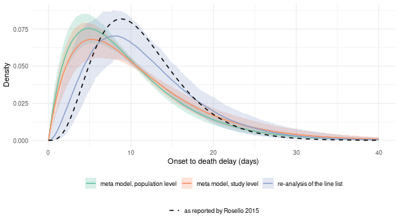

::: {.alert .alert-warning}
The meta model is experimental.
Its interface may still change in future releases.
:::

Systematic reviews of epidemiological delays mostly collect published summary values, such as a mean and standard deviation, or a median and interquartile range, rather than individual level data.
Those summaries are usually biased, because studies often do not adjust for right truncation, treat day rounded delays as if they were continuous, or only partially correct for interval censoring.
The meta model fits directly to these summarised, and potentially biased, published estimates, jointly with any individual level data we do have.
It does this by forward modelling what each study's own estimation procedure would have converged to.
Jointly synthesising individual level data and published summaries in one hierarchical model overlaps with the federated analysis approach of the [ddsynth](https://github.com/cm401/ddsynth) package.
The meta model differs in adjusting each summary for the biases of the study's own estimation procedure rather than treating it as an unbiased estimate of the continuous delay.
It also builds on `brms`, so formulas, families, priors and post-processing all carry over.

::: {.alert .alert-primary}
For a methodological overview of the biases in published delay estimates see @park2024estimating, and for a practical checklist aimed at applied users see @charniga2024best.
For individual level rows the meta model reuses the likelihood of the marginal model (`vignette("epidist")`), which relies on the [`primarycensored`](https://primarycensored.epinowcast.org/) package [@primarycensored].
It adds a forward model of the naive estimator for summary rows, so both kinds of evidence can be combined in one `brms` [@brms] model.
:::

# What we need from a study {#metadata}

Reviews rarely record exactly how a study estimated its delay.
To use a reported summary we need to know how the study handled the common biases, along with the data process it saw.
The meta model supports only a few common approaches, encoded as follows.
We plan to support further biases, such as right and left censoring, across all of the models in the package.

* **How the study adjusted for censoring** (`cens_adjusted`), one of `0` if it took integer date differences and summarised them directly (the most common case), `1` if it used a double interval censored likelihood targeting the continuous delay, `2` if it adjusted only the secondary interval assuming a uniform delay within it, `3` if it assigned each delay to the centre of the interval it was observed in, or `4` if it took the midpoint of the primary event's window and integrated the secondary interval.
* **Whether it adjusted for right truncation** (`trunc_adjusted`), and if not, **the observation time** (`relative_obs_time`) and **how collection stopped** (`trunc_design`).
  For a `"cohort"` design the observation time is the truncation point on the delay scale.
  For an `"accrual"` design, where collection stopped at a calendar date, it is the length of the collection window.
* **The censoring windows** (`pwindow`, `swindow`), for example 1 for daily reporting or 7 for weekly reporting.
* **The sample size** (`n`) the summary was computed from, or a reported standard error (`se`).
* **The smallest delay it counted** (`delay_min`), where the study dropped shorter delays, so that its summaries describe a left truncated delay distribution.
  Defaults to 0, meaning it counted every delay.

If you cannot tell which of these a study used, state the assumption you are making explicitly, and note it alongside any results.
See `?as_epidist_estimates_data` for the full details.

Where the underlying delays are available and the cutoff that produced them is known, refitting them with the marginal model (`vignette("epidist")`) is simpler and more reliable than reconstructing what a summary of them means.
The meta model is for the case where the delays cannot be had.

A study that fitted a distribution to its delays can publish draws of the fitted parameters.
`as_epidist_multivariate()` turns those draws into a mean vector and a covariance matrix, and `as_epidist_estimates_data()` converts that into the summaries the fitted distribution implies.
This keeps the correlation between the quantities the study reports.
It is the only route by which a covariance reaches the model.

::: {.alert .alert-primary}
**What to report, best first.**
The delays themselves, fitted with the marginal model.
Failing that, draws of the parameters of a fitted distribution, through `as_epidist_multivariate()`.
Failing that, the point estimates of those parameters with their standard errors, through `epidist_estimates_parameters()`.
Failing that, a mean and a standard deviation, or a set of quantiles, with the sample size, which are fitted jointly.
A single summary with a standard error is the weakest, since nothing constrains its shape.

Summaries of different kinds from one study, such as a mean and a median, are treated as independent unless they came from one set of draws.
That understates their joint uncertainty.
The normal approximations also degrade for small sample sizes.
:::

# Setup {#setup}


``` r
library(epidist)
library(brms)
#> Loading required package: Rcpp
#> Loading 'brms' package (version 2.23.0). Useful instructions
#> can be found by typing help('brms'). A more detailed introduction
#> to the package is available through vignette('brms_overview').
#>
#> Attaching package: 'brms'
#> The following object is masked from 'package:rstan':
#>
#>     loo
#> The following object is masked from 'package:stats':
#>
#>     ar
library(ggplot2)
library(dplyr)
#>
#> Attaching package: 'dplyr'
#> The following objects are masked from 'package:stats':
#>
#>     filter, lag
#> The following objects are masked from 'package:base':
#>
#>     intersect, setdiff, setequal, union
library(tidyr)
#>
#> Attaching package: 'tidyr'
#> The following object is masked from 'package:rstan':
#>
#>     extract
library(purrr) # nolint
library(tibble)
```

# Simulating biased published estimates {#simulate}

We simulate an outbreak exactly as in `vignette("epidist")`, a stochastic epidemic with a lognormal delay between primary (symptom onset) and secondary (case notification) events, both interval censored to a day.
Figure \@ref(fig:outbreak) shows the case counts.


``` r
set.seed(101)
meanlog <- 1.8
sdlog <- 0.5
growth_rate <- 0.2
outbreak_start_date <- as.Date("2024-01-01")

outbreak <- simulate_gillespie(r = growth_rate, seed = 101)
obs <- simulate_secondary(
  outbreak,
  dist = rlnorm, meanlog = meanlog, sdlog = sdlog
)
obs_cens <- obs |>
  simulate_dates(
    outbreak_start_date = outbreak_start_date, keep_times = TRUE
  ) |>
  mutate(
    ptime_lwr = as.numeric(.data$pdate_lwr - outbreak_start_date),
    ptime_upr = as.numeric(.data$pdate_upr - outbreak_start_date),
    stime_lwr = as.numeric(.data$sdate_lwr - outbreak_start_date),
    stime_upr = as.numeric(.data$sdate_upr - outbreak_start_date),
    delay_daily = .data$stime_lwr - .data$ptime_lwr
  )
```

(ref:outbreak) Case counts over the course of the simulated outbreak (only every 50th case is shown to avoid over-plotting).


``` r
obs_cens |>
  filter(case %% 50 == 0) |>
  ggplot(aes(x = ptime, y = case)) +
  geom_point(col = "#56B4E9") +
  labs(x = "Primary event time (day)", y = "Case number") +
  theme_minimal()
```

<div class="figure">

<p class="caption">(\#fig:outbreak)(ref:outbreak)</p>
</div>

Now imagine several studies each analysing this outbreak at a different point in time, reporting integer date differences with no adjustment for right truncation, that is `cens_adjusted = 0` and `trunc_adjusted = FALSE`.
We mimic this by taking cases whose delay is less than a study specific cutoff, since a case with a longer delay would not yet have been observed by that study.


``` r
naive_snapshot <- function(cutoff) {
  delays <- obs_cens |>
    filter(.data$delay_daily + 1 <= cutoff) |>
    pull(delay_daily)
  return(
    tibble(cutoff = cutoff, naive_mean = mean(delays), n = length(delays))
  )
}

true_mean <- exp(meanlog + sdlog^2 / 2)
bias_illustration <- map(c(4, 6, 8, 12, 16, 25), naive_snapshot) |>
  list_rbind()
```

(ref:bias) The naive mean delay from a snapshot taken with a given cutoff (points), compared to the true mean delay (dashed line). Studies analysing the outbreak earlier see a more heavily right truncated, and so more biased, sample of delays.


``` r
ggplot(bias_illustration, aes(x = cutoff, y = naive_mean)) +
  geom_line(col = "#56B4E9") +
  geom_point(col = "#56B4E9", size = 2) +
  geom_hline(yintercept = true_mean, linetype = "dashed") +
  labs(x = "Study cutoff (days)", y = "Naive mean delay (days)") +
  theme_minimal()
```

<div class="figure">

<p class="caption">(\#fig:bias)(ref:bias)</p>
</div>

Real reviews collect studies that differ in how they measured delays and in what they chose to report.
We build nine such studies from the same line list, each applying its own estimation procedure to it.
The table below sets out what each one did and reports.

<details><summary>Click to expand for code to build the simulated studies</summary>


``` r
set.seed(2)

# The delays each censoring adjustment would have measured.
measured_delay <- function(data, cens_adjusted) {
  return(switch(
    as.character(cens_adjusted),
    "0" = data$delay_daily,
    "1" = data$stime - data$ptime,
    "2" = data$stime - data$ptime_lwr,
    "3" = data$delay_daily + 0.5,
    "4" = data$stime - data$ptime_lwr - 0.5
  ))
}

# A study that stopped at a calendar date needs the growth rate of primary
# events over its collection window. The simulated outbreak grows more slowly
# than its rate parameter once it starts to deplete susceptibles, so we take
# the realised rate rather than the one we simulated with.
window_growth_rate <- function(window) {
  counts <- obs_cens |>
    filter(.data$ptime <= window) |>
    count(day = floor(.data$ptime))
  return(unname(coef(glm(n ~ day, family = poisson, data = counts))[2]))
}

accrual_growth_rate <- window_growth_rate(20)

# Whether a study analysing at a cohort cutoff would have seen a case. A
# study working from a discrete grid sees a case only if the whole day its
# delay falls in is below the cutoff.
observed_by <- function(data, cens_adjusted, obs_time) {
  if (cens_adjusted %in% c(0, 3)) {
    return(data$delay_daily + 1 <= obs_time)
  }
  return(measured_delay(data, cens_adjusted) <= obs_time)
}

# The cases a study with a given truncation situation would have seen.
available_cases <- function(cens_adjusted, trunc_adjusted, obs_time,
                            trunc_design, delay_min) {
  cases <- obs_cens
  if (!trunc_adjusted && trunc_design == "accrual") {
    cases <- filter(cases, .data$ptime <= obs_time, .data$stime <= obs_time)
  } else if (!trunc_adjusted) {
    cases <- filter(cases, observed_by(cases, cens_adjusted, obs_time))
  }
  return(filter(cases, measured_delay(cases, cens_adjusted) >= delay_min))
}

# One study: draw a sample, measure it, and report the chosen summaries.
simulate_study <- function(study, report, probs, cens_adjusted,
                           trunc_adjusted, obs_time, trunc_design = "cohort",
                           delay_min = 0, study_growth_rate = 0,
                           study_n = 250) {
  cases <- available_cases(
    cens_adjusted, trunc_adjusted, obs_time, trunc_design, delay_min
  )
  delays <- measured_delay(
    slice_sample(cases, n = min(study_n, nrow(cases))), cens_adjusted
  )
  metadata <- list(
    pwindow = 1, swindow = 1,
    cens_adjusted = cens_adjusted, trunc_adjusted = trunc_adjusted,
    relative_obs_time = obs_time, trunc_design = trunc_design,
    delay_min = delay_min, growth_rate = study_growth_rate, max_delay = 60
  )
  if (report == "multivariate") {
    # The study fitted a lognormal to its own delays and published draws of
    # the two parameters, taken here from the asymptotic sampling
    # distribution of the maximum likelihood fit.
    fitted <- c(meanlog = mean(log(delays)), sdlog = stats::sd(log(delays)))
    parameter_se <- c(
      fitted[["sdlog"]] / sqrt(length(delays)),
      fitted[["sdlog"]] / sqrt(2 * length(delays))
    )
    parameter_draws <- cbind(
      meanlog = rnorm(1000, fitted[["meanlog"]], parameter_se[1]),
      sdlog = rnorm(1000, fitted[["sdlog"]], parameter_se[2])
    )
    return(do.call(as_epidist_estimates_data, c(
      list(
        as_epidist_multivariate(parameter_draws),
        study = study, family = "lognormal"
      ),
      metadata
    )))
  }
  rows <- if (report == "moments") {
    tibble(
      type = c("mean", "sd"),
      value = c(mean(delays), stats::sd(delays)), p = NA_real_,
      n = length(delays), se = NA_real_
    )
  } else if (report == "mean_se") {
    # Many papers report a mean with its standard error and no sample
    # size. A reported se is used in place of one derived from n.
    tibble(
      type = "mean", value = mean(delays), p = NA_real_,
      n = NA_real_, se = stats::sd(delays) / sqrt(length(delays))
    )
  } else {
    tibble(
      type = "quantile",
      value = stats::quantile(delays, probs, names = FALSE), p = probs,
      n = length(delays), se = NA_real_
    )
  }
  rows <- mutate(rows, study = study)
  return(as_epidist_estimates_data(do.call(mutate, c(list(rows), metadata))))
}

study_designs <- tribble(
  ~study,           ~report,      ~probs,             ~cens_adjusted,
  "naive cohort",   "moments",    NA,                 0,
  "naive IQR",      "quantiles",  c(0.25, 0.5, 0.75), 0,
  "calendar stop",  "quantiles",  c(0.2, 0.5, 0.8),   0,
  "uniform window", "moments",    NA,                 2,
  "midpoint",       "quantiles",  c(0.3, 0.6, 0.9),   3,
  "adjusted (MVN)", "multivariate", NA,               1,
  "delays over 2d", "moments",    NA,                 0,
  "mean and se",    "mean_se",    NA,                 0,
  "midpoint window", "moments",   NA,                 4
) |>
  mutate(
    trunc_adjusted = c(
      FALSE, FALSE, FALSE, FALSE, FALSE, TRUE, FALSE, FALSE, FALSE
    ),
    relative_obs_time = c(12, 16, 20, 25, 30, Inf, 18, 22, 26),
    trunc_design = c(
      "cohort", "cohort", "accrual", "cohort", "cohort", "cohort",
      "cohort", "cohort", "cohort"
    ),
    delay_min = c(0, 0, 0, 0, 0, 0, 2, 0, 0),
    study_growth_rate = c(
      0, 0, accrual_growth_rate, 0, 0, 0, 0, 0, 0
    ),
    study_n = c(180, 55, 240, 95, 40, 300, 130, 25, 110)
  )

simulated_studies <- suppressMessages(
  study_designs |>
    pmap(function(study, report, probs, cens_adjusted, trunc_adjusted,
                  relative_obs_time, trunc_design, delay_min,
                  study_growth_rate, study_n) {
      return(simulate_study(
        study, report, probs, cens_adjusted, trunc_adjusted,
        relative_obs_time, trunc_design, delay_min, study_growth_rate,
        study_n
      ))
    })
)
```

</details>

(ref:studies) The nine simulated studies, their estimation procedures and what each reports.


``` r
study_designs |>
  transmute(
    Study = study,
    Reports = case_when(
      report == "moments" ~ "mean, sd",
      report == "mean_se" ~ "mean with a standard error",
      report == "multivariate" ~ "lognormal parameter draws",
      .default = paste0("quantiles at p = ", map_chr(probs, toString))
    ),
    Censoring = case_when(
      cens_adjusted == 0 ~ "0: date differences",
      cens_adjusted == 1 ~ "1: fully adjusted",
      cens_adjusted == 2 ~ "2: uniform window",
      cens_adjusted == 3 ~ "3: midpoint",
      .default = "4: midpoint primary, uniform secondary"
    ),
    Truncation = case_when(
      trunc_adjusted ~ "adjusted",
      trunc_design == "accrual" ~ "calendar stop",
      .default = "cohort cutoff"
    ),
    `Obs time` = relative_obs_time,
    `Min delay` = delay_min,
    N = study_n
  ) |>
  knitr::kable(caption = "(ref:studies)")
```


Table: (\#tab:studies)(ref:studies)

|Study           |Reports                          |Censoring                              |Truncation    | Obs time| Min delay|   N|
|:---------------|:--------------------------------|:--------------------------------------|:-------------|--------:|---------:|---:|
|naive cohort    |mean, sd                         |0: date differences                    |cohort cutoff |       12|         0| 180|
|naive IQR       |quantiles at p = 0.25, 0.5, 0.75 |0: date differences                    |cohort cutoff |       16|         0|  55|
|calendar stop   |quantiles at p = 0.2, 0.5, 0.8   |0: date differences                    |calendar stop |       20|         0| 240|
|uniform window  |mean, sd                         |2: uniform window                      |cohort cutoff |       25|         0|  95|
|midpoint        |quantiles at p = 0.3, 0.6, 0.9   |3: midpoint                            |cohort cutoff |       30|         0|  40|
|adjusted (MVN)  |lognormal parameter draws        |1: fully adjusted                      |adjusted      |      Inf|         0| 300|
|delays over 2d  |mean, sd                         |0: date differences                    |cohort cutoff |       18|         2| 130|
|mean and se     |mean with a standard error       |0: date differences                    |cohort cutoff |       22|         0|  25|
|midpoint window |mean, sd                         |4: midpoint primary, uniform secondary |cohort cutoff |       26|         0| 110|


The study labelled MVN could not share its delays, so it published draws of the two parameters of the lognormal it fitted to them.
`as_epidist_estimates_data()` converts those draws to a mean and a standard deviation with the covariance between the two.
A two parameter fit carries two degrees of freedom, so asking it for a third summary as well gives a singular covariance and an error.


``` r
biased_estimates <- as_epidist_estimates_data(simulated_studies)
#> ! The quantiles reported by "naive IQR" and "calendar stop" sit within ten
#>   censoring windows of the smallest delay these studies counted, so the
#>   discrete grid barely resolves the delay. A reported quantile is rounded to
#>   that grid, which can bias the fit by tens of percent and does not shrink as
#>   `n` grows. Check that `swindow` is the resolution the study worked at, and
#>   fit a reported mean and standard deviation in preference where one is
#>   available.
biased_estimates
#> # A tibble: 20 × 16
#>    study        type  value     se     n     p pwindow swindow relative_obs_time
#>    <chr>        <chr> <dbl>  <dbl> <dbl> <dbl>   <dbl>   <dbl>             <dbl>
#>  1 naive cohort mean   6.27 NA       180 NA          1       1                12
#>  2 naive cohort sd     2.50 NA       180 NA          1       1                12
#>  3 naive IQR    quan…  4    NA        55  0.25       1       1                16
#>  4 naive IQR    quan…  6    NA        55  0.5        1       1                16
#>  5 naive IQR    quan…  9    NA        55  0.75       1       1                16
#>  6 calendar st… quan…  3    NA       240  0.2        1       1                20
#>  7 calendar st… quan…  5    NA       240  0.5        1       1                20
#>  8 calendar st… quan…  7    NA       240  0.8        1       1                20
#>  9 uniform win… mean   6.99 NA        95 NA          1       1                25
#> 10 uniform win… sd     3.79 NA        95 NA          1       1                25
#> 11 midpoint     quan…  5.5  NA        40  0.3        1       1                30
#> 12 midpoint     quan…  6.5  NA        40  0.6        1       1                30
#> 13 midpoint     quan… 10.7  NA        40  0.9        1       1                30
#> 14 adjusted (M… mean   6.83 NA        NA NA          1       1               Inf
#> 15 adjusted (M… sd     3.52 NA        NA NA          1       1               Inf
#> 16 delays over… mean   6.28 NA       130 NA          1       1                18
#> 17 delays over… sd     3.14 NA       130 NA          1       1                18
#> 18 mean and se  mean   5.4   0.497    NA NA          1       1                22
#> 19 midpoint wi… mean   6.42 NA       110 NA          1       1                26
#> 20 midpoint wi… sd     3.28 NA       110 NA          1       1                26
#> # ℹ 7 more variables: trunc_adjusted <lgl>, trunc_design <chr>,
#> #   cens_adjusted <int>, delay_min <dbl>, growth_rate <dbl>, max_delay <dbl>,
#> #   mvn_id <chr>
```

::: {.alert .alert-primary}
`max_delay` sets how far the grid used to work out the implied naive summaries extends.
We set it explicitly here because the default, twenty times the largest reported value, would make the grid unnecessarily large for this simulated example and slow fitting down.
:::

# Fitting and comparing models {#fit}

## A bias-adjusted fit to the summaries alone

We convert the estimates to an `epidist_meta_model` object and fit it, exactly as we would fit any other `epidist` model.


``` r
meta_summary_only <- as_epidist_meta_model(estimates = biased_estimates)

fit_meta_summary <- epidist(
  data = meta_summary_only,
  chains = 2, cores = 2, iter = 1000,
  refresh = ifelse(interactive(), 250, 0),
  seed = 1,
  backend = "cmdstanr"
)
```


``` r
summary(fit_meta_summary)
#>  Family: meta_lognormal
#>   Links: mu = identity; sigma = log
#> Formula: delay_lwr | weights(n) + vint(obs_type, study_n, trunc_adjusted, cens_adjusted, trunc_design, group_start, group_len, chol_start) + vreal(relative_obs_time, pwindow, swindow, delay_upr, delay_min, report_se, quantile_p, growth_rate) ~ 1
#>          sigma ~ 1
#>    Data: transformed_data (Number of observations: 9)
#>   Draws: 2 chains, each with iter = 1000; warmup = 500; thin = 1;
#>          total post-warmup draws = 1000
#>
#> Regression Coefficients:
#>                 Estimate Est.Error l-95% CI u-95% CI Rhat Bulk_ESS Tail_ESS
#> Intercept           1.78      0.02     1.75     1.81 1.00      907      726
#> sigma_Intercept    -0.69      0.03    -0.74    -0.64 1.00      686      647
#>
#> Draws were sampled using sample(hmc). For each parameter, Bulk_ESS
#> and Tail_ESS are effective sample size measures, and Rhat is the potential
#> scale reduction factor on split chains (at convergence, Rhat = 1).
```

`summary()` reports `sigma` on its log link scale.
`predict_delay_parameters()` puts both parameters back on the scale the simulation used.


``` r
predict_delay_parameters(fit_meta_summary) |>
  select("mu", "sigma") |>
  pivot_longer(everything(), names_to = "parameter") |>
  summarise(
    median = median(.data$value),
    q025 = quantile(.data$value, 0.025),
    q975 = quantile(.data$value, 0.975),
    .by = "parameter"
  )
#> # A tibble: 2 × 4
#>   parameter median  q025  q975
#>   <chr>      <dbl> <dbl> <dbl>
#> 1 mu         1.78  1.75  1.81
#> 2 sigma      0.502 0.476 0.527
```

Even though every study is individually biased, the meta model recovers the simulated log mean of 1.8 and log standard deviation of 0.5 closely.

## What happens with the wrong metadata

The metadata about how a study adjusted its estimate matters.
Whether a study corrected for right truncation is the field reviews most often leave out, so we refit the same nine studies with every one of them relabelled as `trunc_adjusted = TRUE`.


``` r
wrong_flags_estimates <- biased_estimates
wrong_flags_estimates$trunc_adjusted <- TRUE
meta_wrong_flags <- as_epidist_meta_model(estimates = wrong_flags_estimates)

fit_meta_wrong_flags <- epidist(
  data = meta_wrong_flags,
  chains = 2, cores = 2, iter = 1000,
  refresh = ifelse(interactive(), 250, 0),
  seed = 1,
  backend = "cmdstanr"
)
```


``` r
summary(fit_meta_wrong_flags)
#>  Family: meta_lognormal
#>   Links: mu = identity; sigma = log
#> Formula: delay_lwr | weights(n) + vint(obs_type, study_n, trunc_adjusted, cens_adjusted, trunc_design, group_start, group_len, chol_start) + vreal(relative_obs_time, pwindow, swindow, delay_upr, delay_min, report_se, quantile_p, growth_rate) ~ 1
#>          sigma ~ 1
#>    Data: transformed_data (Number of observations: 9)
#>   Draws: 2 chains, each with iter = 1000; warmup = 500; thin = 1;
#>          total post-warmup draws = 1000
#>
#> Regression Coefficients:
#>                 Estimate Est.Error l-95% CI u-95% CI Rhat Bulk_ESS Tail_ESS
#> Intercept           1.72      0.02     1.69     1.75 1.00      555      472
#> sigma_Intercept    -0.72      0.03    -0.78    -0.66 1.01      814      626
#>
#> Draws were sampled using sample(hmc). For each parameter, Bulk_ESS
#> and Tail_ESS are effective sample size measures, and Rhat is the potential
#> scale reduction factor on split chains (at convergence, Rhat = 1).
```

The model has no way to know the metadata is wrong, so it takes each reported summary as an estimate of the untruncated delay and converges confidently on a mean several percent too short.

## A mixed fit: summaries plus a handful of individual records

Now suppose we also have a small individual level sample, perhaps from one site that shared its line list.
We add 40 individual records, observed up to day 40, alongside the same nine published summaries.
Individual records keep any `study` column they arrive with, and are labelled `"individual"` only when they have none, so a term like `mu ~ 1 + (1 | study)` pools line lists from several sites alongside the published summaries.


``` r
individual_subsample <- obs_cens |>
  mutate(obs_time = 40) |>
  filter(.data$stime_upr <= .data$obs_time) |>
  slice_sample(n = 40)

individual_data <- as_epidist_linelist_data(
  individual_subsample$ptime_lwr,
  individual_subsample$ptime_upr,
  individual_subsample$stime_lwr,
  individual_subsample$stime_upr,
  individual_subsample$obs_time
)

meta_mixed <- as_epidist_meta_model(
  individual_data,
  estimates = biased_estimates
)

fit_meta_mixed <- epidist(
  data = meta_mixed,
  chains = 2, cores = 2, iter = 1000,
  refresh = ifelse(interactive(), 250, 0),
  seed = 1,
  backend = "cmdstanr"
)
```


``` r
summary(fit_meta_mixed)
#>  Family: meta_lognormal
#>   Links: mu = identity; sigma = log
#> Formula: delay_lwr | weights(n) + vint(obs_type, study_n, trunc_adjusted, cens_adjusted, trunc_design, group_start, group_len, chol_start) + vreal(relative_obs_time, pwindow, swindow, delay_upr, delay_min, report_se, quantile_p, growth_rate) ~ 1
#>          sigma ~ 1
#>    Data: transformed_data (Number of observations: 46)
#>   Draws: 2 chains, each with iter = 1000; warmup = 500; thin = 1;
#>          total post-warmup draws = 1000
#>
#> Regression Coefficients:
#>                 Estimate Est.Error l-95% CI u-95% CI Rhat Bulk_ESS Tail_ESS
#> Intercept           1.78      0.02     1.75     1.81 1.00      815      716
#> sigma_Intercept    -0.69      0.02    -0.74    -0.64 1.00      479      433
#>
#> Draws were sampled using sample(hmc). For each parameter, Bulk_ESS
#> and Tail_ESS are effective sample size measures, and Rhat is the potential
#> scale reduction factor on split chains (at convergence, Rhat = 1).
```

## Reference: the marginal model on the full line list

Finally, as a reference, we fit the marginal model (`vignette("epidist")`) to the whole, effectively untruncated, line list.
This is what we would recover with access to every underlying delay rather than to published summaries, so it is the most precise fit here.
The marginal model groups identical rows, so the whole line list costs little more to fit than a sample of it.


``` r
reference_subsample <- obs_cens |>
  mutate(obs_time = max(.data$stime_upr))

reference_data <- as_epidist_linelist_data(
  reference_subsample$ptime_lwr,
  reference_subsample$ptime_upr,
  reference_subsample$stime_lwr,
  reference_subsample$stime_upr,
  reference_subsample$obs_time
)

fit_reference <- epidist(
  data = as_epidist_marginal_model(reference_data),
  chains = 2, cores = 2, iter = 1000,
  refresh = ifelse(interactive(), 250, 0),
  seed = 1,
  backend = "cmdstanr"
)
```

## Comparing the four fits

<details><summary>Click to expand for code to prepare the comparison plot</summary>


``` r
predicted_parameters <- list(
  "adjusted (summary only)" = fit_meta_summary,
  "truncation ignored" = fit_meta_wrong_flags,
  mixed = fit_meta_mixed,
  "reference (marginal)" = fit_reference
) |>
  lapply(predict_delay_parameters) |>
  bind_rows(.id = "model") |>
  filter(index == 1) |>
  mutate(model = factor(
    model,
    levels = c(
      "truncation ignored", "adjusted (summary only)", "mixed",
      "reference (marginal)"
    )
  ))

true_sd <- true_mean * sqrt(exp(sdlog^2) - 1)
true_params <- tibble(
  parameter = c("mu", "sigma", "mean", "sd"),
  value = c(meanlog, sdlog, true_mean, true_sd)
)

p_compare <- predicted_parameters |>
  pivot_longer(
    cols = c(mu, sigma, mean, sd),
    names_to = "parameter", values_to = "value"
  ) |>
  ggplot() +
  geom_density(aes(x = value, fill = model), alpha = 0.5) +
  geom_vline(
    data = true_params, aes(xintercept = value),
    linetype = "dashed", linewidth = 1
  ) +
  facet_wrap(~parameter, scales = "free") +
  scale_fill_brewer(palette = "Set2") +
  labs(x = "", y = "") +
  theme_minimal() +
  theme(legend.position = "bottom")
```

</details>

(ref:compare) Posterior draws of the delay distribution parameters from the four fits, compared to the true values used in the simulation (dashed lines). The bias-adjusted, mixed, and reference fits agree closely with the truth. The fit told that every study had adjusted for right truncation does not.


``` r
p_compare
```

<div class="figure">

<p class="caption">(\#fig:compare)(ref:compare)</p>
</div>

# Real world estimates from epireview {#epireview}

[epireview](https://github.com/mrc-ide/epireview) [@epireview] collates published parameter estimates gathered by the Pathogen Epidemiology Review Group.
It is not on CRAN.
It is published on [mrc-ide's r-universe](https://mrc-ide.r-universe.dev), and its own [installation instructions](https://mrc-ide.github.io/epireview/) cover that and the other routes.


``` r
library(epireview) # nolint: library_call_linter.
#> Loading required package: epitrix
#> Loading required package: ggforce
```

We use the onset to death delay from the Ebola data.
Alongside the delay type we filter to the value types we can model (means and medians), to estimates reported in days with no scaling exponent, and to parameters that are not inverse rates.
This stops other value types silently slipping in as medians.


``` r
ebola_params <- suppressMessages(load_epidata("ebola"))$params

onset_to_death <- ebola_params |>
  filter(
    .data$parameter_type_short == "delay_onset_to_death",
    !is.na(.data$parameter_value),
    !is.na(.data$population_sample_size),
    .data$parameter_value_type %in% c("Mean", "Median"),
    .data$parameter_unit == "Days",
    .data$exponent == 0,
    !.data$inverse_param
  )
nrow(onset_to_death)
#> [1] 29
```

## Adjusting for the phase of the outbreak {#phase}

An estimate made while an outbreak is still growing is right truncated.
The long delays have not had time to be observed, so the estimate is biased towards shorter delays.
An estimate made after the outbreak has ended sees the whole delay distribution and comes closer to the unshortened delay.
Correcting for this directly needs the observation time of each study, and for a study that stopped collecting at a calendar date it also needs the growth rate of primary events over the collection window.
epireview records neither.
It does record the phase of the outbreak an estimate was made in, so we adjust for that instead and let the size of the bias be estimated from the studies.

We make the post outbreak studies the reference level.
The population level intercept is then the retrospective delay, the one we expect to be closest to unbiased, and each remaining coefficient reads directly as how much the delay is shifted in that group.
A negative coefficient on the log link is the direction we expect for estimates made during an outbreak.
Coding it the other way round would leave the intercept describing the biased studies, which is not the quantity we want to report.


``` r
onset_to_death <- onset_to_death |>
  mutate(
    phase = case_when(
      .data$method_moment_value == "Post outbreak" ~ "post outbreak",
      .data$method_moment_value %in% c("Start outbreak", "Mid outbreak") ~
        "during outbreak",
      .default = "unrecorded"
    ),
    # The reference level is the retrospective studies.
    phase = factor(
      .data$phase,
      levels = c("post outbreak", "during outbreak", "unrecorded")
    )
  )
count(onset_to_death, phase)
#> # A tibble: 3 × 2
#>   phase               n
#>   <fct>           <int>
#> 1 post outbreak       7
#> 2 during outbreak     2
#> 3 unrecorded         20
```

::: {.alert .alert-warning}
Only two of these studies record having been made during an outbreak, so this contrast is weak.
The remaining studies are split between those recorded as post outbreak and those where the field is unrecorded or explicitly unspecified, and the `unrecorded` group mixes both.
The term absorbs whatever separates these groups, which need not be truncation alone.
Reviews reporting the metadata of @charniga2024best would remove the need for it.
:::

::: {.alert .alert-primary}
epireview does not record how, or whether, a study adjusted for censoring, so we have to state that assumption explicitly rather than leave it implicit.
We treat every study as `cens_adjusted = 0`, meaning it took integer date differences and summarised them directly.
A study that reports a fitted distribution has usually fitted it to integer date differences, so reporting one says nothing about how it handled censoring.
Estimates that predate the recent literature on these biases rarely adjusted for censoring, and rarely say either way, so assuming otherwise would be optimistic.
We apply no explicit truncation correction, setting `trunc_adjusted = TRUE` for every study, because the observation times needed for one are not recorded.
The `phase` term stands in for it.
For examples of the @charniga2024best checklist in use see [andv-linelist-analysis](https://github.com/epiforecasts/andv-linelist-analysis) (the Epuyén Andes virus outbreak) and [bdbv-linelist-analysis](https://github.com/epiforecasts/bdbv-linelist-analysis) (the 2012 Isiro Bundibugyo Ebola outbreak, re-analysing the line list of @rosello2015ebola).
:::

A small helper maps each row of `onset_to_death` to the long format `as_epidist_estimates_data()` expects.
Means become `"mean"` rows, with a matching `"sd"` row where a standard deviation is reported, either as the study's own spread or as the second parameter of a fitted Gamma.
A reported standard error becomes an `se` on the mean row instead.
Medians become `"quantile"` rows at `p = 0.5`, with further quantile rows at `p = 0.25` and `p = 0.75` where an interquartile range is reported.
A study reporting a spread that does not match its own value type, such as a median alongside a standard deviation, keeps only the matching set.
Fitting both would treat two summaries of the same delays as independent and understate their joint uncertainty.

<details><summary>Click to expand for the epireview conversion helper</summary>


``` r
# Columns carried onto every row a study contributes. Add a covariate here
# and it flows through to the model.
meta_cols <- c(
  "study", "n", "trunc_adjusted", "relative_obs_time", "cens_adjusted",
  "max_delay", "phase"
)

# Each study contributes one coherent set of summaries, either a mean with a
# standard deviation or a set of quantiles, never a mixture. Summaries of
# different kinds from one study are fitted as though they were independent,
# which understates their joint uncertainty, so a study reporting both keeps
# only the set matching the value type the review recorded as its estimate.
row_to_estimates <- function(row) {
  base <- as_tibble(row[meta_cols])
  spread_type <- row$parameter_uncertainty_singe_type
  spread <- row$parameter_uncertainty_single_value
  # epireview records a fitted Gamma as a mean and an sd, coding the second
  # parameter as "Mean sd". A study reporting a shape and a scale instead is
  # handled separately below.
  reported_sd <- if (identical(spread_type, "Standard Deviation")) {
    spread
  } else if (identical(row$distribution_par2_type, "Mean sd")) {
    row$distribution_par2_value
  }
  if (identical(row$parameter_value_type, "Mean")) {
    rows <- mutate(
      base, type = "mean", value = row$parameter_value, p = NA_real_
    )
    if (identical(spread_type, "Standard Error")) {
      rows$se <- spread
    }
    if (!is.null(reported_sd) && !is.na(reported_sd)) {
      rows <- bind_rows(
        rows, mutate(base, type = "sd", value = reported_sd, p = NA_real_)
      )
    }
  } else {
    rows <- mutate(
      base, type = "quantile", value = row$parameter_value, p = 0.5
    )
    if (identical(row$parameter_uncertainty_type, "IQR")) {
      rows <- bind_rows(
        rows,
        mutate(
          base, type = "quantile",
          value = row$parameter_uncertainty_lower_value, p = 0.25
        ),
        mutate(
          base, type = "quantile",
          value = row$parameter_uncertainty_upper_value, p = 0.75
        )
      )
    }
  }
  return(rows)
}
```

</details>


``` r
ebola_estimates_df <- onset_to_death |>
  mutate(
    trunc_adjusted = TRUE,
    relative_obs_time = Inf,
    cens_adjusted = 0,
    study = .data$article_label,
    n = .data$population_sample_size,
    max_delay = NA_real_ # replaced below, once rows are in long format
  ) |>
  pmap(\(...) row_to_estimates(list(...))) |>
  list_rbind() |>
  mutate(
    # Size the grid to the reported spread, see ?as_epidist_estimates_data.
    max_delay = if (any(.data$type == "sd")) {
      ceiling(
        max(.data$value[.data$type == "mean"]) +
          10 * max(.data$value[.data$type == "sd"])
      )
    } else {
      40
    },
    .by = "study"
  )

ebola_estimates <- as_epidist_estimates_data(ebola_estimates_df)
#> ℹ No `pwindow` column supplied, assuming a censoring window of 1 (daily
#>   reporting) for every study.
#> ℹ No `swindow` column supplied, assuming a censoring window of 1 (daily
#>   reporting) for every study.
#> ! The quantiles reported by "Li 2016 (a)", "Khan 1999", "Camacho 2014", "Baron
#>   1983", "Miglietta 2019", and "Nsio 2019" sit within ten censoring windows of
#>   the smallest delay these studies counted, so the discrete grid barely
#>   resolves the delay. A reported quantile is rounded to that grid, which can
#>   bias the fit by tens of percent and does not shrink as `n` grows. Check that
#>   `swindow` is the resolution the study worked at, and fit a reported mean and
#>   standard deviation in preference where one is available.
```

::: {.alert .alert-primary}
`max_delay` is set per study above rather than to one shared value, because a grid short relative to a study's own reported spread biases its implied standard deviation downwards.
`as_epidist_estimates_data()` warns if this happens.
That grid is used to compute the implied summaries of studies with `cens_adjusted = 0`, which here is all of them.
A study we could treat as fully adjusted would use closed form continuous moments and need no grid.
:::

The caution printed above is a different one, and it is worth reading rather than skipping.
Six studies report a quantile that sits within ten censoring windows of the shortest delay they counted, so the daily grid barely resolves it.
A quantile rounded to that grid can be badly biased, and unlike a sampling error the bias does not shrink as the study gets larger.
The package suggests fitting a reported mean and standard deviation in preference, which is what we do wherever a study reports one.
Five of these six record only a median, so the coarse quantile is all we have.
Nsio 2019 also reports a standard deviation, but alongside its median rather than a mean, and the helper keeps only the set matching the value type the review recorded.
Fitting both would treat two summaries of the same delays as independent and overstate what that one study contributes.
A review that reported the mean as well would let the model use the better resolved summary here.

We fit a Gamma, with a `(1 | study)` term to allow for genuine differences between studies (see the note on plug in standard errors in `?as_epidist_meta_model`).


``` r
ebola_meta <- as_epidist_meta_model(estimates = ebola_estimates)

fit_ebola <- epidist(
  data = ebola_meta,
  formula = mu ~ 1 + phase + (1 | study),
  family = Gamma(link = "log"),
  chains = 2, cores = 2, iter = 1000,
  refresh = ifelse(interactive(), 250, 0),
  seed = 1,
  backend = "cmdstanr"
)
```


``` r
summary(fit_ebola)
#>  Family: meta_gamma
#>   Links: mu = log; shape = log
#> Formula: delay_lwr | weights(n) + vint(obs_type, study_n, trunc_adjusted, cens_adjusted, trunc_design, group_start, group_len, chol_start) + vreal(relative_obs_time, pwindow, swindow, delay_upr, delay_min, report_se, quantile_p, growth_rate) ~ phase + (1 | study)
#>          shape ~ 1
#>    Data: transformed_data (Number of observations: 29)
#>   Draws: 2 chains, each with iter = 1000; warmup = 500; thin = 1;
#>          total post-warmup draws = 1000
#>
#> Multilevel Hyperparameters:
#> ~study (Number of levels: 29)
#>               Estimate Est.Error l-95% CI u-95% CI Rhat Bulk_ESS Tail_ESS
#> sd(Intercept)     0.14      0.03     0.09     0.22 1.00      310      523
#>
#> Regression Coefficients:
#>                     Estimate Est.Error l-95% CI u-95% CI Rhat Bulk_ESS Tail_ESS
#> Intercept               2.27      0.07     2.14     2.40 1.00      380      588
#> shape_Intercept         0.69      0.04     0.61     0.77 1.00     1078      826
#> phaseduringoutbreak     0.04      0.14    -0.24     0.31 1.00      426      542
#> phaseunrecorded        -0.03      0.08    -0.18     0.13 1.00      343      478
#>
#> Draws were sampled using sample(hmc). For each parameter, Bulk_ESS
#> and Tail_ESS are effective sample size measures, and Rhat is the potential
#> scale reduction factor on split chains (at convergence, Rhat = 1).
```

## The population level delay and the size of the phase bias {#population-estimates}

Switching the `(1 | study)` term off with `re_formula = NA` gives the population level delay, the one the studies are estimates of rather than any single study's own.
Reporting only its mean understates the posterior, so we report the Gamma shape and scale alongside the natural mean and standard deviation, each as a median with a 95% credible interval.
The shape and scale are the parameters of the distribution.
The mean and standard deviation are the moments they imply.


``` r
phase_grid <- as_tibble(ebola_meta)[rep(1, nlevels(ebola_meta$phase)), ] |>
  mutate(phase = factor(levels(ebola_meta$phase), levels(ebola_meta$phase)))

population_draws <- predict_delay_parameters(
  fit_ebola, newdata = phase_grid, re_formula = NA
) |>
  mutate(phase = levels(ebola_meta$phase)[.data$index])

population_summary <- population_draws |>
  filter(.data$phase == "post outbreak") |>
  transmute(
    shape = .data$shape,
    scale = .data$mean / .data$shape,
    mean = .data$mean,
    sd = .data$sd
  ) |>
  pivot_longer(everything(), names_to = "parameter") |>
  summarise(
    median = median(.data$value),
    q025 = quantile(.data$value, 0.025),
    q975 = quantile(.data$value, 0.975),
    .by = "parameter"
  )

population_summary
#> # A tibble: 4 × 4
#>   parameter median  q025  q975
#>   <chr>      <dbl> <dbl> <dbl>
#> 1 shape       1.98  1.84  2.16
#> 2 scale       4.86  4.12  5.69
#> 3 mean        9.69  8.53 11.1
#> 4 sd          6.85  5.96  7.85
```

The phase bias is the contrast between each phase and the retrospective reference, holding everything else fixed.
`marginaleffects` gives it directly, on the scale of the mean delay in days.


``` r
marginaleffects::avg_comparisons(
  fit_ebola, variables = "phase", re_formula = NA
)
#>
#>                         Contrast Estimate 2.5 % 97.5 %
#>  during outbreak - post outbreak    0.415 -2.19   3.29
#>  unrecorded - post outbreak        -0.226 -1.82   1.18
#>
#> Term: phase
#> Type: response
```


``` r
population_draws |>
  select("draw", "phase", "mean") |>
  pivot_wider(names_from = "phase", values_from = "mean") |>
  transmute(ratio = .data$`during outbreak` / .data$`post outbreak`) |>
  summarise(
    median = median(.data$ratio),
    q025 = quantile(.data$ratio, 0.025),
    q975 = quantile(.data$ratio, 0.975)
  )
#> # A tibble: 1 × 3
#>   median  q025  q975
#>    <dbl> <dbl> <dbl>
#> 1   1.04 0.789  1.36
```

With two of the 29 studies recorded as made during an outbreak, this contrast is not resolved by these data.
The interval spans one in both directions, so the metadata epireview records cannot say whether estimates made during an outbreak were shorter.
That is a statement about the metadata rather than about the biases, which the simulated example above shows are real and large.
The population level estimate is the more useful output here, and the phase term's value is that it stops the retrospective studies and the rest being pooled as though they were interchangeable.

## Fitting to a study's own distribution parameters {#natural-parameters}

Four of these studies report a fitted distribution, all of them from @rosello2015ebola, which fitted a Gamma separately to each of several outbreaks in the Democratic Republic of the Congo.


``` r
reported_gamma <- onset_to_death |>
  filter(!is.na(.data$distribution_type)) |>
  transmute(
    outbreak = .data$population_location,
    study = .data$article_label,
    family = .data$distribution_type,
    par1 = .data$distribution_par1_type,
    par1_value = .data$distribution_par1_value,
    par2 = .data$distribution_par2_type,
    par2_value = .data$distribution_par2_value
  )

reported_gamma
#> # A tibble: 4 × 7
#>   outbreak study            family par1  par1_value par2    par2_value
#>   <chr>    <chr>            <chr>  <chr>      <dbl> <chr>        <dbl>
#> 1 Kikwit   Rosello 2015 (1) Gamma  Mean        9.47 Mean sd       4.44
#> 2 Mweka    Rosello 2015 (2) Gamma  Mean        7.62 Mean sd       4.44
#> 3 Isiro    Rosello 2015 (3) Gamma  Mean       11.4  Mean sd       5.41
#> 4 Boende   Rosello 2015 (4) Gamma  Mean        9.39 Mean sd       5.67
```

epireview records each of these as a mean and a standard deviation, which is what the helper above picks up.
A Gamma's mean and standard deviation determine its shape and scale exactly, so for a two parameter family the two descriptions carry the same information and nothing is lost by fitting the moments.
Generating extra quantiles from them would not add information, it would count the same two numbers several times.

No onset to death record in epireview reports a shape and a scale.
All four that give a distribution are the Rosello Gammas above, recorded as a mean and a standard deviation, so for the delay this vignette models the question does not arise.
Other records in the same dataset do give the parameters directly.


``` r
ebola_params |>
  filter(.data$distribution_par1_type == "Shape") |>
  select(
    "article_label", "parameter_type_short", "distribution_type",
    "distribution_par1_value", "distribution_par2_value",
    "parameter_value", "population_sample_size"
  )
#> # A tibble: 4 × 7
#>   article_label    parameter_type_short distribution_type distribution_par1_va…¹
#>   <chr>            <chr>                <chr>                              <dbl>
#> 1 Fallah 2015 (1)  incubation_period    Gamma                               2.86
#> 2 Fallah 2015 (2)  incubation_period    Gamma                               2.60
#> 3 Marziano 2023 (… serial_interval      Weibull                             1.76
#> 4 Marziano 2023 (… serial_interval      Weibull                             1.63
#> # ℹ abbreviated name: ¹​distribution_par1_value
#> # ℹ 3 more variables: distribution_par2_value <dbl>, parameter_value <dbl>,
#> #   population_sample_size <int>
```

Where a study reports the parameters, they describe the distribution better than two of its moments do, and `epidist_estimates_parameters()` is the route to fitting them.
It converts the parameters to the summaries that distribution implies over the range of delays the study could have seen, carries any reported parameter standard errors onto the summary scale by the delta method, and passes the study metadata through unchanged.
Those summaries then go through the same forward model as any other summary row, so the censoring and truncation adjustments still apply.
Fitting a study's reported parameters is not the same as asserting that the study was unbiased.

The gain is largest when the study fitted a different family from the one we are fitting.
A study's Weibull shape and scale imply a particular set of summaries, and those summaries are what a Gamma should then be fitted to.
Its mean alone would discard the shape the study actually reported.
None of the records above is an onset to death delay, so the call below is on a serial interval and is here to show the API rather than to feed the model we fitted.


``` r
marziano <- filter(
  ebola_params,
  .data$article_label == "Marziano 2023 (2)",
  .data$distribution_par1_type == "Shape"
)

epidist_estimates_parameters(
  study = marziano$article_label,
  family = tolower(marziano$distribution_type),
  parameters = c(
    shape = marziano$distribution_par1_value,
    scale = marziano$distribution_par2_value
  ),
  probs = c(0.25, 0.5, 0.75),
  n = marziano$population_sample_size,
  relative_obs_time = Inf,
  trunc_adjusted = TRUE,
  cens_adjusted = 0
)
#> ℹ No `pwindow` column supplied, assuming a censoring window of 1 (daily
#>   reporting) for every study.
#> ℹ No `swindow` column supplied, assuming a censoring window of 1 (daily
#>   reporting) for every study.
#> ℹ No max_delay column supplied, using twenty times the largest reported value
#>   for each study (minimum 10) as the grid cutoff. Increase this if the delay
#>   distribution has a long tail, and lower it to speed up fitting.
#> # A tibble: 5 × 16
#>   study          type  value    se     n     p pwindow swindow relative_obs_time
#>   <chr>          <chr> <dbl> <dbl> <int> <dbl>   <dbl>   <dbl>             <dbl>
#> 1 Marziano 2023… mean  10.7     NA    12 NA          1       1               Inf
#> 2 Marziano 2023… sd     6.74    NA    12 NA          1       1               Inf
#> 3 Marziano 2023… quan…  5.57    NA    12  0.25       1       1               Inf
#> 4 Marziano 2023… quan…  9.56    NA    12  0.5        1       1               Inf
#> 5 Marziano 2023… quan… 14.6     NA    12  0.75       1       1               Inf
#> # ℹ 7 more variables: trunc_adjusted <lgl>, trunc_design <chr>,
#> #   cens_adjusted <int>, delay_min <dbl>, growth_rate <dbl>, max_delay <dbl>,
#> #   mvn_id <chr>
```

Check that a record's reported summary and its reported parameters agree before using either.
They do here, where the reported mean of 11.7 days sits close to the 10.71 days the reported Weibull implies.
They do not for `Marziano 2023 (1)` in the same article, which records a mean of 12 days against a Weibull implying 9.03, a gap wide enough to fall outside the credible interval reported alongside the mean.

epireview flags whether uncertainty on the distribution parameters was reported but does not store its value, so there is no standard error to pass here and the model falls back to plug in standard errors from `n`.
It does record an interval on the reported mean, which is why the ordering set out at the start of this vignette puts parameters with their uncertainty above parameters without it.
Where a review records those standard errors, or records draws that `as_epidist_multivariate()` can turn into a mean vector and a covariance, that uncertainty and the correlation between the parameters reach the model instead.

## Comparing with a modern re-analysis of the same line list {#bdbv}

The published summaries are what a reader of the literature sees.
The question is whether passing them through the meta model moves them towards what the underlying data actually say.
One of the 29 studies lets us check.
`Rosello 2015 (3)` is the 2012 Isiro outbreak, and that line list has since been re-analysed in [bdbv-linelist-analysis](https://github.com/epiforecasts/bdbv-linelist-analysis).
That re-analysis works from the individual records and adjusts for double interval censoring on both event times.
It applies no truncation correction because it needs none.
The outbreak closed in 2012 and the line list was published in 2015, so every case has a recorded outcome and the delays are not truncated at all.
That makes it the closest thing to a ground truth available for any of the studies we fitted to.

It reports onset to death as a Monte Carlo convolution of its fitted onset to admission and admission to death delays, rather than as a fitted distribution, so it publishes moments rather than a shape and a scale.
We use a Gamma matched to its mean and standard deviation as the reference distribution, and check below that this stands in for the convolution closely enough.

`bdbv-onset-to-death.csv` holds 1000 draws of the convolution's mean, standard deviation, median and 95th percentile, subsampled from the 4000 draw posterior the project releases as `output/posterior_gamma.csv` in its `main-latest` release.


``` r
bdbv <- read.csv("bdbv-onset-to-death.csv") |>
  mutate(shape = (.data$mean / .data$sd)^2, scale = .data$sd^2 / .data$mean)

isiro_draws <- predict_delay_parameters(
  fit_ebola,
  newdata = filter(
    as_tibble(ebola_meta), .data$study == "Rosello 2015 (3)"
  )[1, ]
)
```

The matched Gamma is not the convolution, so it is worth seeing how far apart they are.
Its posterior median delay and 95th percentile land within a tenth of a day of the ones the re-analysis reports.
Draw by draw the gap is larger, and the 95th percentile is the looser of the two, which is what a two moment summary of a convolution should be expected to do.


``` r
bdbv |>
  mutate(
    gamma_median = qgamma(0.5, shape = .data$shape, scale = .data$scale),
    gamma_p95 = qgamma(0.95, shape = .data$shape, scale = .data$scale)
  ) |>
  reframe(
    quantity = c("median", "95th percentile"),
    reported = c(median(.data$median), median(.data$p95)),
    matched_gamma = c(median(.data$gamma_median), median(.data$gamma_p95)),
    per_draw_gap = c(
      median(abs(.data$gamma_median - .data$median)),
      median(abs(.data$gamma_p95 - .data$p95))
    )
  )
#>          quantity reported matched_gamma per_draw_gap
#> 1          median  10.4870      10.50644    0.1267663
#> 2 95th percentile  24.1385      24.22437    0.4340871
```

The mean and standard deviation of the delay, four ways.


``` r
# Median with a 95% credible interval, as a string, so the four sources
# line up in one table.
interval <- function(draws, source) {
  out <- draws |>
    select("mean", "sd") |>
    pivot_longer(everything(), names_to = "parameter") |>
    summarise(
      value = sprintf(
        "%.2f (%.2f, %.2f)", median(.data$value),
        quantile(.data$value, 0.025), quantile(.data$value, 0.975)
      ),
      .by = "parameter"
    ) |>
    mutate(source = source)
  return(out)
}

isiro_reported <- reported_gamma |>
  filter(.data$outbreak == "Isiro") |>
  transmute(
    shape = (.data$par1_value / .data$par2_value)^2,
    scale = .data$par2_value^2 / .data$par1_value,
    mean = .data$par1_value,
    sd = .data$par2_value
  )

bind_rows(
  tibble(
    parameter = c("mean", "sd"),
    # Reported as point estimates, with no uncertainty recorded.
    value = sprintf("%.2f", c(isiro_reported$mean, isiro_reported$sd)),
    source = "as reported by Rosello 2015"
  ),
  interval(isiro_draws, "meta model, study level"),
  interval(
    filter(population_draws, .data$phase == "post outbreak"),
    "meta model, population level"
  ),
  interval(bdbv, "re-analysis of the line list")
) |>
  pivot_wider(names_from = "parameter", values_from = "value")
#> # A tibble: 4 × 3
#>   source                       mean                sd
#>   <chr>                        <chr>               <chr>
#> 1 as reported by Rosello 2015  11.37               5.41
#> 2 meta model, study level      10.81 (9.07, 13.48) 7.67 (6.42, 9.66)
#> 3 meta model, population level 9.69 (8.53, 11.08)  6.85 (5.96, 7.85)
#> 4 re-analysis of the line list 11.76 (9.31, 15.06) 6.57 (4.88, 9.44)
```

<details><summary>Click to expand for code to prepare the comparison plot</summary>


``` r
delay_grid <- seq(0, 40, by = 0.25)

density_band <- function(draws, source, n = 200) {
  out <- draws |>
    slice_sample(n = min(n, nrow(draws))) |>
    mutate(.draw = row_number()) |>
    reframe(
      x = delay_grid,
      y = dgamma(delay_grid, shape = .data$shape, scale = .data$scale),
      .by = ".draw"
    ) |>
    summarise(
      lower = quantile(.data$y, 0.025),
      median = median(.data$y),
      upper = quantile(.data$y, 0.975),
      .by = "x"
    ) |>
    mutate(source = source)
  return(out)
}

comparison_band <- bind_rows(
  density_band(
    transmute(
      isiro_draws, shape = .data$shape, scale = .data$mean / .data$shape
    ),
    "meta model, study level"
  ),
  density_band(
    transmute(
      filter(population_draws, .data$phase == "post outbreak"),
      shape = .data$shape, scale = .data$mean / .data$shape
    ),
    "meta model, population level"
  ),
  density_band(bdbv, "re-analysis of the line list")
)

reported_curve <- tibble(
  x = delay_grid,
  y = dgamma(
    delay_grid, shape = isiro_reported$shape, scale = isiro_reported$scale
  )
)

p_bdbv <- ggplot() +
  geom_ribbon(
    data = comparison_band,
    aes(x = x, ymin = lower, ymax = upper, fill = source), alpha = 0.25
  ) +
  geom_line(
    data = comparison_band, aes(x = x, y = median, colour = source),
    linewidth = 0.7
  ) +
  geom_line(
    data = reported_curve,
    aes(x = x, y = y, linetype = "as reported by Rosello 2015"),
    colour = "black", linewidth = 0.7
  ) +
  scale_colour_brewer(palette = "Set2", aesthetics = c("colour", "fill")) +
  scale_linetype_manual(values = "dashed") +
  labs(
    x = "Onset to death delay (days)", y = "Density",
    colour = NULL, fill = NULL, linetype = NULL
  ) +
  theme_minimal() +
  theme(legend.position = "bottom", legend.box = "vertical")
```

</details>


(ref:bdbv) The Isiro onset to death delay, four ways. The dashed line is the Gamma reported by @rosello2015ebola. The bands are 95% posterior intervals of the density from the meta model at study level, from the meta model at population level with the `(1 | study)` term switched off, and from the re-analysis of the same line list.


``` r
p_bdbv
```

<div class="figure">

<p class="caption">(\#fig:bdbv)(ref:bdbv)</p>
</div>

The study level estimate is centred close to the re-analysis but is more dispersed than either the reported fit or the re-analysis.
That dispersion comes from the model rather than from the study.
`shape ~ 1` gives every study one shared shape, estimated across all 29 studies, over half of which report a single summary with no spread at all.
The Gamma Rosello fitted to Isiro is much more peaked than that shared shape.
Putting a term on `shape` as well, such as `shape ~ 1 + (1 | study)`, lets a study's own reported spread inform its own shape, at the cost of a much harder fit.

The population level estimate is shorter than the re-analysis, which is what we should expect and is not evidence that the adjustment failed.
It describes 29 studies spanning several outbreaks and more than one Ebola species, while the re-analysis describes one Bundibugyo virus outbreak.
The re-analysis also builds onset to death from onset to admission and admission to death, so it conditions on admission and excludes deaths in the community.
Pooling across outbreaks that genuinely differ is a modelling choice rather than a correction, and where they differ this much a stratifying term would serve better than a single population mean.

The wider point is about the metadata.
The adjustment the model can make is limited by what the review recorded, and here that is little.
Observation times, how each study handled censoring and truncation, and the phase of the outbreak are all either missing or recorded for a handful of studies.
The simulated example earlier in this vignette shows that when the metadata is complete the adjustment recovers the true delay closely, and that the wrong metadata sends it confidently in the wrong direction.
Reviews reporting against the checklist of @charniga2024best would make this section a corrected estimate rather than a demonstration.

# Learning more {#learning-more}

* For the marginal and latent models this vignette builds on, see `vignette("epidist")`.
* For the mathematical detail behind the meta model's likelihood, see `vignette("model")`.
* For a real world example fitting the marginal model to individual level Ebola data, see `vignette("ebola")`.

## References {-}
