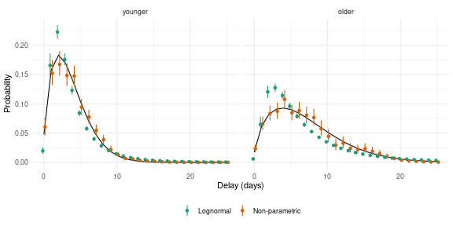

# Background

The families in `epidist` assume a shape for the delay, such as a lognormal.
When the shape is wrong the fitted delay is biased, most of all in its tail.
`nonparametric()` makes no such assumption.
It places the delay on a grid of bins and estimates the probability of each bin, using the non-parametric distributions of [`primarycensored`](https://primarycensored.epinowcast.org/) [@primarycensored].

The distribution is written in terms of the hazard of each bin, the probability that the delay ends in that bin given that it has not ended before.
The logit hazards are a linear predictor over the bins, set by the `formula` argument of `nonparametric()`.
It takes `brms` terms in two variables of the bins, `delay`, the right edge of each bin, and `bin`, a factor with a level per bin.
The default is a spline over the delay, `~ s(delay)`, so neighbouring bins have similar hazards.
`~ (1 | bin)` gives each bin its own hazard around the mean, and `~ delay` a logit hazard that changes linearly with the delay.
The `mu` parameter is the mean logit hazard, so a covariate in its formula shifts the logit hazard of every bin.
Each coefficient of the hazard formula is a distributional parameter too, so a covariate in its formula changes the shape of the delay.
`?nonparametric` gives the details, and the non-parametric section of `vignette("model")` gives the model in full.
`primarycensored` derives the censored likelihood of the distribution in its article on [fitting non-parametric delays](https://primarycensored.epinowcast.org/articles/fitting-nonparametric-delays.html).


``` r
library(epidist)
library(dplyr)
library(tidyr)
library(purrr)
library(ggplot2)
library(brms)
```

# Simulating delays that differ by age

We simulate a Weibull delay whose scale doubles from the younger to the older age group.
Cases arrive at a constant rate, and follow up is long enough that no delay is right truncated.


``` r
set.seed(101)

weibull_shape <- 1.5
weibull_scale <- c(younger = 4, older = 8)

cases <- imap(weibull_scale, function(scale, age_group) {
  simulate_uniform_cases(sample_size = 500, t = 60) |>
    simulate_secondary(dist = rweibull, shape = weibull_shape, scale = scale) |>
    simulate_dates(obs_time = 200, keep_times = TRUE) |>
    mutate(age_group = age_group)
})

linelist <- as_epidist_linelist_data(bind_rows(cases))
model_data <- as_epidist_marginal_model(linelist)
```

# Fitting

The non-parametric fit puts a bin at each whole day from 0 to the longest observed delay.
Pass `boundaries` to `nonparametric()` to set other bins.
The default hazard formula is a thin plate spline with one unpenalised coefficient, `h1b`, for its linear part.
Its penalised part has a standard deviation, `h1sd`, and standardised coefficients `h1z`, `h2z` and so on.
We let `mu` and `h1b` vary by age group, so the age groups differ in the level and the slope of the logit hazard over the delay.
We compare it with a lognormal fit whose `mu` and `sigma` both vary by age group.


``` r
fit_np <- epidist(
  model_data,
  formula = bf(mu ~ 1 + age_group, h1b ~ 1 + age_group),
  family = nonparametric(),
  chains = 2, cores = 2, refresh = 0, seed = 1, backend = "cmdstanr"
)
#> Running MCMC with 2 parallel chains...
#> Chain 2 finished in 292.1 seconds.
#> Chain 1 finished in 303.8 seconds.
#>
#> Both chains finished successfully.
#> Mean chain execution time: 298.0 seconds.
#> Total execution time: 303.9 seconds.

fit_lognormal <- epidist(
  model_data,
  formula = bf(mu ~ 1 + age_group, sigma ~ 1 + age_group),
  family = lognormal(),
  chains = 2, cores = 2, refresh = 0, seed = 1, backend = "cmdstanr"
)
#> Running MCMC with 2 parallel chains...
#> Chain 1 finished in 0.6 seconds.
#> Chain 2 finished in 0.6 seconds.
#>
#> Both chains finished successfully.
#> Mean chain execution time: 0.6 seconds.
#> Total execution time: 0.7 seconds.
```

`delay_summary_draws()` gives the mean and standard deviation of the delay in each age group, as for any other family.


``` r
summarise_fit <- function(fit) {
  delay_summary_draws(fit, probs = 0.9) |>
    ungroup() |>
    summarise(across(c(mean, sd, q90), median), .by = age_group)
}

truth <- tibble(
  age_group = names(weibull_scale),
  mean = weibull_scale * gamma(1 + 1 / weibull_shape),
  sd = weibull_scale *
    sqrt(gamma(1 + 2 / weibull_shape) - gamma(1 + 1 / weibull_shape)^2),
  q90 = qweibull(0.9, shape = weibull_shape, scale = weibull_scale)
)

bind_rows(
  `Non-parametric` = summarise_fit(fit_np),
  Lognormal = summarise_fit(fit_lognormal),
  Truth = truth,
  .id = "model"
)
#> # A tibble: 6 × 5
#>   model          age_group  mean    sd   q90
#>   <chr>          <chr>     <dbl> <dbl> <dbl>
#> 1 Non-parametric younger    3.78  2.59  7
#> 2 Non-parametric older      6.89  4.84 14
#> 3 Lognormal      younger    3.95  3.48  7.82
#> 4 Lognormal      older      7.29  7.27 15.0
#> 5 Truth          younger    3.61  2.45  6.97
#> 6 Truth          older      7.22  4.90 13.9
```

The non-parametric delay puts all of the probability of each bin at its right edge.
A delay of a whole number of days, seen with daily reporting, is what it describes.
So we compare the fits on the probability of each daily delay, with a uniform primary event and daily censoring of both events.
The log likelihood of a delay of `d` days, with a secondary window of one day, gives this probability for each posterior draw.


``` r
delays <- 0:25

grid <- epidist_newdata(model_data, age_group, pwindow = 1, swindow = 1) |>
  crossing(delay = delays) |>
  mutate(delay_lwr = delay, delay_upr = delay + 1)

daily_pmf <- function(fit) {
  pmf <- exp(log_lik(fit, newdata = grid))
  grid |>
    select(age_group, delay) |>
    mutate(
      median = apply(pmf, 2, median),
      lower = apply(pmf, 2, quantile, 0.05),
      upper = apply(pmf, 2, quantile, 0.95)
    )
}

true_pmf <- grid |>
  select(age_group, delay) |>
  mutate(median = map2_dbl(delay, age_group, function(d, group) {
    primarycensored::dpcens(
      d, pweibull,
      pwindow = 1, swindow = 1,
      shape = weibull_shape, scale = weibull_scale[[group]]
    )
  }))

fitted_pmf <- bind_rows(
  `Non-parametric` = daily_pmf(fit_np),
  Lognormal = daily_pmf(fit_lognormal),
  .id = "model"
)
```


``` r
age_levels <- names(weibull_scale)
fitted_pmf <- mutate(fitted_pmf, age_group = factor(age_group, age_levels))
true_pmf <- mutate(true_pmf, age_group = factor(age_group, age_levels))

ggplot(fitted_pmf, aes(x = delay, y = median, colour = model)) +
  geom_line(data = true_pmf, colour = "black") +
  geom_pointrange(
    aes(ymin = lower, ymax = upper),
    position = position_dodge(width = 0.6), size = 0.2
  ) +
  facet_wrap(vars(age_group)) +
  scale_colour_brewer(palette = "Dark2") +
  labs(x = "Delay (days)", y = "Probability", colour = NULL) +
  theme_minimal() +
  theme(legend.position = "bottom")
```

<div class="figure">

<p class="caption">(\#fig:pmf-plot)The probability of each daily delay by age group. Points and ranges show the posterior median and 90% interval of each fit, and the line the truth.</p>
</div>

# The meta model

The family works in the meta model in the same way.
Here we use `simulate_study()` to build published summaries of the older age group from three studies.
None of them adjusted for right truncation.
`vignette("meta")` explains the study metadata.


``` r
older <- as_epidist_linelist_data(cases$older)

studies <- tribble(
  ~study,     ~report,     ~cens_adjusted, ~relative_obs_time, ~n,
  "naive",    "moments",   0,              15,                 150,
  "quantile", "quantiles", 0,              20,                 100,
  "window",   "moments",   2,              25,                 200
)

estimates <- studies |>
  pmap(simulate_study, data = older) |>
  as_epidist_estimates_data()
estimates
#> # A tibble: 7 × 17
#>   study    type     value    se     n     p pwindow swindow relative_obs_time
#>   <chr>    <chr>    <dbl> <dbl> <dbl> <dbl>   <dbl>   <dbl>             <dbl>
#> 1 naive    mean      5.33    NA   150 NA          1       1                15
#> 2 naive    sd        3.58    NA   150 NA          1       1                15
#> 3 quantile quantile  3.75    NA   100  0.25       1       1                20
#> 4 quantile quantile  6       NA   100  0.5        1       1                20
#> 5 quantile quantile  8       NA   100  0.75       1       1                20
#> 6 window   mean      7.45    NA   200 NA          1       1                25
#> 7 window   sd        4.82    NA   200 NA          1       1                25
#> # ℹ 8 more variables: trunc_adjusted <lgl>, trunc_design <chr>,
#> #   cens_adjusted <int>, delay_min <dbl>, growth_rate <dbl>,
#> #   growth_rate_sd <dbl>, max_delay <dbl>, mvn_id <chr>
```


``` r
fit_meta <- epidist(
  as_epidist_meta_model(estimates = estimates),
  family = nonparametric(),
  chains = 2, cores = 2, refresh = 0, seed = 1, backend = "cmdstanr"
)
#> Running MCMC with 2 parallel chains...
#>
#> Chain 1 finished in 263.1 seconds.
#> Chain 2 finished in 267.6 seconds.
#>
#> Both chains finished successfully.
#> Mean chain execution time: 265.4 seconds.
#> Total execution time: 267.7 seconds.
```

The reported means are biased low by right truncation.


``` r
delay_summary_draws(fit_meta) |>
  ungroup() |>
  summarise(
    median = median(mean),
    lower = quantile(mean, 0.05),
    upper = quantile(mean, 0.95)
  )
#> # A tibble: 1 × 3
#>   median lower upper
#>    <dbl> <dbl> <dbl>
#> 1   11.5  6.61  22.9
truth$mean[truth$age_group == "older"]
#>    older
#> 7.221962
```

The fit moves the mean up and its interval covers the truth.
The interval is wide, because three summaries say little about the tail of a delay with no assumed shape.

A study that fully adjusted for censoring, `cens_adjusted = 1`, targets a continuous delay.
The non-parametric delay has no density, so from such a study the meta model only uses a mean or standard deviation of the whole distribution, from a study that adjusted for right truncation.
It gives an error for any other summary under that code.

# Summary

* `nonparametric()` estimates the probability of each bin rather than assuming a shape.
It fits in the marginal and meta models and is summarised in the same way as the other families.
* The logit hazards are a formula over the bins.
The default spline smooths the fitted delay, and other `brms` terms such as `(1 | bin)` or `delay` give other structures.
* A covariate in the `mu` formula shifts the logit hazard of every bin by the same amount.
This is a proportional odds model for the hazard.
It lets strata with little data borrow the shape of the delay from the others.
* A covariate in the formula of a hazard coefficient, such as `h1b`, changes the shape of the delay by stratum.
* Each bin adds to the cost of the likelihood, so a long delay on daily bins is slower to fit than a parametric family.
Wider bins in the tail make it faster.

# References
